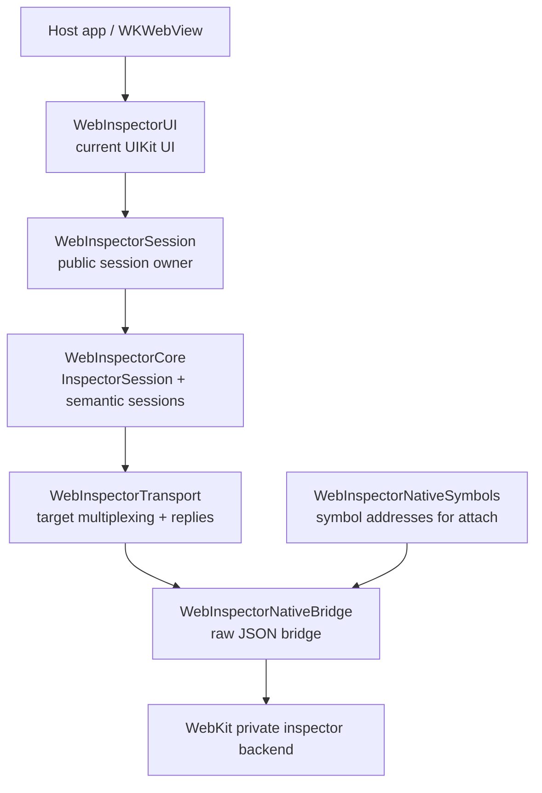
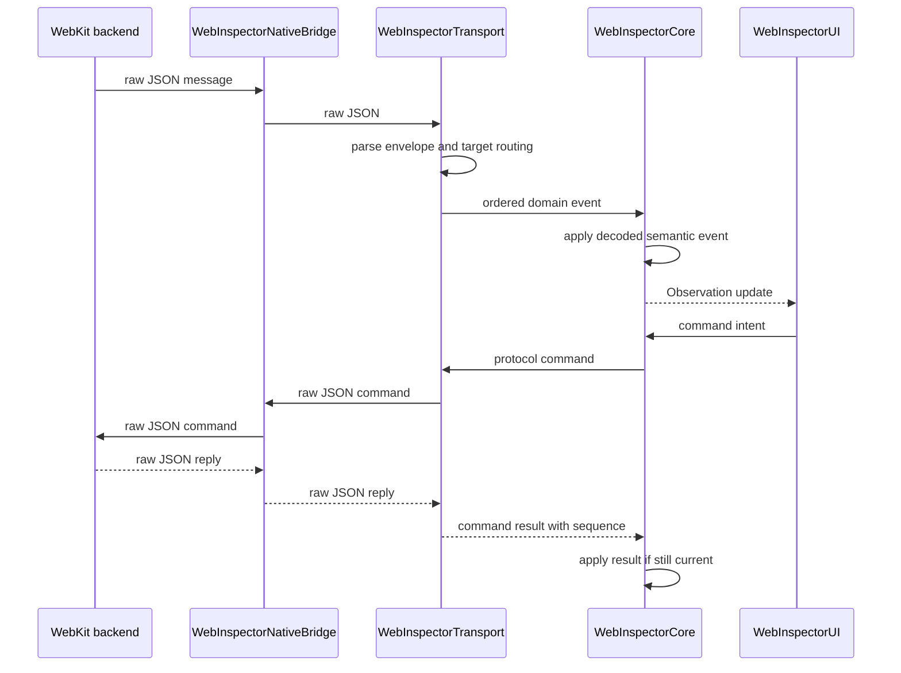
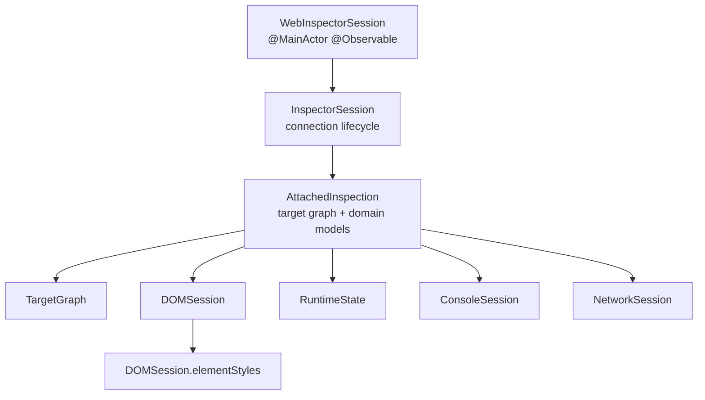

# WebInspector Architecture Overview

This document is an orientation map for the current WebInspector inspector stack. It
focuses on module boundaries, runtime ownership, and transport flow. Detailed
UIKit containment and view-controller wiring lives in
[`UIIntegration.md`](../Sources/WebInspectorUI/Docs/UIIntegration.md).

The package now exposes the same WebInspector-named modules and types internally
and publicly. There is no parallel legacy implementation target and no
compatibility alias layer between the public API and the active implementation.

## Naming Surface

| Public / final name | Role |
| --- | --- |
| `WebInspectorSession` | UI-facing session and lifecycle owner |
| `WebInspectorViewController` | UIKit inspector container |
| `WebInspectorTab` | Public tab descriptor |
| `WebInspectorCore` | Inspector attachment, protocol dispatching, and semantic domain models |
| `WebInspectorTransport` | Protocol primitives, command/reply, and target multiplexing |
| `WebInspectorNativeBridge` | Raw native inspector JSON bridge |
| `WebInspectorNativeSymbols` | Native symbol resolution for attach bootstrap |

`WebInspectorUI` is the UIKit implementation target. `WebInspectorKit` is the
app-facing umbrella product that re-exports the UI surface.

## Layer Overview



Responsibilities stay intentionally narrow:

- `WebInspectorNativeBridge`: attach, send raw JSON, receive raw JSON, detach.
- `WebInspectorNativeSymbols`: resolve private WebKit attach bootstrap
  addresses. Its MachOKit/dyld shared cache fallback chain is
  loaded image symbols, loaded dyld shared cache local symbols,
  file-backed `.symbols` local symbols, and host `FullDyldCache` as the final
  fallback. It owns redacted fallback diagnostics and does not expose mangled
  symbol names or framework paths to callers.
- `WebInspectorTransport`: parse protocol envelopes, unwrap target messages,
  route commands, manage replies, track protocol targets, and preserve
  execution-context owner/source target identity.
- `WebInspectorCore`: bootstrap domains, own event pumps, dispatch protocol
  events through domain handlers, perform command intents, and hold
  `@MainActor @Observable` model state for DOM, element styles, Runtime,
  Console, and Network.
- `WebInspectorUI`: render and interact with native UIKit/TextKit2 views.

## Event And Command Flow



The native bridge is deliberately not target-aware. Target wrapping,
`Target.dispatchMessageFromTarget` unwrapping, reply matching, and domain fan-out
belong to transport.

## Session Shape

`WebInspectorSession` is the UI-facing lifecycle owner. Package-internal UI
controllers observe the semantic sessions through the runtime owner:



The UI should receive one session object and avoid direct ownership of
transport/backend objects. Expensive work still stays outside the observable
model boundary:

- raw transport I/O
- JSON parsing
- protocol payload decoding
- DOM markup/tokenization
- search indexing
- response body decoding

Protocol implementation is domain-local. Command/result/event decoding belongs
in files named like `DOMProtocolDispatching.swift`,
`TargetProtocolDispatching.swift`, or `NetworkProtocolDispatching.swift`.
`InspectorSession` owns connection lifecycle and event pumping; it does not
hold per-domain event parsers.

## UI Integration Boundary

`WebInspectorUI` owns the current UIKit/TextKit2 presentation. The root
container observes `WebInspectorSession`; DOM and Network controllers observe
the semantic sessions exposed from it.

Detailed UI diagrams are intentionally kept with the UI source:

- [`UIIntegration.md`](../Sources/WebInspectorUI/Docs/UIIntegration.md)
- [`ViewControllerStructure.md`](../Sources/WebInspectorUI/Docs/ViewControllerStructure.md)

## Public Surface Direction

The current public shape is intentionally small:

```swift
let session = WebInspectorSession()
let viewController = WebInspectorViewController(session: session)

try await session.attach(to: webView)
```

The important boundary is that the container observes `WebInspectorSession`;
UIKit controllers do not own transport/backend objects directly.

## Maintenance Rules

1. Keep README, migration notes, and architecture notes pointed at the
   WebInspector public API.
2. Keep WebInspector regression tests for DOM, Network, transport, runtime, and
   UI behavior.
3. Keep `WebInspectorKit` as the small umbrella export surface.
4. Keep domain routing in runtime/transport and semantic state in
   `WebInspectorCore`.

## Avoided Shapes

- Do not keep a compatibility model that copies WebInspector state into a second
  model graph.
- Do not keep two long-term UI implementation targets.
- Do not let UI parse raw protocol messages.
- Do not let the native bridge understand target routing.
- Do not move MachOKit or dyld shared cache resolution out of
  `WebInspectorNativeSymbols`; transport and bridge code should only receive
  resolved native symbol addresses.
- Do not store iframe documents as regular DOM children.
- Do not make redirect hops separate top-level network requests.
