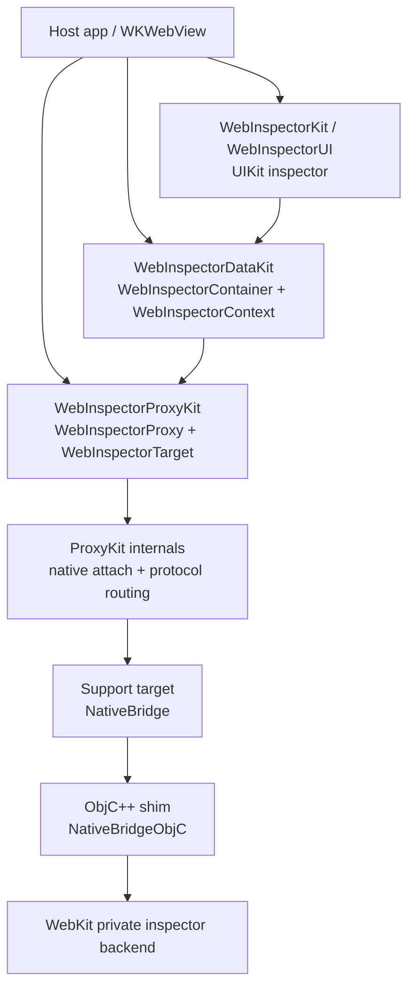
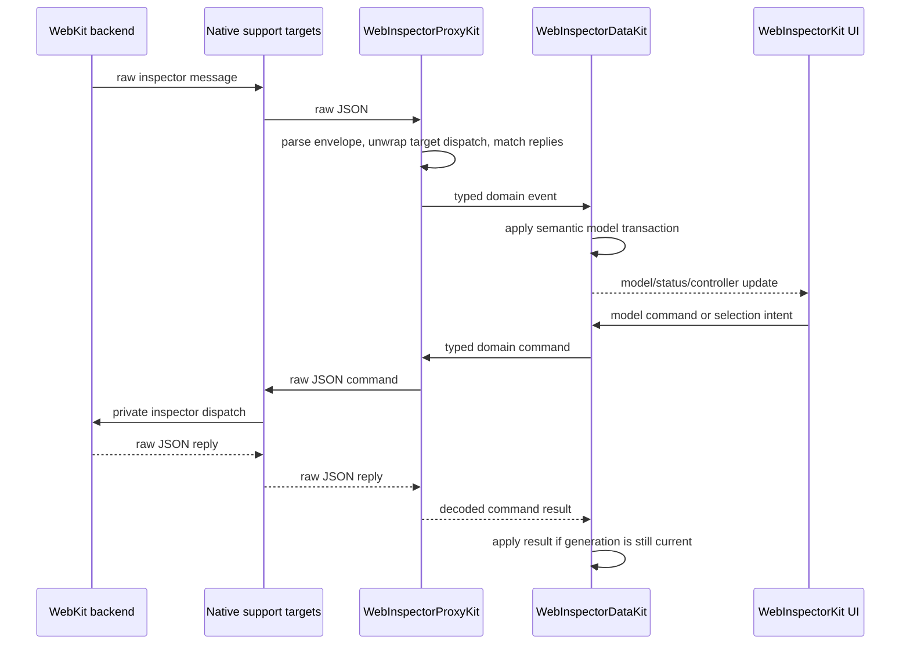
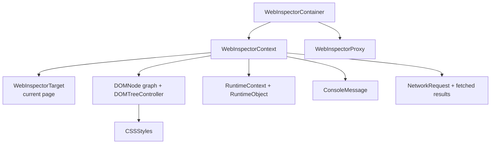

# WebInspector Architecture Overview

This document is an orientation map for the current WebInspectorKit stack. It
focuses on public product boundaries, runtime ownership, and the flow between a
host `WKWebView`, WebKit's private inspector backend, and native inspector UI.
Detailed UIKit containment and view-controller wiring lives in
[`UIIntegration.md`](../Sources/WebInspectorUI/Docs/UIIntegration.md).

The current architecture has no public `WebInspectorCore`,
`WebInspectorTransport`, or `WebInspectorNativeTransport` layer. The SDK surface
is intentionally split between a typed proxy layer, an optional model layer, and
the built-in UIKit UI.

## Public Products

| Product | Role |
| --- | --- |
| `WebInspectorProxyKit` | Attach to a `WKWebView`, hide WebKit private attach details, and expose typed domain commands/events. |
| `WebInspectorDataKit` | Build observable DOM, Network, Console, Runtime, and CSS models from a `WebInspectorProxyKit` connection. |
| `WebInspectorKit` | Built-in UIKit inspector UI backed by `WebInspectorDataKit`. |
| `WebInspectorProxyKitTesting` | Public test runtime for exercising ProxyKit/DataKit consumers without the native WebKit bridge. |

`WebInspectorNativeBridge` remains the Swift-facing package support target for
the native bridge and private symbol-resolution mechanics.
`WebInspectorNativeBridgeObjC` is only the ObjC++ implementation shim required
by SwiftPM's target language boundary. Neither is an SDK layer and neither
should be imported by consumers. Internal transport types such as
`TransportSession`, `TransportBackend`, and protocol envelopes are owned by
`WebInspectorProxyKit`.

## Layer Overview



Responsibilities stay narrow:

- `WebInspectorProxyKit`: owns `WKWebView` attachment, `isInspectable`
  preservation, private inspector bootstrap, target routing, reply correlation,
  raw WebKit JSON decoding, and typed domain command/event clients.
- `WebInspectorDataKit`: owns semantic current-page state, DOM document
  generation, node identity, selection materialization, selected-node highlight
  restore, Network retention, Console/Runtime/CSS models, and fetched-results
  style transactions.
- `WebInspectorKit` / `WebInspectorUI`: owns native UIKit rendering, tab and
  split presentation, DOM row expansion, selection scrolling, keyboard commands,
  and view-local interaction state.
- `WebInspectorNativeBridge`: owns only the native C/ObjC++ bridge and private
  symbol lookup needed by ProxyKit internals.

## Event And Command Flow



The native bridge is deliberately not target-aware. Target wrapping,
`Target.dispatchMessageFromTarget` unwrapping, reply matching, and domain fan-out
belong to `WebInspectorProxyKit`. DOM selection, materialization, and highlight
restore belong to `WebInspectorDataKit`; row expansion and scroll-to-selection
belong to UI.

## Model Shape

`WebInspectorContainer` is the DataKit composition root. Its `mainContext`
convenience creates a `WebInspectorContext` on `MainActor`; other context owners
can use the explicit isolated initializer.



The UI should receive DataKit models or the existing UIKit facade and avoid
direct ownership of native bridge, protocol-envelope, or raw transport objects.
Expensive work stays outside view controllers:

- raw inspector I/O
- JSON parsing
- protocol payload decoding
- DOM materialization
- DOM markup/tokenization
- search indexing
- response body decoding

Protocol implementation is ProxyKit-owned. Semantic state is DataKit-owned.
Presentation artifacts are UI-owned.

## UI Integration Boundary

`WebInspectorUI` owns the current UIKit/TextKit2 presentation. The root
container observes `WebInspectorContainer` / `WebInspectorContext`; DOM and
Network controllers observe DataKit models and controller transactions.

Detailed UI diagrams are intentionally kept with the UI source:

- [`UIIntegration.md`](../Sources/WebInspectorUI/Docs/UIIntegration.md)
- [`ViewControllerStructure.md`](../Sources/WebInspectorUI/Docs/ViewControllerStructure.md)

## Public Surface Direction

Custom UI without DataKit imports only `WebInspectorProxyKit`:

```swift
let proxy = try await WebInspectorProxy(attachingTo: webView)
let page = try await proxy.waitForCurrentPage()
let document = try await page.dom.getDocument()

for await event in page.dom.events {
    // Update your own model.
}
```

Custom UI with DataKit imports `WebInspectorDataKit`:

```swift
let container = try await WebInspectorContainer(attachingTo: webView)
let context = container.mainContext
```

The built-in inspector imports `WebInspectorKit`:

```swift
let inspector = WebInspectorViewController()
try await inspector.attach(to: webView)
```

## Maintenance Rules

1. Keep README, migration notes, and architecture notes pointed at the current
   public products: `WebInspectorProxyKit`, `WebInspectorDataKit`, and
   `WebInspectorKit`.
2. Do not publish raw transport or native attach vocabulary as a consumer API.
3. Keep WebInspector regression tests for DOM, Network, Runtime, Console, CSS,
   ProxyKit routing, and UI behavior.
4. Keep protocol routing and command result decoding in ProxyKit.
5. Keep semantic model state and lifecycle recovery in DataKit.
6. Keep visual row state, keyboard commands, hover/click affordances, and scroll
   behavior in UI.

## Avoided Shapes

- Do not keep a compatibility model that copies WebInspector state into a second
  model graph.
- Do not keep two long-term UI implementation targets.
- Do not let UI parse raw protocol messages.
- Do not let the native bridge understand target routing.
- Do not make `TransportSession`, `TransportBackend`, or native bridge symbols
  part of the SDK surface.
- Do not store iframe documents as regular DOM children.
- Do not make redirect hops separate top-level network requests.
