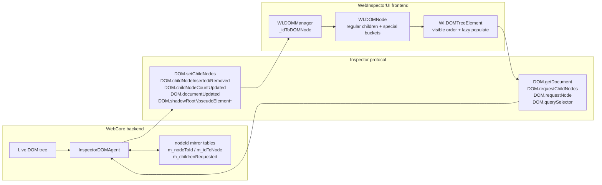
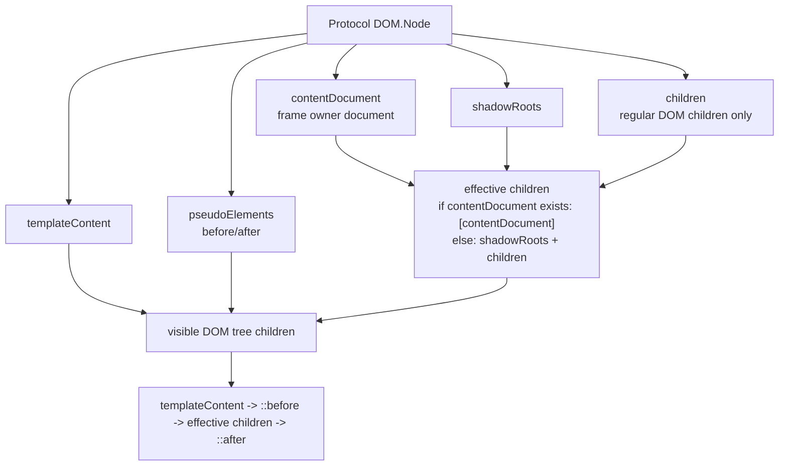
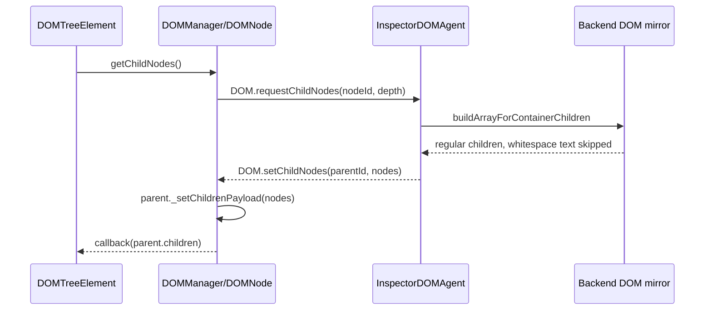
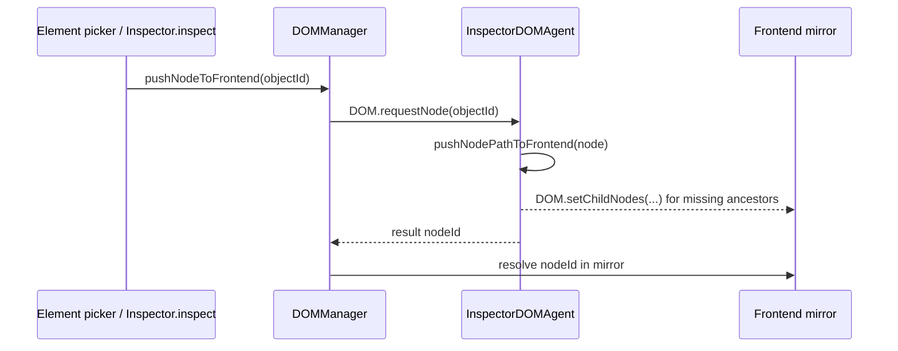
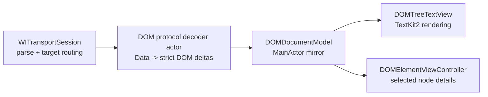
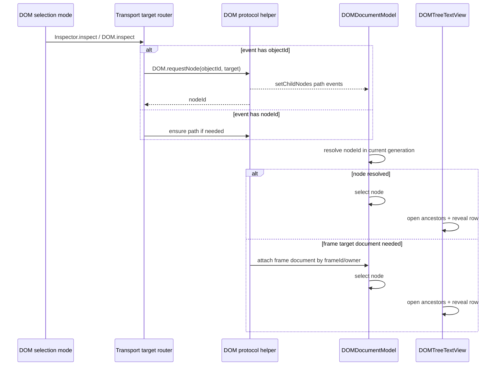

# DOM Transport / Model Simplification Notes

Working notes for simplifying the native DOM tree pipeline. This document is intentionally rough while the investigation is ongoing.

## Scope

- Repository under investigation: WebInspectorKit
- WebKit reference source: WebKit latest checkout
- Secondary source checked for drift: WebKit iOS 18.5 checkout
- Goal: remove transport/model complexity that was useful for the old WebView-rendered DOM tree but is not needed for the native TextKit2 DOM tree.

## WebKit Protocol Facts

Primary sources:

- `Source/JavaScriptCore/inspector/protocol/DOM.json`
- `Source/WebCore/inspector/agents/InspectorDOMAgent.cpp`
- `Source/WebInspectorUI/UserInterface/Models/DOMNode.js`
- `Source/WebInspectorUI/UserInterface/Controllers/DOMManager.js`
- `Source/WebInspectorUI/UserInterface/Views/DOMTreeElement.js`

Current findings:

- WebKit DOM `Node` is a backend mirror object keyed by `nodeId`.
- Backend only sends DOM events for nodes already known to the frontend.
- `DOM.getDocument` resets backend DOM mirror state and returns `buildObjectForNode(document, 2)`.
- `DOM.requestChildNodes` replies through `setChildNodes` events; the command result itself is not the subtree.
- `DOM.requestNode(objectId)` calls `pushNodePathToFrontend`, which pushes the ancestor path by emitting `setChildNodes` as needed, then returns the pushed `nodeId`.
- `childNodeCount` counts regular inner children, skipping whitespace-only text nodes.
- Protocol fields are separate buckets:
  - `children`: regular DOM children
  - `contentDocument`: frame owner document
  - `shadowRoots`
  - `templateContent`
  - `pseudoElements`
- WebKit frontend visible DOM tree order is:
  - `templateContent`
  - `::before`
  - `children`
  - `::after`
- WebKit frontend treats `contentDocument` as replacing visible/effective children: frame owner `_children = [contentDocument]`.
- WebKit frontend lazily populates children: `DOMTreeElement.onpopulate -> updateChildren -> DOMNode.getChildNodes -> DOM.requestChildNodes`.
- `DOMManager._requestDocumentWithCallback` caches one document promise/callback batch and simply calls `DOM.getDocument`, then `_setDocument(root)`.
- `DOMManager._setChildNodes` replaces a parent's children payload and emits node removal/insertion notifications around that replacement.
- Backend regular DOM insertion/removal behavior depends on whether the parent's children were requested:
  - if not requested: emit only `childNodeCountUpdated`
  - if requested: emit `childNodeInserted` / `childNodeRemoved`
- `pushNodePathToFrontend` requires the main document to have been requested, then pushes the missing ancestor path by repeated `setChildNodes`.
- `querySelector` / `querySelectorAll` also push returned node paths to the frontend before returning IDs.
- `pseudoElementCreated` first calls `pushChildNodesToFrontend(parentId, 1)` and then emits `pseudoElementAdded`.
- `innerFirstChild` / `innerNextSibling` skip whitespace-only text nodes; client-side filtering should not duplicate this for protocol children.

## WebKit Model / Transport Sketch

WebKit's source-of-truth is the backend DOM mirror. The frontend model is intentionally a mirror cache, not a separate DOM serializer. The client is responsible for remembering nodes it has received, but the backend decides which nodes are known and only emits events for those known nodes.

The key point for WebInspectorKit: protocol `children` is not the visual tree. It is just regular DOM children. Visual traversal is a derived view over the special buckets.

`requestChildNodes` is event-shaped by design. Waiting for `setChildNodes` is not old WebView UI baggage; it is intrinsic to the WebKit DOM protocol. What can be simplified is where and how that wait is represented.

This is the main simplification opportunity for selection: WebKit already has a path-push primitive. WebInspectorKit should not need to independently guess materialization roots and request broad/deep subtrees for ordinary inspect selection.

## Current WebInspectorKit Complexity To Audit

Files:

- `Sources/WebInspectorRuntime/DOM/WIDOMInspector.swift`
- `Sources/WebInspectorEngine/DOM/DOMPayloadNormalizer.swift`
- `Sources/WebInspectorEngine/DOM/DOMTransportPayload.swift`
- `Sources/WebInspectorEngine/DOM/DOMDocumentStore.swift`
- `Sources/WebInspectorTransport/WITransportSession.swift`

Observed complexity:

- `WIDOMInspector` has a large pending inspect-selection materialization state machine.
- `WIDOMInspector` waits for transport event draining in several selection/materialization paths.
- `requestChildNodesAndWaitForCompletion` exists because `requestChildNodes` completes via events.
- `mergeFrameTargetDocumentIfNeeded` rewrites frame-target document snapshots into the main document tree.
- `DOMConfiguration.snapshotDepth` suggests configurable initial snapshot depth, but WebKit `getDocument` itself is fixed to depth `2`.
- Deprecated `DOMPageEvent` / `AnySendablePayload` remain for compatibility even though native DOM pipeline no longer emits them.
- `DOMGraphNodeDescriptor` still carries identity compatibility fields such as synthesized/stable backend IDs.
- `DOMPayloadNormalizer` is already off-main/actor based and parses `paramsData` / `resultData`, but still:
  - synthesizes `backendNodeID` from `nodeId`
  - supports `backendNodeId` / `backendNodeIdIsStable` fields that are not in current WebKit `DOM.Node`
  - folds overlay filtering into protocol normalization
  - derives `childCount` from special children in some cases
- `DOMDocumentModel` is already MainActor + Observation + package-internal invalidation callback, but selection rebind logic still depends on stable backend ID compatibility.
- `DOMNodeModel` remains the single semantic state object for UI observation, which matches the Observation/direct rendering direction. Removing Observation from the node model is not required to simplify transport.
- `WITransportSession` already parses inbound JSON outside MainActor into `method`, `targetIdentifier`, `paramsData`, `resultData`, and `errorMessage`.
- `WITransportSession` still maintains page event delivery sequence/drain waiters so callers can wait until queued page events are consumed.

## Likely Simplification Directions

Not final yet:

- Treat WebKit `nodeId` as the canonical DOM mirror identity for the current document generation.
- Model regular children and special children as protocol buckets, not as a flattened legacy payload.
- Replace inferred child loading state (`childCount`, `childCountIsKnown`, current arrays) with explicit regular-child load state if feasible.
- Use `requestNode(objectId)` as the primary inspect-selection materialization path because WebKit already pushes ancestors.
- Keep `requestChildNodes` as event-driven lazy loading for user expansion; avoid global wait/state unless a caller truly needs an awaitable one-shot.
- Replace frame document snapshot rewriting with a smaller frame-document attach path keyed by WebKit frame owner / `frameId`.
- Remove deprecated compatibility types and any string/wrapper/envelope payload paths once no tests or public surface depend on them.
- Make `snapshotDepth` semantics honest:
  - either remove it from DOM document load
  - or rename/scope it to native initial hydration after `getDocument`
  - `DOM.getDocument` itself should be treated as WebKit's fixed depth-2 snapshot.
- Prefer explicit protocol types:
  - `DOMProtocolNode`
  - `DOMProtocolMutation`
  - `DOMProtocolDocumentSnapshot`
  - convert to `DOMGraphNodeDescriptor` only at the model boundary, or replace descriptor with protocol-shaped value directly.
- Narrow transport draining:
  - generic page-event drain is only needed where command replies are intentionally followed by DOM events (`requestNode`, `requestChildNodes`)
  - a DOM-specific helper can await "path pushed / child nodes loaded" instead of exposing global event-drain as a broad runtime primitive.

## Open Questions

- Which target-routing pieces are still required for cross-origin iframe inspection, and which are artifacts of the old JS frontend?
- Can selection reveal rely entirely on `requestNode` path-push plus visible ancestor opening?
- Should document reload clear selection instead of trying to rebind by synthesized stable backend IDs?
- Is `snapshotDepth` still meaningful, or should it be replaced by explicit initial hydration rules for native UI?
- Can transport event draining be narrowed to a per-command DOM path push helper instead of a general runtime primitive?

## Frame Target Notes

WebKit latest shows that frame targets exist, but DOM support is not as complete as page-target DOM:

- `Target.TargetInfoType` includes `frame`.
- `DOM` domain is registered for `itml` and `page`, not `frame`, in the generated iOS 26.4 commands.
- WebInspectorUI has explicit FIXMEs for `FrameTarget` support around several domains; `DOMManager` has a `FIXME` saying to add DOM support for `FrameTarget` in at least the event-breakpoint path.
- `InspectorObserver.inspect` creates node remote objects against `WI.mainTarget`.
- `DOMManager.pushNodeToFrontend` uses `WI.assumingMainTarget()` and `DOM.requestNode`.
- iOS 18.5 checkout differs in file contents from latest, but the relevant DOM model facts above are the same:
  - `getDocument` returns `buildObjectForNode(document, 2)`
  - frame owner `contentDocument` is protocol-special
  - `DOM` is registered for `itml` / `page`
  - `DOMNode` makes `contentDocument` its effective `_children`
  - `DOMTreeElement` derives visible children through `_visibleChildren`

Implication for WebInspectorKit:

- Target tracking is not just old WebView DOM tree UI baggage. It is needed because the private transport can surface page/frame target lifecycle and inspect events with target identifiers.
- But target tracking should stay in transport/routing. The DOM model should not need to encode broad target fallback policy or frame-document snapshot rewriting as general graph mutation logic.
- A simpler model is to keep page/frame targets as transport endpoints, then expose DOM-specific operations:
  - `loadMainDocument()`
  - `requestPathForRemoteObject(objectID, targetIdentifier)`
  - `requestRegularChildren(nodeID, targetIdentifier, depth)`
  - `loadFrameDocument(targetIdentifier)` only when cross-origin frame inspection cannot attach through the main document mirror.

## Early Direction

The biggest remaining simplification is not the parser. The parser is already mostly in the right shape. The larger issue is that DOM selection currently compensates for incomplete local mirror state by:

- scanning many possible materialization roots
- requesting deep child subtrees
- tracking pending materialization strategies
- retrying after transport drains and mutations
- merging frame target snapshots by rewriting node identity

WebKit already provides a simpler primitive for this: `DOM.requestNode(objectId)` / `pushNodePathToFrontend`. The native UI should lean on that instead of reconstructing ancestor discovery itself.

Potential target model:

1. `DOM.getDocument` establishes a document generation and root mirror.
2. Regular user expansion calls `DOM.requestChildNodes(nodeId, depth)` and waits only if the UI needs a loading spinner or deterministic test hook.
3. Inspect selection from `Inspector.inspect` calls `DOM.requestNode(objectId)` on the event target, then waits for the path-push `setChildNodes` events for that command.
4. Once the node exists in `DOMDocumentModel`, selection/reveal opens ancestors and scrolls the native TextKit2 tree.
5. If the event target is a frame target and the returned node cannot be attached to the current main document, load that target document and attach it through a frame-document-specific operation keyed by `frameId`, rather than general `replaceSubtree` identity rewriting.

## Proposed Direction

### Intent

Simplify the native DOM pipeline by making it a direct WebKit protocol mirror:

- Transport parses and routes protocol messages.
- Normalizer decodes strict WebKit DOM payloads into sendable protocol values/deltas.
- `DOMDocumentModel` owns the MainActor mirror and emits semantic invalidation.
- `DOMTreeTextView` renders the model directly with TextKit2.

Target ownership:

- Transport owns target lifecycle, target identifiers, reply matching, and event routing.
- DOM decoder owns WebKit DOM JSON shape only.
- DOM model owns node identity, child buckets, selection, and tree invalidation.
- UI owns expansion state, scroll/reveal, TextKit layout, and transient pending visual states.

### Assumptions

- Backward compatibility with the old JavaScript DOM tree frontend is no longer required.
- WebKit DOM protocol is the only DOM tree data source.
- Public API breakage is acceptable if it removes legacy/compatibility paths.
- `DOMNodeModel` can remain `@Observable` because it is MainActor-owned semantic state and is the source of truth for native UI.

### Option A: Protocol-Mirror Refactor

Keep the current module split, but make each boundary protocol-shaped and remove legacy identity/materialization behavior.

Changes:

- Rename conceptual identity from `localID` to `nodeID` internally where possible.
- Remove synthesized `backendNodeID` / `backendNodeIDIsStable` from normal DOM tree identity.
- Remove deprecated `DOMPageEvent`, `AnySendablePayload`, and old wrapper/envelope tests.
- Replace `childCount + childCountIsKnown + array inference` with an explicit regular-child state:
  - `unrequested(count: Int)`
  - `loaded([DOMNodeModel])`
- Keep special child buckets separate and derive visual order from them.
- Replace broad inspect-selection materialization with:
  - `requestNode(objectID, targetIdentifier)`
  - wait for the associated path-push events
  - select/reveal the resulting `nodeID`
- Replace `replaceSubtree` frame merge with `attachFrameDocument(frameID/ownerID, snapshot)` or similar targeted store operation.

Merits:

- Matches WebKit's own mirror model.
- Removes most selection-state machinery.
- Keeps MainActor work focused on model mutation + UI invalidation.
- Makes tests closer to protocol behavior.

Costs / risks:

- Larger breaking change.
- Selection persistence across full document reload should be intentionally reduced or redesigned.
- Cross-origin frame inspection needs careful target tests because WebKit itself has incomplete FrameTarget DOM support.

### Option B: Incremental Cleanup Only

Keep current identities and selection machinery, but remove obvious dead compatibility.

Changes:

- Delete deprecated compatibility types.
- Make `snapshotDepth` naming honest.
- Tidy `DOMPayloadNormalizer` around protocol buckets.
- Keep `backendNodeID` fallback and existing materialization state machine.

Merits:

- Smaller diff.
- Lower immediate regression risk.

Costs / risks:

- Does not address the largest complexity and main-thread pressure source.
- Keeps compensating checks and retries that obscure protocol invariants.
- Selection bugs around frame/nested document materialization remain likely.

### Recommendation

Use Option A, staged:

1. **Protocol shape cleanup**
   - Remove old compatibility payload types and tests.
   - Introduce explicit `DOMProtocolNode` / `DOMProtocolMutation` decode types.
   - Stop synthesizing stable backend identity from `nodeId`.

2. **Child state simplification**
   - Represent regular child loading explicitly.
   - Keep special child buckets separate.
   - Make `hasUnloadedRegularChildren` a direct state query, not a count/array inference.

3. **Selection path simplification**
   - Make `requestNode` + path-push the default inspect-selection path.
   - Replace the materialization strategy enum and broad candidate scans with one pending selection transaction.
   - Keep only a narrow await helper for command-followed-by-DOM-events.

4. **Frame document handling**
   - Keep target tracking in transport.
   - Move frame document grafting into a dedicated store operation keyed by frame owner/frame ID.
   - Remove general `replaceSubtree` identity rewriting once frame tests cover the new path.

5. **Configuration cleanup**
   - Remove or rename `snapshotDepth`.
   - Keep `subtreeDepth` only for lazy expansion/explicit recursive expansion.

This should reduce both code complexity and unnecessary MainActor work. The most important rule is to stop modeling "maybe this selected node is somewhere under an unloaded subtree" as a UI-side search problem. WebKit already exposes that operation as `requestNode` / `pushNodePathToFrontend`.

## Keep / Change / Remove

### Keep

- `TextKit2` DOM tree rendering.
- `DOMDocumentModel` and `DOMNodeModel` as MainActor-owned semantic source of truth.
- `@Observable` on `DOMNodeModel` unless Instruments shows Observation itself as a hot spot after removing broad reload/materialization.
- Off-main inbound parse in `WITransportSession`.
- Event-driven `DOM.requestChildNodes` handling, because WebKit protocol requires it.
- Target tracking in transport, because page/frame target lifecycle is real protocol state.

### Change

- `DOMPayloadNormalizer`
  - Change from "graph descriptor normalizer with compatibility identity" to "strict WebKit DOM protocol decoder".
  - Decode only WebKit fields that exist in `DOM.Node`.
  - Keep special buckets as explicit fields.
  - Stop deriving regular child count from `contentDocument` or special children.
- `DOMGraphNodeDescriptor`
  - Rename conceptual `localID` to `nodeID` internally.
  - Remove synthesized `backendNodeID` as primary identity.
  - Consider replacing descriptor with `DOMProtocolNode` if the shape becomes identical.
- `DOMDocumentModel`
  - Replace `childCountIsKnown` with explicit regular-child load state.
  - Keep `children` as effective children, but make regular children available through a clearly named internal property.
  - Replace `replaceSubtree` frame merge with a dedicated frame document attach/update operation.
- `WIDOMInspector`
  - Move from materialization strategy search to a command-driven selection flow.
  - Make `requestNode` path-push the normal inspect-selection path.
  - Keep a narrow await helper only for commands whose replies are followed by DOM events.
- `DOMConfiguration`
  - Remove or rename `snapshotDepth`.
  - `getDocument` should not pretend to honor configurable depth because WebKit backend returns depth `2`.

### Remove

- `DOMPageEvent` and `AnySendablePayload`.
- Old snapshot/mutation wrapper language from tests and docs.
- Synthesized stable backend ID fallback for normal DOM tree identity.
- Broad selection materialization strategies:
  - `frameRelated`
  - `genericIncomplete`
  - `nestedDocumentRoots`
  - `body`
  - `html`
  - `structuredChild`
  - `root`
- Deferred loading mutation follow-up refresh if full document load is made authoritative:
  - DOM events observed while `getDocument` is in-flight can be dropped or coalesced into the subsequent authoritative document snapshot.
  - If a race remains, handle it as a document generation mismatch, not a second generic refresh path.

## Simplified Selection Flow

The current broad subtree-search behavior should become exceptional. The protocol command already tells WebKit to push the missing path for a concrete node.

## Implementation Risk Checklist

- Verify `DOM.requestNode` path-push works for:
  - main document element picking
  - already-loaded nodes
  - unloaded deep descendants
  - shadow roots
  - template content
  - pseudo elements
  - same-origin iframe content documents
  - cross-origin frame target inspect events, if transport exposes DOM there
- Verify `DOM.requestChildNodes` remains event-driven and does not assume command result includes children.
- Verify full `DOM.documentUpdated` resets document generation and does not try to rebind by unstable IDs.
- Verify UI reveal opens ancestors after path-push and does not force broad subtree hydration.
- Verify frame target lifecycle remains handled by transport, not DOM store.
