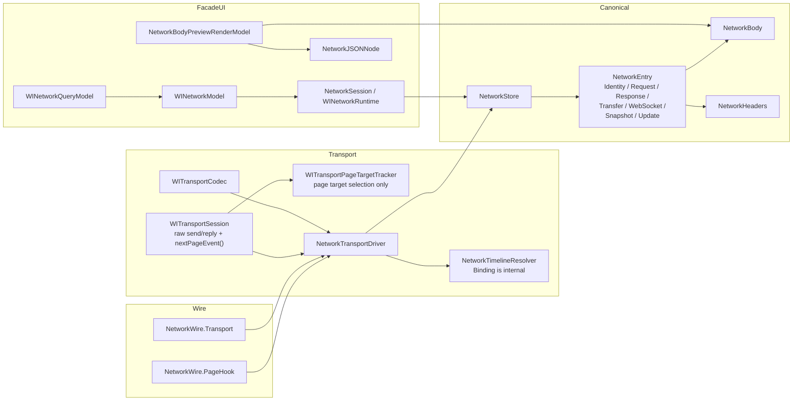

# Network Model Review and Proposed Redesign

この資料は、`WebInspectorKit` のネットワーク関連モデルを **レビューし直すための土台** と、  
そのまま次の設計議論に使える **修正案のモデル構成** をまとめたものです。

結論から言うと、今の問題は「型が多い」こと自体ではなく、**同じ意味のデータが別レイヤで別の型 family に分裂していること**です。  
今後の整理では、モデルを次の 4 family に強制的に寄せるのが最もメンテしやすい構成です。

## Summary

- canonical network state は `NetworkStore` / `NetworkEntry` / `NetworkBody` / `NetworkHeaders` だけに絞る
- bootstrap 専用型と live continuation 専用型は、canonical domain から追い出す
- page hook と inspector transport の raw model は、`NetworkWire` namespace 配下の decode 専用型にまとめる
- transport 固有 state は `WITransportSession` 直下に散らさず、`WITransportPageTargetTracker` と `NetworkTimelineResolver` に閉じ込める
- UI/runtime 側は projection に徹し、canonical state の複製を持たない

## Current Problems

### 1. 同じ意味の state が複数表現で存在する

- `NetworkEntry`
  - canonical record
- `NetworkEntrySeed`
  - bootstrap 時だけの full-state record
- `NetworkContinuationBinding`
  - live event / bootstrap row の関連付け metadata
- `NetworkEventBatch` / `NetworkEventPayload`
  - page hook 側 raw event
- `NetworkTransportEventModels`
  - inspector protocol 側 raw event

結果として、「1件の network activity」が

- canonical row
- bootstrap row
- continuation binding
- page hook payload
- inspector payload

の 5 系統に分散しています。

### 2. transport 固有 state が session に漏れすぎている

- `WITransportSession` が
  - raw send/reply
  - page target lifecycle
  - event delivery
  - target selection
を同時に持とうとしており、処理フローを追いにくいです。

### 3. UI/runtime と domain の境界が薄い

- `WINetworkModel`
- `WINetworkQueryModel`
- `NetworkBodyPreviewRenderModel`

自体は projection 寄りですが、元の domain が分裂しているので、どこが SSOT か分かりにくくなっています。

## Proposed Model Families

### 1. Canonical Domain

ここだけが SSOT です。

- `NetworkStore`
- `NetworkEntry`
- `NetworkBody`
- `NetworkHeaders`

`NetworkEntry` の中だけに、record の完全な意味を持たせます。

- `NetworkEntry.Identity`
- `NetworkEntry.Request`
- `NetworkEntry.Response`
- `NetworkEntry.Transfer`
- `NetworkEntry.WebSocket`
- `NetworkEntry.Snapshot`
- `NetworkEntry.Update`

#### Rules

- bootstrap 用の full-state は `NetworkEntry.Snapshot`
- live event 用の差分は `NetworkEntry.Update`
- canonical request/resource record は `NetworkEntry` だけ
- WebSocket も `NetworkEntry.Kind.webSocket` と `NetworkEntry.WebSocket` に統一する

### 2. Wire Models

protocol / script / inspector JSON の decode 専用です。  
canonical domain とは混ぜません。

- `NetworkWire.PageHook.Batch`
- `NetworkWire.PageHook.Event`
- `NetworkWire.PageHook.Time`
- `NetworkWire.PageHook.Error`

- `NetworkWire.Transport.Event.RequestWillBeSent`
- `NetworkWire.Transport.Event.ResponseReceived`
- `NetworkWire.Transport.Event.LoadingFinished`
- `NetworkWire.Transport.Event.LoadingFailed`
- `NetworkWire.Transport.Event.TargetCreated`
- `NetworkWire.Transport.Event.TargetDidCommitProvisionalTarget`
- `NetworkWire.Transport.Event.TargetDestroyed`
- `NetworkWire.Transport.Event.WebSocket*`

- `NetworkWire.Transport.Command`
  - method constants
  - parameter structs
  - response structs

#### Rules

- page hook 系 raw model は `NetworkWire.PageHook` に置く
- inspector protocol 系 raw model は `NetworkWire.Transport` に置く
- decode 専用型を top-level `Network*Payload` として増やさない
- wire 型は domain 型を直接 mutate しない

### 3. Transport/Internal State

外に見せない internal state です。

- `WITransportSession`
  - raw send/reply
  - `nextPageEvent()`
- `WITransportPageTargetTracker`
  - 1つの `WKWebView` 内での page target 切替状態
- `WITransportCodec`
  - JSON encode/decode
- `NetworkTimelineResolver`
  - lineage / canonical request binding

#### Rules

- `WITransportSession` は typed protocol client にならない
- page target state は `WITransportPageTargetTracker` に隔離する
- continuation binding は standalone 型にせず、`NetworkTimelineResolver.Binding` の nested/internal 型に寄せる
- transport state は `NetworkStore` や `NetworkEntry` に漏らさない

### 4. Facade / UI Projection

projection と orchestration だけです。

- `NetworkSession`
- `WINetworkRuntime`
- `WINetworkModel`
- `WINetworkQueryModel`
- `NetworkBodyPreviewRenderModel`
- `NetworkJSONNode`

#### Rules

- runtime/UI は canonical state を複製しない
- 表示都合の model は projection に限定する
- search/filter/sort/selection は facade 側で持ち、domain 側に押し込まない

## Proposed Relationships

## Current -> Proposed Mapping

| Current | Proposed | Decision |
| --- | --- | --- |
| `NetworkEntry` | `NetworkEntry` | 維持。canonical record |
| `NetworkStore` | `NetworkStore` | 維持。SSOT |
| `NetworkBody` | `NetworkBody` | 維持。ただし responsibilities は要再確認 |
| `NetworkHeaders` | `NetworkHeaders` | 維持 |
| `NetworkEntrySeed` | `NetworkEntry.Snapshot` | 削除して統合 |
| `NetworkContinuationBinding` | `NetworkTimelineResolver.Binding` | standalone 型を削除して内包 |
| `NetworkEventBatch` / `NetworkEventPayload` | `NetworkWire.PageHook.*` | namespace 配下へ移動 |
| `NetworkTransportEventModels` | `NetworkWire.Transport.Event.*` | namespace 配下へ移動 |
| `WITransportCommands.swift` の decode/parameter 型 | `NetworkWire.Transport.Command.*` | command wrapper を廃止し plain models 化 |
| session 内 page target state | `WITransportPageTargetTracker` | 専用型へ隔離 |
| `NetworkTransportClient` | `NetworkTransportClient` | 維持。typed operation holder |
| `NetworkBootstrapSource` | `NetworkBootstrapSource` | 維持。bootstrap source holder |
| `WINetworkModel` / `WINetworkQueryModel` | 維持 | projection/facade に限定 |

## Proposed Responsibilities

### `NetworkStore`

- `NetworkEntry.Update` を適用する唯一の場所
- `entries` の lifetime を管理
- session/requestID index を持つ

### `NetworkEntry`

- canonical request/resource record
- request/response/transfer/webSocket を nested value type で保持
- HTTP と WebSocket の family を統一する

### `NetworkBody`

- body content と deferred loading state を持つ
- ただし将来的には
  - canonical body value
  - deferred fetch state
を分ける余地がある

### `WITransportSession`

- raw transport state machine
- command/reply correlation
- `nextPageEvent()` の提供
- consumer の仕事は待たない

### `WITransportPageTargetTracker`

- `Target.targetCreated`
- `Target.didCommitProvisionalTarget`
- `Target.targetDestroyed`

だけを受けて、

- current page target
- committed page target
- synthetic page lifecycle event

を決める専用 state holder

### `NetworkTimelineResolver`

- bootstrap/live row の canonical request binding
- committed target lineage
- rebind の判断

### `NetworkTransportDriver`

- transport event を domain update に変換する adapter
- bootstrap と live event replay の orchestration
- `NetworkStore` を更新する transport 側の唯一の入口

## Review Hotspots

次のレビューでは特にここを重点確認します。

### 1. `NetworkBody`

- `fetchState`
- `reference`
- `handle`
- `deferredLocator`

を canonical model に置く妥当性

### 2. `NetworkEntry.Snapshot`

- `NetworkEntrySeed` を本当に吸収できるか
- stable bootstrap / historical bootstrap の差を field で持つか、metadata で持つか

### 3. `NetworkTimelineResolver.Binding`

- standalone 型をやめて nested/internal にしたとき、テスト容易性が落ちないか

### 4. `WITransportPageTargetTracker`

- 「複数 `WKWebView`」の話ではなく、「1つの `WKWebView` 内の page target 切替」だけを扱うことを守れるか

## Guardrails

この構成に寄せるなら、以後は次をルール化した方がよいです。

- 新しい top-level `Network*Payload` / `*Seed` / `*Binding` を原則追加しない
- protocol JSON のためだけの型は必ず `NetworkWire` 配下に置く
- canonical state を持てるのは `NetworkStore` / `NetworkEntry` / `NetworkBody` / `NetworkHeaders` だけ
- transport 固有 state は engine domain に出さない
- UI 用の整形 model は canonical model を複製しない

## Review Questions

- `NetworkBody` の deferred fetch state は、canonical model の責務として妥当か
- `NetworkEntry.Snapshot` に `NetworkEntrySeed` を完全吸収できるか
- `NetworkTimelineResolver.Binding` を nested/internal にした方が、本当に責務は追いやすくなるか
- `NetworkWire.PageHook` と `NetworkWire.Transport` は、将来的にさらに共通 raw event family に寄せるべきか
- `NetworkTransportDriver` は bootstrap と live replay を 1 型で持つべきか、それとも source/replay coordinator に分けるべきか
