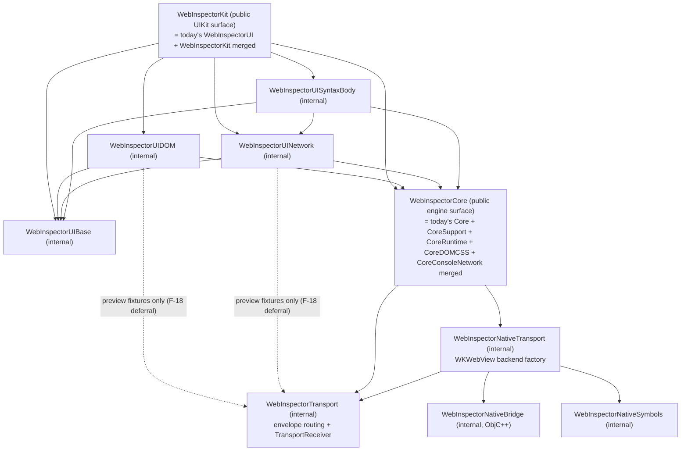

# Design Doc — WebInspectorKit Public SDK Surface

Target state for the rearchitecture defined by
[01-scope-contract.md](01-scope-contract.md), grounded in the numbered
findings of [02-findings.md](02-findings.md). Revision 2 — the first revision
was adversarially reviewed against the actual sources; all signature and
dependency claims below were corrected against code at baseline `45c6d880`.

This document is the design contract: workers implement it as written; any
deviation is an escalation, not a judgment call.

Signature notation:
- `(existing)` — the current declaration keeps its shape; only access level,
  location, or a rename listed in E5 changes.
- `(new)` / `(new shape)` — designed here; the written signature is binding.
- Promoted stored properties change only the **getter** to public; the setter
  keeps its current level (write `public package(set)` where mutation happens
  outside the declaring file — e.g. `isSelectingElement` is assigned from
  DOMSessionProtocolOperations.swift:1532 — and `public private(set)` where
  it does not).

## Design elements index

| ID | Element | Defined in |
| --- | --- | --- |
| E1 | Package graph restructure (products 6→2, merges) | §1 |
| E2 | Public Core engine surface (`WebInspector` + domain sessions) | §2.1–§2.6 |
| E3 | Public Kit UIKit surface (`WebInspectorSession.inspector` bridge) | §2.7 |
| E4 | Native-attach dependency inversion + internalized staging SPI | §1, §2.1 |
| E5 | Public vocabulary renames | §2.9 |
| E6 | Channel-binding owner consolidation | §5 |
| E7 | Attachment-precondition consolidation (`requireAttached`) | §5 |
| E8 | `StatusSeverity` relocation to Core | §2.3 |
| E9 | Contract-test package + Monocly Console tab + README fix | §8 |
| E10 | Package.swift hygiene (undeclared/dead dependency edges) | §6 #11 |
| E11 | `@MainActor` on CSS observable classes | §2.6 |
| E12 | Public observable lifecycle state (`WebInspector.state`) | §2.1 |
| E13 | Single DOM intent→method mapping owner | §6 #8 |
| E14 | Docs updates (ArchitectureOverview, MIGRATION, README) | §7 |

## 1. Target package graph (E1)

### Products: 6 → 2

| Product | Module | Platforms | Responsibility (one sentence) | Client story |
| --- | --- | --- | --- | --- |
| `WebInspectorCore` | `WebInspectorCore` | iOS 18+, macOS 15+ | Owns the observable semantic state of an inspected `WKWebView` page and the commands against it. | Any app or UI layer that attaches to a web view and renders/queries inspector state its own way (second app, future AppKit UI, custom tabs). |
| `WebInspectorKit` | `WebInspectorKit` | iOS 18+ (UIKit; see residual note) | Presents the drop-in UIKit inspector UI over a `WebInspector`. | UIKit apps that want the built-in inspector container and tab surface (Monocly). |

Products **removed** (targets demoted to internal, or merged):
`WebInspectorTransport`, `WebInspectorNativeSymbols`,
`WebInspectorNativeBridge`, `WebInspectorUI` (F-02).

Accepted residual: SwiftPM cannot restrict a product to iOS, so on a macOS
build the `WebInspectorKit` product remains an empty module (its whole-file
`#if canImport(UIKit)` gates stay — F-21). The F-02 acceptance claim is
therefore scoped: *no product is empty on its declared platform story*;
Kit-on-macOS is a documented SwiftPM limitation, not a regression.

### Targets and dependency direction

The diagram shows **repo-target edges** (complete — Package.swift must match
it exactly). External package dependencies (ObservationBridge on the UI
targets, UIHostingMenu/SyntaxEditorUI iOS-only, MachOKit on NativeSymbols)
are unchanged and omitted from the diagram. The UIDOM/UINetwork →
WebInspectorTransport edges exist only for the preview fixtures whose rework
is deferred (F-18) and are marked for removal with that follow-up.



Key direction changes:

- **Core → NativeTransport (inverted, resolves F-10).** NativeTransport stops
  importing Core; it exposes the package factory in §2.1 and Core's
  `WebInspector.attach(to:)` owns the orchestration. The staging APIs
  (`beginAttachmentRequest`, `ensureCurrentAttachmentRequest`,
  `detachForAttachmentRequest`, `makeTransportSession`,
  `recordAttachmentError`, `connectAttachment`, `connect(transport:)` —
  AttachedInspection.swift:488-527) become internal to the Core target.
  Feasibility (verified): NativeInspectorBackend/Factory import only
  WebKit + NativeBridge + NativeSymbols + Transport; the only Core-type uses
  in NativeTransport are the extension being moved and
  `NativeInspectablePage`'s use of `InspectorSession.Error`
  (InspectorSession+NativeAttachment.swift:80) — the latter is replaced by an
  NT-local error type surfaced to Core through the factory's `throws`.
- **`TransportReceiver` moves from CoreSupport into WebInspectorTransport**
  (F-37; verified it imports only Synchronization + WebInspectorTransport).
- **Core sub-target merge (fork 1).** One module, one designed surface;
  domain subdirectories (`DOM/`, `CSS/`, `Network/`, `Console/`, `Runtime/`,
  `Support/`) preserved. Verified: no duplicate basenames, no per-target
  resources.
- **Kit merge.** Today's 12 `WebInspectorUI` files move into the
  `WebInspectorKit` target; `WebInspectorKit.swift` and
  `WebInspectorNativeAttachment.swift` are deleted (F-03, F-04). Verified: no
  UI sub-target references any WebInspectorUI-defined type, so no cycle.

## 2. Public API sketch

### 2.1 WebInspectorCore — session lifecycle (E2, E4, E12)

Apple analog: `ARSession` (attach/run–detach/stop lifecycle + observable
state). The public class is named `WebInspector` — a rename of today's
package `InspectorSession` (AttachedInspection.swift:367), chosen to avoid a
permanent near-collision with Kit's `WebInspectorSession`
(`session.inspector` then reads naturally). Verified rename cost: 9 source
files + 3 test files reference `InspectorSession`; Monocly references it
nowhere.

```swift
// WebInspectorCore
@MainActor @Observable
public final class WebInspector {
    public init()

    // E12 — observable lifecycle state (new). NOT a projection of the
    // private InspectorConnectionPhase: `state` is owned by WebInspector and
    // driven directly by the attach()/detach() orchestration, so `.attaching`
    // begins when attach() is entered (covering the symbol-resolution span
    // that connectionPhase never saw). Re-attach passes through .detaching.
    public enum State: Sendable, Equatable {
        case detached, attaching, attached, detaching
    }
    public private(set) var state: State
    public private(set) var lastError: InspectorError?   // (existing, promoted)

    // Domain state — identity-stable across attach/detach cycles (F-27).
    // Promotions of the existing computed pass-throughs
    // (AttachedInspection.swift:393-407). AttachedInspection itself stays
    // package.
    public var dom: DOMSession { get }
    public var network: NetworkSession { get }
    public var console: ConsoleSession { get }
    public var runtime: RuntimeState { get }

    // E4 — attach owned by Core, same module, no overload trickery.
    // Cancellation: attach can throw CancellationError (existing behavior,
    // AttachedInspection.swift:642-646) — part of the public contract.
    public func attach(to webView: WKWebView) async throws
    public func detach() async

    // Page reload (existing, promoted; AttachedInspection.swift:712,720)
    public var canReloadPage: Bool { get }
    public func reloadPage() async throws
}

// (existing, promoted) — Sources/WebInspectorCoreSupport/InspectorError.swift.
// Full public shape; there are no other public error types. Domain commands
// throw InspectorError, TransportSession-internal errors mapped at the
// boundary, or CancellationError.
public struct InspectorError: Error, Sendable {
    public let message: String
}
```

Internal-owner note (responds to F-39): `WebInspector` stays a facade —
the ~150-line native attach orchestration arriving from
`InspectorSession+NativeAttachment.swift` lands in an **internal**
free-standing flow (e.g. `NativeAttachmentFlow.run(...)` inside Core), not in
the `WebInspector` body; the E6 participant list and dispatcher registration
stay a single init block. Full internal decomposition of the lifecycle owner
is deferred with fork 3.

The package seam Core consumes (in WebInspectorNativeTransport). Two-stage
shape is load-bearing (verified ordering constraints of the current flow):
symbol resolution must fail **before** any teardown of an existing
connection (InspectorSession+NativeAttachment.swift:8-11), and the bridge
attach must run **after** the old connection is detached (:36). The backend
is the concrete type — Core has package visibility; no speculative protocol
(api-design: seam minimal).

```swift
// WebInspectorNativeTransport (package)
package enum NativeAttachment {
    // Stage 1 — fail-fast, touches nothing:
    package static func resolveSymbols() async throws -> ResolvedSymbols

    // Stage 2 — after the caller has torn down any previous connection:
    package static func makeComponents(
        webView: WKWebView,
        symbols: ResolvedSymbols,
        messageSink: @escaping @Sendable (String) -> Void,
        fatalFailureSink: @escaping @Sendable (String) -> Void  // → WebInspector error recording
    ) throws -> Components

    package struct Components {
        package let backend: NativeInspectorBackend   // conforms to TransportBackend; Core calls backend.attach() post-teardown
        package let receiver: TransportReceiver
        package let pageReloadAction: @MainActor () throws -> Void
        package let pageReloadAvailability: @MainActor () -> Bool
        package let connectionCleanup: @MainActor () -> Void
    }
}
```

Details of the factory may be adjusted during implementation **only** within
these constraints: (a) NativeTransport does not import Core, (b)
`WebInspector.attach(to:)` is the only production composition root, (c) the
two-stage ordering above holds, (d) fatal failures reach `lastError`,
(e) symbol resolution stays inside NativeSymbols.

### 2.2 WebInspectorCore — DOM domain (E2)

Public members are the measured de-facto contract (F-31/F-32) minus
zero-consumer members, plus their value types. Signatures below were
verified against the sources — where the sketch previously deviated it now
reproduces the code.

```swift
@MainActor @Observable
public final class DOMSession {
    // Observable state (getter public; setter level unchanged, see notation)
    public private(set) var treeRevision: UInt64
    public private(set) var selectionRevision: UInt64
    public package(set) var isSelectingElement: Bool     // mutated from DOMSessionProtocolOperations.swift:1532
    public var selectedNodeID: DOMNode.ID? { get }
    public var selectedNode: DOMNode? { get }
    public var currentPageRootNode: DOMNode? { get }
    public var elementStyles: CSSSession { get }
    public var hasPendingSelectionRequest: Bool { get }

    // Availability (existing; DOMSessionAvailability.swift:4-20)
    public var canReloadDocument: Bool { get }
    public var canBeginElementPicker: Bool { get }
    public var canDeleteSelectedNode: Bool { get }
    // canSelectElement is NOT promoted — zero consumers measured; stays package.

    // Queries (existing shapes — node-based, non-optional returns; DOMModel.swift:939-1140)
    public func node(for id: DOMNode.ID) -> DOMNode?
    public func visibleDOMTreeChildren(of node: DOMNode) -> [DOMNode]
    public func hasUnloadedRegularChildren(_ node: DOMNode) -> Bool
    public func isTemplateContent(_ node: DOMNode) -> Bool     // (existing, DOMModel.swift:964)
    public func selectorPath(for node: DOMNode) -> String
    public func xPath(for node: DOMNode) -> String

    // Commands (existing shapes — all throwing commands keep `throws`;
    // DOMSessionProtocolOperations.swift)
    public func selectNode(_ id: DOMNode.ID?)
    public func requestChildNodes(for id: DOMNode.ID, depth: Int) async -> Bool
    public func highlightNode(for id: DOMNode.ID, owner: DOMPageHighlightOwner = .transient) async  // :450-453
    public func hideNodeHighlight() async
    public func restoreSelectedNodeHighlightOrHide() async
    public func toggleElementPicker() async
    public func beginElementPicker() async throws
    public func cancelElementPicker() async
    public func deleteSelectedNode(undoManager: UndoManager?) async throws   // :834
    public func deleteNodes(_ ids: [DOMNode.ID], undoManager: UndoManager?) async throws  // :844
    public func copyNodeText(_ kind: DOMNode.CopyTextKind, for id: DOMNode.ID) async throws -> String  // :809
    public func reloadDocument() async throws
    public func ensureDocumentLoaded() async -> Bool
    public func setCSSProperty(_ id: CSSProperty.ID, enabled: Bool) async throws  // :948
}

@MainActor @Observable public final class DOMNode {
    public struct ID: Hashable, Sendable { /* opaque, package storage */ }
    // Public read-only (verified against DOMModelTypes.swift:368-538):
    // id, parentID, nodeType, nodeName, localName, nodeValue, attributes,
    // pseudoType, shadowRootType, regularChildren: ChildrenState.
    // NOTE: regularChildKnownCount / isTemplateContent are NOT DOMNode
    // members (the F-32 report misattributed them — they live on the render
    // snapshot / as a session query); the public equivalents are
    // ChildrenState.knownCount and DOMSession.isTemplateContent(_:).
    public struct ChildrenState: Sendable { /* existing (DOMModelTypes.swift:344-348), promoted read-only */ }
    public enum CopyTextKind: Sendable { /* existing (DOMProtocol.swift:188-192), promoted */ }
}
public enum DOMPageHighlightOwner: Equatable, Sendable { /* existing (.selection / .transient), promoted — DOMProtocol.swift:8-11 */ }
```

Stays **package** (built-in-UI render plumbing, F-32): `changes(since:)`,
`rowDeltas(since:)`, `domTreeRenderSnapshot()`, `treeProjection(rootTargetID:)`,
`currentDOMTreeRenderRootNodeID`, `treeRenderInvalidation*`,
`setSelectedNodeStyleHydrationActive`, `canSelectElement`, all `apply*`
mutators, `handleDOMProtocolEvent`, `perform(_ intent:)`, intent factories,
`DOMNode.Payload`, `DOMAction.Target`, `DOMTransaction`, `TargetGraph`,
`selectProtocolNode`, `beginInspectSelectionRequest`.

### 2.3 WebInspectorCore — Network domain (E2, E8)

Public field set = the measured de-facto contract (map-ui-callsites: id, url,
method, resourceType, requestBody, responseBody, canFetchResponseBody, plus
status/statusText/mimeType via response) + `state` for story B list
rendering. WebSocket fields, redirects, metrics, initiator, timestamps and
sizes have **zero measured or story consumers** and stay package — this
deliberately trims the earlier draft; publishing them later is additive.

```swift
@MainActor @Observable
public final class NetworkSession {
    public private(set) var requestTopologyRevision: Int
    public private(set) var requestDisplayRevision: Int
    // requestContentRevision is NOT promoted — zero consumers; stays package.
    public var orderedRequestIDs: [NetworkRequest.ID] { get }
    public var requests: [NetworkRequest] { get }
    public func request(for id: NetworkRequest.ID) -> NetworkRequest?
    public func fetchResponseBody(for id: NetworkRequest.ID) async
    // ^ returns Void by design (existing): the result lands in the
    //   observable request.responseBody (phase available→fetching→loaded/failed).
}

@MainActor @Observable public final class NetworkRequest {
    public struct ID: Hashable, Sendable { /* opaque, package storage */ }
    // Public read-only: id, resourceType: ResourceType?, state: State,
    // request: RequestData, response: ResponseData?,
    // requestBody: NetworkBody?, responseBody: NetworkBody?,
    // canFetchResponseBody: Bool.
    public enum ResourceType: Sendable { /* existing (NetworkProtocol.swift:276), promoted */ }
    public enum State: Sendable { /* existing (.pending/.responded/.finished/.failed(errorText:canceled:)), promoted */ }

    // E5 renames. These stay struct-shaped, but only the listed members are
    // public — protocol-detail members (timing, security, source, integrity,
    // referrerPolicy, …) stay package INSIDE the public structs, so no
    // further Payload types enter the transitive closure.
    public struct RequestData: Sendable {   // rename of NetworkRequest.Payload
        public var url: String { get }
        public var method: String { get }
        public var headers: [String: String] { get }   // match existing storage shape
        public var postData: String? { get }
    }
    public struct ResponseData: Sendable {  // rename of Response.Payload
        public var url: String? { get }
        public var status: Int? { get }
        public var statusText: String? { get }
        public var mimeType: String? { get }
        public var headers: [String: String] { get }
    }
}

@MainActor @Observable public final class NetworkBody {
    // Public read-only: role: Role, kind: Kind?, phase: Phase, size,
    // isBase64Encoded, isTruncated, full: String?, textRepresentation,
    // textRepresentationSyntaxKind, needsFetch.
    public enum Role: Sendable { /* existing, promoted */ }
    public enum Kind: Sendable { /* existing, promoted */ }
    public enum SyntaxKind: Sendable { /* existing, promoted */ }
    public enum Phase: Sendable { /* existing (.available/.fetching/.loaded/.failed(FetchError)), promoted */ }
    public struct FetchError: Error, Sendable { /* existing, promoted */ }
}
```

If a listed member's existing storage shape differs from the sketch (e.g.
headers stored as an ordered array), keep the existing shape and expose it
as-is — the binding part is the member list, not the collection type.

Stays package: `requestContentRevision`, `requestDisplayChanges(after:)` +
history, all 18 `apply*`, `NetworkCommand.Intent`, snapshots, webSocket*/
redirects/metrics/initiator fields and their payload types, the UI-side
display extensions (`NetworkRequest+Display.swift` stays in UINetwork).

E8 (committed shape): the severity enum re-parents as
`NetworkRequest.StatusSeverity` declared in Core (package) — this avoids
moving the `NetworkRequest.Display` namespace, which stays in UINetwork's
NetworkRequest+Display.swift together with the display projections and the
UIColor mapping (F-23). `NetworkRequest.Display.StatusSeverity` ceases to
exist; UINetwork call sites migrate to the Core-declared type.

### 2.4 WebInspectorCore — Console domain (E2; new surface)

No existing UI consumer (F-31) — designed fresh at minimum-viable scope for
a Console tab: read the merged stream, clear, evaluate (§2.5).

```swift
@MainActor @Observable
public final class ConsoleSession {
    public private(set) var warningCount: Int      // (existing)
    public private(set) var errorCount: Int        // (existing)
    public var messages: [ConsoleMessage] { get }  // (existing merged stream)
    public func message(for id: ConsoleMessage.ID) -> ConsoleMessage?

    // (new) all-targets wrapper over the per-target .clearMessages intents.
    // Failure semantics: attempts every target, then throws the first
    // InspectorError if any target failed (local clearing still applied via
    // the Console.messagesCleared events that arrive from targets that
    // succeeded).
    public func clearMessages() async throws
}

@MainActor @Observable public final class ConsoleMessage {
    public struct ID: Hashable, Comparable, Sendable { /* opaque */ }
    // Public read-only: id, source, level, type, text, url, line, column,
    // repeatCount, timestamp, parameters: [RuntimeRemoteObject],
    // networkRequestID: NetworkRequest.ID?  (E5 rename of networkRequestKey,
    // ConsoleModel.swift:40 — cross-link to Network detail).
    // stackTrace is NOT promoted (drags CallFramePayload public); deferred.
}
// ConsoleMessage.Source / .Level / .Kind stay the existing RawRepresentable
// string types, promoted public.
```

Stays package: `TargetState`, per-target enable/disable/logging-channel
intents, `applyMessageAdded` etc., `ConsoleMessage.Payload`,
`StackTracePayload`, snapshots, unsupported-command learning.

### 2.5 WebInspectorCore — Runtime domain (E2; new surface, minimum viable)

```swift
@MainActor @Observable
public final class RuntimeState {
    // (new) aggregate over the existing per-agent AgentState.executionContexts
    // (RuntimeModel.swift:174) — no session-level aggregate exists today.
    // Ordering: by agent target registration order, then context ID.
    public var executionContexts: [RuntimeExecutionContext] { get }

    // (new shape) — existing selectedContextKey stores the transport-side
    // RuntimeContext.Key (RuntimeModel.swift:413); the public surface uses
    // the Core-defined opaque wrapper (§2.8), mapped at the boundary.
    public private(set) var selectedContextKey: RuntimeExecutionContext.Key?
    public func selectExecutionContext(_ key: RuntimeExecutionContext.Key?)

    // (new) — wraps the existing evaluateIntent + perform +
    // applyEvaluationResult plumbing (RuntimeModel.swift:971-1006). The
    // console evaluation policy (command-line API, `.console` object group,
    // saveResult, user-gesture emulation) is a documented baked-in policy of
    // THIS method, not a name suffix (the earlier `evaluateForConsole` name
    // repeated the consumer-vocabulary leak that deletion #12 removes).
    // `in: nil` = selected context, falling back to the default context
    // (existing behavior, RuntimeModel.swift:998-1006).
    // JS exceptions are NOT Swift errors: WebKit reports them via wasThrown
    // (RuntimeProtocol.swift:486-505, currently discarded — the wrapper must
    // surface it). Swift `throws` is reserved for protocol/transport failure.
    public func evaluate(
        _ expression: String,
        in context: RuntimeExecutionContext.Key? = nil
    ) async throws -> RuntimeEvaluationResult

    // (new) — decodes the existing PropertiesResultPayload into semantic
    // values; raw Data envelopes never cross the boundary (F-29). Child
    // objects are returned as registered live RuntimeRemoteObject instances
    // (nil for primitives), so expansion recurses without any public ID
    // resolver.
    public func properties(
        of object: RuntimeRemoteObject
    ) async throws -> RuntimeObjectProperties
}

public struct RuntimeEvaluationResult: Sendable {          // (new)
    public let value: RuntimeRemoteObject
    public let isException: Bool                            // wasThrown
}

@MainActor @Observable public final class RuntimeExecutionContext {
    public struct Key: Hashable, Sendable { /* opaque; package storage wraps
        the transport-side RuntimeContext.Key (F-30) */ }
    public var key: Key { get }
    public var name: String { get }   // existing stored shape wins if it is Optional
    // kind is not promoted — no story needs it.
}

@MainActor @Observable public final class RuntimeRemoteObject {
    // Public read-only SEMANTIC accessors (the raw Payload struct stays
    // package): kind (new enum, typed once at the boundary from the
    // type/subtype strings), className: String?, descriptionText: String?,
    // valueText: String?, preview: RuntimeObjectPreview?
    public enum Kind: Sendable { /* new — object/function/string/number/boolean/
        symbol/bigint/undefined/null/array/error/… mapped at decode */ }
}
public struct RuntimeObjectPreview: Sendable {              // (new)
    public struct Entry: Sendable {
        public let name: String?
        public let valueText: String?
    }
    public let text: String?          // one-line summary
    public let isOverflow: Bool       // more entries exist than shown
    public let entries: [Entry]       // shallow entries only (depth 1)
}
public struct RuntimeObjectProperties: Sendable {           // (new)
    public struct Property: Sendable {
        public let name: String
        public let valueText: String?
        public let object: RuntimeRemoteObject?   // live object for expandables, nil for primitives
    }
    public let properties: [Property]
}
```

Stays package: `RuntimeCommand.Intent`, `RuntimeEvaluation.Request` (the
WebKit flags stay a baked-in policy, F-29), `RuntimeRemoteObject.Payload` and
all `*Payload` types, `RuntimeRemoteObject.ID` (not needed publicly once
Property carries live objects), saveResult/alias/release intents, `apply*`,
`AgentState`/`TargetState` registries.

### 2.6 WebInspectorCore — CSS domain (E2, E11)

```swift
@MainActor @Observable
public final class CSSSession {
    public private(set) var selectedNodeStyles: CSSNodeStyles?
    public var selectedPhase: CSSNodeStyles.Phase { get }
    public func nodeStyles(for id: CSSNodeStyles.ID) -> CSSNodeStyles?
}

@MainActor @Observable public final class CSSNodeStyles {
    public struct ID: Hashable, Sendable { /* opaque */ }
    // Public read-only: id, phase, sections: [CSSStyle.Section],
    // computedProperties: [CSSComputedStyleProperty]

    // (new shape) — the existing Phase/UnavailableReason embed
    // ProtocolTarget.ID in an associated value
    // (CSSProtocol.swift:663-676: .cssUnavailableForTarget(ProtocolTarget.ID)),
    // which enum pattern-matching would make public. The public enums drop
    // the target payload:
    public enum Phase: Sendable {
        case loading, loaded, needsRefresh
        case unavailable(UnavailableReason)
        case failed(String)
    }
    public enum UnavailableReason: Sendable { /* existing cases minus
        associated target IDs (e.g. .cssUnavailable without payload) */ }
}
// CSSStyle (+ .Section), CSSRule, CSSProperty (+ .ID, .Status),
// CSSComputedStyleProperty: public read-only per the F-32 field lists
// (name, value, priority, isEnabled, isOverridden, isEditable,
// isModifiedByInspector, status, text, id).
// E11: add the missing @MainActor to the CSS observable classes
// (CSSModel.swift:23,137,246,297,323).
```

Stays package: refresh coordinator/tokens, `setStyleText` rewriting
machinery, stylesheet header registry, all payload types. The only public
CSS mutation stays `DOMSession.setCSSProperty(_:enabled:)`.

### 2.7 WebInspectorKit — UIKit surface (E3)

```swift
@MainActor @Observable
public final class WebInspectorSession {
    public let inspector: WebInspector                    // (new — THE unlock for F-05)
    public private(set) var pageUserInterfaceStyle: UIUserInterfaceStyle
    public convenience init(tabs: [WebInspectorTab] = [.dom, .network])
    public init(inspector: WebInspector, tabs: [WebInspectorTab] = [.dom, .network]) // (new)
    public func attach(to webView: WKWebView) async throws  // single real forwarding impl (deletes the F-04 decoy pair)
    public func detach() async
}

public final class WebInspectorViewController: UIViewController {
    // Public shape preserved (F-07), INCLUDING attach(to:)/detach() — after
    // the Kit merge these become single real forwarding implementations
    // (the README Quick Start attaches via the VC and must keep compiling).
    public let session: WebInspectorSession
    public var automaticallyDetachesOnDismiss: Bool
    public var drawsBackground: Bool
    public init(session: WebInspectorSession = WebInspectorSession())
    public convenience init(tabs: [WebInspectorTab])
    public func attach(to webView: WKWebView) async throws
    public func detach() async
    // + existing UIViewController overrides
}

public struct WebInspectorTab { /* unchanged public shape (F-07) */ }
```

`InterfaceModel`, tab projection, content cache, page-style observer stay
package inside Kit. Custom tabs reach domain state via
`session.inspector.dom` / `.network` / `.console` / `.runtime`.

### 2.8 Boundary doctrines

- **Opaque IDs.** Public ID types (`DOMNode.ID`, `NetworkRequest.ID`,
  `ConsoleMessage.ID`, `RuntimeExecutionContext.Key`, `CSSNodeStyles.ID`,
  `CSSProperty.ID`) are public `Hashable & Sendable` structs whose stored
  components stay package (they embed `ProtocolTarget.ID` — F-30). Consumers
  receive, hold, and pass IDs; they never construct or decompose them.
  Verified: none of these currently conform to Codable, so package storage
  is safe.
- **Transitive closure is part of the contract.** Every type reachable from
  a public member is either enumerated in §2 or must be reported as an
  escalation — no silent publication of an unlisted type, and no public
  member silently dropped to avoid one.
- **No raw envelopes.** `ProtocolCommand`, `ProtocolCommand.Result`,
  `ProtocolEvent`, `resultData`/`paramsData`, method strings, and
  `perform(_ intent:)` never appear in public API (F-29).
- **No public mutators.** `apply*`, `bindProtocolChannel`, `reset()` stay
  package. State changes only through owner commands or protocol events.
- **Error model.** Public commands are fail-fast: they throw
  `InspectorError` (or `CancellationError` on attach cancellation); JS-side
  evaluation exceptions are data (`RuntimeEvaluationResult.isException`),
  not Swift errors; body-fetch failures are observable state
  (`NetworkBody.Phase.failed`).

### 2.9 E5 — public vocabulary renames (complete list)

| Current | Public name |
| --- | --- |
| `InspectorSession` | `WebInspector` |
| `NetworkRequest.Payload` | `NetworkRequest.RequestData` |
| `NetworkRequest.Response.Payload` | `NetworkRequest.ResponseData` |
| `ConsoleMessage.networkRequestKey` | `ConsoleMessage.networkRequestID` |
| `retireBackendInteractionForPresentationEnd()` | `suspendBackendInteraction()` (stays package) |

No other renames are sanctioned; anything else that seems to need one is an
escalation.

## 3. Consumer usage code

### Story A — Monocly drop-in (first consumer) — before/after

```swift
// BEFORE (works today)                       // AFTER (unchanged shape)
let session = WebInspectorSession()           let session = WebInspectorSession()
try await session.attach(to: webView)         try await session.attach(to: webView)
let vc = WebInspectorViewController(          let vc = WebInspectorViewController(
    session: session)                             session: session)
```

All 6 public symbols Monocly uses today survive unchanged (verified). New
capability: Monocly's ~300-line hand-rolled attachment state machine (F-34)
can observe `session.inspector.state` / `.lastError` instead of inferring
phases (migrating it is optional in this series; the enabling API — E12 —
is not).

### Story A2 — custom Console tab (the README example, made real)

```swift
import WebInspectorKit
import WebInspectorCore

let consoleTab = WebInspectorTab(id: "app_console", title: "Console",
                                 systemImage: "terminal") { session in
    ConsoleTabViewController(inspector: session.inspector)
}

final class ConsoleTabViewController: UIViewController {
    let inspector: WebInspector
    // list: observes inspector.console.messages / warningCount / errorCount
    //   cell = message.level + message.text (+ repeatCount badge)
    // clear: Task { try await inspector.console.clearMessages() }
    // input: let result = try await inspector.runtime.evaluate(text)
    //   renders result.isException ? errorStyle(result.value.descriptionText)
    //                              : normal(result.value.descriptionText)
    //   expandable results: try await inspector.runtime.properties(of: result.value)
    //   → rows of (name, valueText), recursing via property.object
}
```

Before: impossible (F-05). Implemented for real in Monocly during the
migration (E9); primary proof of scope outcome 1.

### Story B — second app, headless / own presentation (proxy consumer)

This story deliberately exercises the full promoted DOM/Network/CSS surface —
it is the reachability justification for the F-31/F-32 de-facto contract
members (§4): a non-package UI must be able to rebuild what the built-in UI
builds, minus the render-diff plumbing.

```swift
import WebInspectorCore   // no UIKit UI import at all; compiles on iOS AND macOS (F-22)

let inspector = WebInspector()
try await inspector.attach(to: webView)
// lifecycle: observe inspector.state == .attached, inspector.lastError

// DOM tree pane: walk from the root, render nodes, follow selection
let root = inspector.dom.currentPageRootNode
let children = root.map { inspector.dom.visibleDOMTreeChildren(of: $0) } ?? []
_ = await inspector.dom.requestChildNodes(for: children[0].id, depth: 1)
inspector.dom.selectNode(children[0].id)          // observe selectionRevision / selectedNode
await inspector.dom.highlightNode(for: children[0].id)   // owner defaults to .transient
let css = inspector.dom.elementStyles.selectedNodeStyles              // style pane
let path = inspector.dom.selectorPath(for: children[0])
if inspector.dom.canDeleteSelectedNode {
    try await inspector.dom.deleteSelectedNode(undoManager: nil)
}
try await inspector.dom.reloadDocument()

// Network pane: list via revisions, fetch-then-read a body
_ = inspector.network.requestTopologyRevision      // observe to re-list orderedRequestIDs
for id in inspector.network.orderedRequestIDs {
    let req = inspector.network.request(for: id)
    _ = (req?.request.url, req?.response?.status, req?.state)
}
if let id = inspector.network.orderedRequestIDs.last {
    await inspector.network.fetchResponseBody(for: id)               // returns Void
    let text = inspector.network.request(for: id)?                   // result is observable state
        .responseBody?.textRepresentation
    _ = text
}

await inspector.detach()
```

### First-consumer call-site simplification (in-repo UI)

- `inspector.attachment.dom.*` chains (F-33, 7 sites) become
  `inspector.dom.*`, and the UI-side `InspectorSession(attachment:)`
  fabrication (DOMSplitViewController.swift:20-28) is deleted.
- The reload decision (`inspector.canReloadPage || dom.canReloadDocument`,
  DOMNavigationItems.swift:122) stays two predicates — page-level vs
  document-level reload are different commands — but both now come from
  public API.
- Acceptance requires reporting this before/after (04 prompt).

## 4. Access-control plan

Public declarations exist **only** in the `WebInspectorCore` and
`WebInspectorKit` targets. The enumeration is §2 — every public type/member
must appear there; the transitive-closure doctrine (§2.8) makes the
enumeration checkable.

Reachability rule, made precise: a public member is justified if it is
exercised by story A/A2/B **or** belongs to the measured de-facto UI contract
(F-31/F-32) that story B exemplifies member-family by member-family. Members
failing both were already trimmed from §2 (`canSelectElement`,
`requestContentRevision`, webSocket/redirect/metrics/initiator fields,
`stackTrace`, `RuntimeRemoteObject.ID`, `RuntimeExecutionContext.kind`).
During implementation, any §2 member that turns out unreachable under this
rule is demoted to package **and reported as a deviation** — "might be
useful" is not a justification; silently keeping §2 intact is not either.

Explicitly **not** public: everything in WebInspectorTransport,
NativeTransport, NativeBridge, NativeSymbols, UIBase/UIDOM/UINetwork/
UISyntaxBody; in Core: `AttachedInspection`, `TargetGraph`, all
`*Command.Intent`, all `*Payload`, all `apply*`/dispatching/pump/channel
machinery, snapshots and render-diff plumbing (F-32).

Re-measure at acceptance: public declaration count 32 → the §2 enumeration;
`@_exported` 5 → 0; `@_disfavoredOverload` 2 → 0; products 6 → 2 (Kit's
macOS-empty residual accepted per §1).

## 5. Variation axes and variant-addition tests (E6, E7)

| Axis | Absorption point (after) | Variant-addition test |
| --- | --- | --- |
| UI toolkit / platform | Product boundary: `WebInspectorCore` is toolkit-free | Add an AppKit UI: new target/app importing `WebInspectorCore`. **0 files edited in Core.** Today: impossible outside the package (F-21/F-22). |
| Tab kind (built-in / custom) | `WebInspectorTab.Content` + single `BuiltInCatalog` registration (the two catalog instances merge — F-17) | Add a custom tab with domain access: **1 app-side file** (story A2). Today: impossible (F-05). |
| Protocol domain | One registration block in Core (dispatcher registry — F-20 — plus the E6 participant list, same init block) | Add a hypothetical `PageSession`: 1 new session file + additions to the aggregate (stored `let` + `reset()` line + public accessor on `WebInspector`) + the 1 registration block. Honest count: 1 new file + ~4 declaration lines + 1 block — no other domain session is edited, and no new bind/unbind copies appear (F-26 re-measure). |
| Transport backend (native / test fakes) | Package-internal by fork 2: `TransportBackend` + the `WebInspector` composition root | 1 conformer + 1 composition-root branch — unchanged from today, documented as internal. |
| Run environment (live / preview / test) | Transport-level fakes (`FakeTransportBackend`), never model-level branches | Unchanged; the preview fake-backend duplication (F-18) is deferred. |

**E6 (channel-binding owner), precise scope:** the copy-pasted
`commandChannel` + `recordError` pair and bind/unbind methods (F-26, 6
owners) consolidate into one package value —
`DomainChannelBinding { channel, recordError }` — stored once per session;
the per-domain `protocolCommands` factory `let` **stays** (it is
domain-typed and cannot live in the shared value). Achievable stored-prop
delta: 3 triplet props → 2 (binding + protocolCommands) per session.
Fan-out: `WebInspector` iterates a `[any ProtocolChannelParticipant]` array
built once in init (same single-registration shape as F-20).

**E7 (`requireAttached`), precise scope:** the nil-channel unwrap-and-throw
gets a single owner on the binding —
`DomainChannelBinding.requireChannel() throws -> ProtocolCommandChannel`
(throwing the one canonical `InspectorError("Inspector session is not
attached.")`) — and all 14 F-14 sites route through it (the existing
`ProtocolCommandChannel.requireAttached()` currency check stays and is
called by the channel itself on send). `commandChannel?.requireAttached()`
silent-no-op shapes are forbidden.

## 6. Deletion list

1. All 5 `@_exported import` statements (F-03) — via the Core and Kit merges.
2. The `@_disfavoredOverload` attach decoys ×2 + `AttachmentUnavailableError`
   (F-04). `WebInspectorSession.attach` / `WebInspectorViewController.attach`
   remain public with a single real forwarding implementation each (§2.7).
3. `Sources/WebInspectorKit/WebInspectorNativeAttachment.swift` and
   `WebInspectorKit.swift` (F-03, F-04, F-08).
4. `InspectorSession+NativeAttachment.swift` package extension (F-10) —
   logic moves into Core (internal `NativeAttachmentFlow`) + the
   NativeTransport factory (§2.1).
5. Core's transport staging surface as package API (the seven staging
   members become internal to Core) (F-10, F-28).
6. Products `WebInspectorTransport`, `WebInspectorNativeSymbols`,
   `WebInspectorNativeBridge`, `WebInspectorUI` (F-02).
7. The 9+ hand-rolled attachment guards + 10 duplicated error strings →
   `DomainChannelBinding.requireChannel()` (E7, F-14).
8. The duplicated DOM intent→method switch `teardownCommandMethodName(for:)`
   (E13, F-15) — single mapping owner.
9. The second `BuiltInCatalog` instance + the hard-coded
   `.controller(for: .dom)` lookups it feeds (F-17).
10. Kit's package `attachment` accessor and the UI-side
    `InspectorSession(attachment:)` fabrication
    (DOMSplitViewController.swift:20-28) (F-33) — callers use the promoted
    `WebInspector` accessors.
11. E10 — dead Package.swift edges: ObservationBridge on 4 Core targets
    (moot after merge — do not re-add), Transport on WebInspectorUI,
    SyntaxEditorUI on WebInspectorUITests; undeclared imports become declared
    or vanish with the merges (F-08, F-09).
12. `retireBackendInteractionForPresentationEnd` (Core + DOM) renamed to
    `suspendBackendInteraction()` (F-28 smell (b)) — stays package.

Shim exceptions: none. All known consumers are in-repo and migrate in the
same change series.

## 7. Avoided Shapes (this design, concrete names)

- No new `@_exported import` anywhere, including "for convenience" re-export
  of `WebInspectorCore` from `WebInspectorKit`. Consumers write two imports.
- No `@_disfavoredOverload` trap-doors; `attach(to:)` has exactly one
  implementation per public type, defined in the module that owns the type.
- No public wrapper/mirror model copying `DOMSession` state for consumers.
  The `@Observable` owners themselves are the public surface.
- No public API mentioning `ProtocolCommand`, `ProtocolEvent`,
  `ProtocolTarget`, `Data` envelopes, or protocol method strings; no public
  `perform(_ intent:)`; no enum whose associated values smuggle transport
  types (the CSS Phase re-shape exists precisely for this).
- No public `apply*` / `bindProtocolChannel` / `reset()`; previews and tests
  inject state through transport fakes, not model mutators.
- No `WebInspectorUI` module left behind as an alias target, and no
  `InspectorSession` typealias for `WebInspector`.
- The contract-test package must not gain package membership, `@testable`,
  or SPI; if a test cannot be written against public API, that is design
  feedback, not a reason to widen test access.
- No capability flags on `WebInspector`; platform/toolkit differences live
  at the product boundary.
- Do not move MachOKit / dyld-cache resolution out of NativeSymbols; the
  NativeTransport factory receives resolved addresses only.

After migration, fold this section into `Docs/ArchitectureOverview.md`'s
Avoided Shapes and update its module map to the new graph (E14).

## 8. Test plan (E9)

| Contract | Layer / where |
| --- | --- |
| attach/detach lifecycle. Pre-change characterization asserts the currently observable proxies (`hasActiveConnection` flips, `lastError` on failure, detach idempotence, cancelled-attach recovery); the full `state` transition assertions (detached→attaching→attached; failure → .detached + lastError; re-attach passes .detaching) are added when E12 lands and replace the proxies | In-package Core tests over `FakeTransportBackend` |
| Re-attach resets domain state but preserves session/object identity (F-27) | In-package Core tests |
| Console merge ordering across targets, repeat counts, clear semantics incl. `.console` object-group release; `clearMessages()` all-targets + partial-failure contract (§2.4) | In-package Core tests |
| `evaluate` returns a registered remote object; `isException` reflects wasThrown (both branches); `properties(of:)` returns live child objects, nil for primitives; no `Data` in signatures | In-package Core tests via fake backend replies |
| Network request lifecycle, redirects stay hops, fetch-then-read body flow incl. `Phase.failed(FetchError)` | Existing tests (map to contracts; keep green) |
| DOM selection/revision behavior on select + target commit; availability gates | Existing tests (map; keep green) |
| Public-surface stories compile and behave from OUTSIDE the package: A, A2, B (§3 code verbatim where possible) | **Contract-test package** `ContractTests/` — standalone SwiftPM package, path dependency on the repo root, plain imports, zero `@testable`. Story B runs under `swift test` on macOS; stories A/A2 are UIKit-gated files run via `xcodebuild test` on an iOS simulator (see 04 prompt for exact invocations). |
| Monocly + custom Console tab build | `xcodebuild` on the Monocly scheme |
| No unplanned public API | Acceptance re-measure (§4) + public-surface diff against §2 |

Characterization tests are written **before** moving code and map 1:1 to
rows above (semantic input→output only). After migration, in-package tests
update imports mechanically (`@testable import WebInspectorCore` replaces
the 5-module imports).

## 9. Finding-response table

| Finding | Response |
| --- | --- |
| F-01, F-02 | E1 §1, §2, §4 (Kit macOS-empty residual declared in §1) |
| F-03 | E1 merges; deletion #1; Avoided Shapes |
| F-04 | E4 (§2.1); deletions #2, #3 |
| F-05 | E3 `session.inspector` + E2 domain surfaces; proven by story A2 |
| F-06 | §1: NativeBridge product removed |
| F-07 | §2.7 keeps 0.2.0 shapes incl. VC attach/detach; MIGRATION.md gains a section (E14) |
| F-08, F-09 | E10 / deletion #11 |
| F-10 | E4 (§1, §2.1); deletions #4, #5 |
| F-11 | Preserved (clean layering untouched) |
| F-12, F-13 | **Deferred** — internal protocol-plumbing quality, orthogonal to the outcomes; the public surface never exposes method strings, so the deferral cannot leak. Follow-up tracked. |
| F-14 | E7 (§5), deletion #7 |
| F-15 | E13, deletion #8 |
| F-16 | **Deferred** — shared staleness primitive; follow-up |
| F-17 | Deletion #9; §5 tab axis |
| F-18 | **Deferred** — preview fixture path; §1 marks the UIDOM/UINetwork→Transport edges it forces. Follow-up: route previews through `FakeTransportBackend`. |
| F-19 | **Deferred** — test-observability owner; follow-up |
| F-20 | Kept and extended: E6 reuses the single-registration pattern |
| F-21, F-22 | §1 platforms; story B compiles on macOS; Kit residual declared |
| F-23 | E8 (§2.3) |
| F-24 | Naming kept; `*Model.swift` file renames opportunistic, not a goal |
| F-25 | **Partially addressed** (fork 3): access split + E6 (3→2 triplet stored props per session — precise claim in §5). Full decomposition deferred; stored-prop counts still reported before/after. |
| F-26 | E6 (§5) |
| F-27 | §2.1 identity-stable accessors; §8 row 2 |
| F-28 | §2.1 promotes the consumer surface; deletion #5 internalizes the staging SPI; deletion #12 renames the vocabulary leak |
| F-29 | §2.8 doctrines; E5; §2.5 semantic results incl. the wasThrown contract |
| F-30 | §2.8 opaque-ID doctrine; `RuntimeExecutionContext.Key` wraps the transport key; no Transport type crosses the boundary |
| F-31 | §2.4/2.5 designed fresh at minimum-viable scope, backed by story A2 |
| F-32 | §2 contract-vs-plumbing split throughout; §2.3 trimmed to the measured field set |
| F-33 | §3 call-site simplification (acceptance-checked); deletion #10 |
| F-34 | E12 |
| F-35 | E9 (§8) |
| F-36–F-38 | Fork 2: transport stays internal; F-37's inbound convention now has exactly one copy inside the §2.1 factory; publication deferred until a real second transport consumer exists |
| F-39 | §2.1 internal-owner note (`NativeAttachmentFlow`, facade discipline); fork 3 deferral extended to the lifecycle owner's internals |

## Build-time note (fork 1 cost)

The Core merge removes intra-Core parallelism introduced by `0118f24b`; the
dominant Core↔UI split survives. Honest mitigation assessment: re-splitting
Core later can only extract self-contained leaf helpers — the dominant
compile units (e.g. the 1,768-line protocol-operations extension) belong to
the public domain classes and must stay in the public module — so recovered
parallelism would be limited. Measure clean-build time before and after the
merge and report it; decide any mitigation from data, not preemptively.
