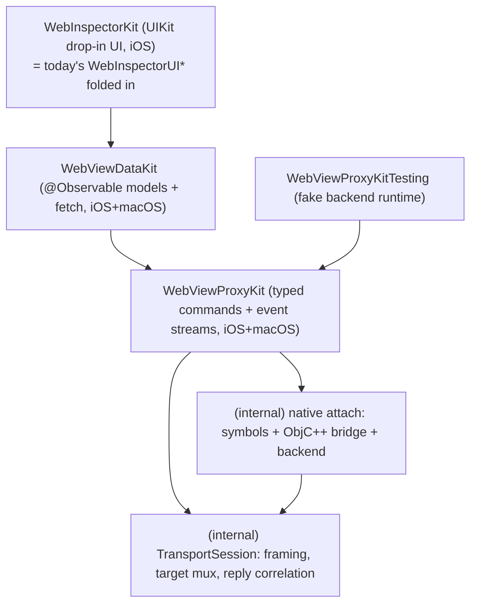

# Design Doc — Two-Layer SDK Surface (WebViewProxyKit + WebViewDataKit)

Status: proposal (2026-07-02). This document supersedes the **public-surface
direction** of [03-design-doc.md](03-design-doc.md). It keeps the scope
outcomes of [01-scope-contract.md](01-scope-contract.md) and the measured
findings of [02-findings.md](02-findings.md) as inputs, but it answers the
newer owner requirement — *"stop publishing the Observable god-model; split the
SDK into a low-level stream/command kit and a SwiftData/CoreData-style data
kit"* — which 03 did not attempt.

The style reference is `CodexKit` (`/Users/kn/Dev/CodexKit`): a low-level comm
kit (`CodexAppServerKit`) that hides JSON-RPC behind typed domain verbs and
typed event streams, and a data kit (`CodexDataKit`) that turns those streams
into `@Observable` SwiftData-style models with fetch descriptors and fetched
results controllers. We reproduce that two-layer split for the WebKit Web
Inspector protocol, but not every CodexKit behavior is copied: WebKit inspector
events are mostly live-only at the proxy layer, and replay belongs to DataKit's
materialized models where the domain semantics require it.

Naming decisions (owner-confirmed 2026-07-02):

| Layer | Module | CodexKit analog |
| --- | --- | --- |
| Low-level comm / stream kit | **`WebViewProxyKit`** | `CodexAppServerKit` |
| SwiftData/CoreData-style data kit | **`WebViewDataKit`** | `CodexDataKit` |
| In-memory test runtime | **`WebViewProxyKitTesting`** | `CodexAppServerKitTesting` |
| Drop-in UIKit inspector UI | **`WebInspectorKit`** (existing product, re-based onto `WebViewDataKit`) | — |

Owner naming choices are recorded in §10; they do not block the interfaces
below.

Signature notation: every `swift` block is the **binding interface sketch** —
it compiles conceptually, is written before implementation (api-design norm),
and the member list is the contract. Field ellipses (`// … full set = …`) point
to the measured source where the full field list already exists.

---

## 1. Layer split and package graph

### 1.1 Responsibility of each layer (one sentence each)

- **`WebViewProxyKit`** — attaches to a `WKWebView`, hides the native-symbol
  bridge and the `Target.sendMessageToTarget` multiplexing, and exposes each
  inspector protocol domain as typed async commands plus a typed event stream,
  scoped per target. **It does not accumulate semantic state** (no DOM tree, no
  request list) — it is the wire, typed.
- **`WebViewDataKit`** — consumes the proxy's event streams and turns them into
  `@Observable` models with stable identity, fetch descriptors, fetched-results
  controllers, and live observation, the way `SwiftData`/CoreData turn a store
  into models. **It is the only layer that accumulates and diffs.**

The current architecture's core defect (F-25, F-29, F-32) is that a single
`@Observable` class does *both* jobs — receives protocol events *and*
accumulates state *and* serves render-diff snapshots to the built-in UI. The
split gives each job a layer.

### 1.2 Products, dependency direction, client story



| Product | Platforms | Client story |
| --- | --- | --- |
| `WebViewProxyKit` | iOS 18+, macOS 15+ | A tool that wants a typed, streaming connection to a `WKWebView`'s inspector backend — e.g. a headless network logger, a test harness, or the data kit. |
| `WebViewDataKit` | iOS 18+, macOS 15+ | An app or UI that wants to *render and command* inspector state (DOM tree, request list, console, evaluation) as observable models without touching the wire — the second app, a future AppKit UI, custom tabs. |
| `WebViewProxyKitTesting` | iOS 18+, macOS 15+ | Tests that drive either kit deterministically over an in-memory backend with no `WKWebView` and no private symbols. |
| `WebInspectorKit` | iOS 18+ (UIKit) | Apps wanting the built-in drop-in inspector container (Monocly). |

The **entire** current `WebInspectorTransport` + `WebInspectorNativeTransport`
+ `WebInspectorNativeBridge` + `WebInspectorNativeSymbols` stack becomes
**internal to `WebViewProxyKit`** — none of it is a public product (resolves
F-02/F-10: the empty products disappear because their content is now the
private engine of one designed product). This is the same move CodexKit makes
with `JSONRPC`/`AppServerAPI`/`AppServerProcessTransport` (all `package`).

### 1.3 What moves where (from the current 16 targets)

- `WebInspectorTransport`, `WebInspectorNativeTransport`, `WebInspectorNativeBridge`,
  `WebInspectorNativeSymbols`, `WebInspectorCoreSupport` → **internal targets of
  `WebViewProxyKit`** (the typed public surface sits on top). `TransportSession`,
  `ProtocolCommand/Event`, `ProtocolCommandChannel`, `TransportReceiver`,
  `NativeInspectorBackend`, symbol resolution — all stay `package`/internal.
- The domain `@Observable` classes (`DOMSession`, `NetworkSession`,
  `ConsoleSession`, `RuntimeState`, `CSSSession`) and their `apply*` pipelines
  (`WebInspectorCore*`) → **rewritten as `WebViewDataKit` models + a private
  event-application layer.** Their *accumulation logic* is reused; their
  *dual role* (also being the public API and the render-diff source) is dropped.
- `WebInspectorUI*` + today's `WebInspectorKit` → **folded into the
  `WebInspectorKit` UIKit product** as a `WebViewDataKit` consumer (F-03/F-04
  `@_exported`/`@_disfavoredOverload` deletions carry over unchanged).

---

## 2. Variation axes and absorption points

| Axis | Absorption point | Variant-addition test |
| --- | --- | --- |
| UI toolkit / platform | Product boundary: `WebViewProxyKit` and the core `WebViewDataKit` product are toolkit-free (Foundation + WebKit only). SwiftUI conveniences, if added later, live in an optional adapter target. | Add an AppKit UI: new module importing `WebViewDataKit`. **0 files edited in either kit.** |
| Inspected target kind (page / frame / worker / service-worker) | The **`WebViewTarget`** object — each target owns its own routing and domain clients (owner answer: per-target sessions) | Add a worker inspector view: consume `proxy.targets` filtered by `.kind == .worker`. No `targetID`-matching added anywhere. |
| Protocol domain | One typed domain client per domain on `WebViewTarget`; one `apply` handler per domain in the data kit | Add a `Page`-domain consumer: 1 new client accessor + 1 event enum. No other domain touched. |
| Transport backend (native / test fake) | `package protocol TransportBackend` inside `WebViewProxyKit` + the `WebViewProxy` composition root (unchanged from today, now internal) | 1 conformer + 1 root branch. Documented as internal. |
| Run environment (live / preview / test) | Backend fake in `WebViewProxyKitTesting`, never a model-level branch | Production `WebViewProxy` / `WebViewModelContainer` run unmodified over the fake. |
| List kind (network / console) | `WebViewFetchDescriptor<Model>` + a per-model known-key-path table | Add a "storage" list later: 1 model + 1 descriptor extension. |

The **target axis** is the one the current code leaks worst (F-30: every public
ID embeds route-scoped `ProtocolTarget.ID`; targetID demux scattered across
domains). Making `WebViewTarget` the absorption point means a consumer receives
a target session and calls `target.dom.getDocument()` — the active routing
target is baked into the handle, never a parameter, and IDs it hands back are
opaque. Public target identity and internal routing identity are deliberately
separate because WebKit replaces the provisional/current route on commit.

---

## 3. WebViewProxyKit — public API

Apple analog: `NWConnection` / `URLSession` (a client actor with an async
lifecycle) whose sub-scopes (`WebViewTarget`) are `Sendable` value handles like
`CodexThread`. Everything public is `Sendable`.

### 3.1 The connection — `WebViewProxy`

```swift
// WebViewProxyKit
public actor WebViewProxy {
    public struct Configuration: Sendable {
        /// Per-command reply timeout (existing default .seconds(5)).
        public var responseTimeout: Duration
        /// Bootstrap wait for the first page target.
        public var bootstrapTimeout: Duration
        public init(responseTimeout: Duration = .seconds(5),
                    bootstrapTimeout: Duration = .seconds(5))
    }

    /// Attach to a live WKWebView. Resolves private symbols off-main, tears down
    /// any prior connection, installs the ObjC++ frontend channel, runs the
    /// Inspector/Target bootstrap, then returns once the first page target is
    /// current. Creation IS connection (CodexAppServer idiom).
    ///
    /// - Throws: `WebViewProxyError.unsupported` when the private WebKit symbols
    ///   cannot be resolved on this OS build; `CancellationError` if a newer
    ///   attach superseded this one; other `WebViewProxyError` on bridge failure.
    @MainActor
    public init(attachingTo webView: WKWebView,
                configuration: Configuration = .init()) async throws

    /// The current main page target. Survives cross-process navigation: on a
    /// provisional-target commit the underlying WebKit route ID is swapped
    /// internally and THIS handle keeps semantic identity (retargeting is
    /// invisible to callers).
    public var currentPage: WebViewTarget? { get async }

    /// Await the current page target (used right after init by consumers that
    /// want a non-optional handle).
    public func waitForCurrentPage() async throws -> WebViewTarget

    /// Live target lifecycle. A fresh independent stream per access.
    /// Replays the current target set, then yields changes.
    public nonisolated var targets: WebViewTargetChanges { get }

    /// Page-level reload (existing canReloadPage / reloadPage, promoted).
    public var canReload: Bool { get async }
    public func reload() async throws

    /// Idempotent CLEAN teardown: disconnect the frontend channel, restore
    /// isInspectable, finish all event streams normally, fail in-flight commands
    /// with `.closed`.
    public func close() async

    /// Returns normally when the connection is torn down through an SDK-owned
    /// clean close path (`close()`); throws `.disconnected` on a fatal
    /// mid-session failure (native bridge / WebContent process loss) or unknown
    /// terminal loss where the proxy did not own a clean close intent. WebKit's
    /// generic inspector channel does not provide a reliable terminal reason for
    /// every disappearance, so "web view went away" must not be inferred as
    /// clean unless the SDK observed the clean path.
    public func waitUntilClosed() async throws
}

public enum WebViewTargetChange: Sendable {
    case created(WebViewTarget)
    /// Provisional target committed. The public target identity is stable; the
    /// event exists so target-scoped DataKit caches can invalidate route-scoped
    /// derived state without exposing WebKit's old/new `Target.targetId` pair.
    /// Lifecycle of the provisional handle: before commit, the provisional
    /// target is a DISTINCT target (`.created` with `isProvisional == true`,
    /// its own temporary `WebViewTarget.ID`). At commit its route is adopted
    /// under the committed target's stable ID and the temporary ID is retired
    /// with `.destroyed(temporaryID)` — no two live targets ever share an ID.
    case committed(WebViewTarget)
    case destroyed(WebViewTarget.ID)
}

/// AsyncSequence wrapper (CodexThreadEventSequence idiom): package init, fresh
/// stream per `WebViewProxy.targets` access.
public struct WebViewTargetChanges: AsyncSequence, Sendable {
    public typealias Element = WebViewTargetChange
    public func makeAsyncIterator() -> AsyncStream<WebViewTargetChange>.Iterator
}
```

Rationale for keeping the connection deliberately thin:

- **No public `state` enum.** Re-attach = make a new `WebViewProxy`. A dead
  connection surfaces as every event stream finishing plus `waitUntilClosed()`
  returning (clean) or throwing `.disconnected` (fatal); commands after teardown
  throw `.closed` or `.disconnected` respectively. The *observable* lifecycle
  state lives one layer up, on
  `WebViewModelContext.state` (§4.1), because that is where a UI reads it —
  api-design: one owner per semantic state, and the data kit is the
  `@Observable` layer. (This corrects the current design where the connection
  object is itself the observable state, F-34.)
- **Attach ordering is load-bearing and stays internal** (transport research §3e):
  symbol resolution must fail before teardown; bridge attach must run after the
  old connection is detached. The two-stage native factory that guarantees this
  is `package` inside `WebViewProxyKit` (unchanged from today's
  `NativeAttachment` two-stage shape).

### 3.2 The per-target session — `WebViewTarget`

A `Sendable` value handle holding a `package` reference to the `WebViewProxy`
actor (CodexThread idiom). All behavior is on the domain-client accessors.

```swift
public struct WebViewTarget: Identifiable, Sendable {
    public struct ID: Hashable, Sendable { /* opaque semantic identity; not a raw Target.targetId */ }
    public enum Kind: Sendable { case page, frame, worker, serviceWorker }

    public let id: ID
    public let kind: Kind
    /// Frame this target renders, when known (page/frame targets).
    public var frameID: FrameID? { get }
    public var isProvisional: Bool { get }

    package let proxy: WebViewProxy
    package let route: RoutingTargetID

    // Typed domain clients — routing target is baked in; no targetID parameters.
    public var dom: DOM.Client { get }
    public var css: CSS.Client { get }
    public var network: Network.Client { get }
    public var console: Console.Client { get }
    public var runtime: Runtime.Client { get }
    public var page: Page.Client { get }
}

package struct RoutingTargetID: Hashable, Sendable { /* wraps the active WebKit Target.targetId */ }
public struct FrameID: Hashable, Sendable { /* opaque, wraps ProtocolFrame.ID */ }
```

Domain enabling is automatic where the protocol requires a tracked domain.
`DOM` has no real `enable`; `getDocument()` returns the document subtree WebKit
chooses to send (currently initial depth 2), and `requestChildNodes` materializes
deeper subtrees. WebKit only emits full DOM mutation events for nodes it has
already pushed to this frontend; unmaterialized parents may still surface
`childNodeCountUpdated`, but removal only updates that count when WebKit's
`hasChildren` state changes. CSS one-shot read commands (`matchedStyles`,
`computedStyle`) can run without `CSS.enable`; CSS event streams and DataKit
flows that depend on stylesheet lifecycle events enable CSS first. The
`Inspector`/`Target` bootstrap and the transport-local synthetic-result
short-circuit stay inside the engine — never surfaced.

Each domain's decoded events are **multicast** to all live `.events` iterators
for that target (the data kit's internal subscriber and any raw-proxy consumer
each receive every event — a source-side subscriber fan-out, the
`CodexAppServerNotificationRouter` equivalent, not a private per-iterator
stream). Streams are live-only (no replay); a late DOM subscriber's reseed is
owned by the data kit (§4.4), not synthesized by the proxy.

### 3.3 Typed domain surfaces

Each domain is a caseless-enum **namespace** carrying (a) a `Client` handle with
async commands and an `events` stream, (b) decoded value DTOs, (c) an `Event`
enum. Only the commands/events **currently exercised** are typed (scope
contract: no protocol coverage expansion); the full field lists reuse the
existing payload structs verbatim, minus the `Data`/method-string leaks (F-29).

Value DTOs are decoded value types; the `{id, method, params}` envelope, the
`Target.sendMessageToTarget` wrapper, and every `resultData: Data` stay
`package`.

Proxy event decoding is complete for every currently exercised method, but the
proxy never mutates semantic models. The binding coverage rule is: each typed
`*.Event` case below must have exactly one DataKit `apply*` owner that either
updates a public model field, invalidates a DataKit controller, or deliberately
records "no public model effect" in a coverage table. Unknown event methods stay
`RawEvent`; known events must not disappear between layers.

#### DOM

```swift
public enum DOM {
    public struct Client: Sendable {
        /// Primes DOM events and returns the document root for this target.
        public func getDocument() async throws -> Node
        public func requestChildNodes(_ id: Node.ID, depth: Int = 1) async throws
        public func requestNode(forRemoteObject objectID: Runtime.RemoteObject.ID) async throws -> Node.ID
        public func outerHTML(of id: Node.ID) async throws -> String
        public func removeNode(_ id: Node.ID) async throws
        public func highlightNode(_ id: Node.ID) async throws
        public func hideHighlight() async throws
        public func setInspectMode(enabled: Bool) async throws
        public func undo() async throws
        public func redo() async throws
        /// Fresh independent stream; DOM node events only flow after getDocument().
        public var events: EventStream { get }
    }

    public struct Node: Identifiable, Sendable {
        public struct ID: Hashable, Sendable { /* opaque; target+document scoped */ }
        public let id: ID
        public let nodeType: Int
        public let nodeName: String
        public let localName: String
        public let nodeValue: String
        public var attributes: [String: String]
        public var childNodeCount: Int
        public var children: [Node]?           // present only when eagerly delivered
        public var contentDocument: Node?       // same-target iframe doc
        public var shadowRoots: [Node]
        public var templateContent: Node?
        public var pseudoType: PseudoType?
        public var shadowRootType: ShadowRootType?
        // … full set = DOM.json Node shape / current DOMNode.Payload fields.
    }
    public enum PseudoType: Sendable { case before, after, /* … */ }
    public enum ShadowRootType: Sendable { case open, closed, userAgent }

    public enum Event: Sendable {
        case documentUpdated                                   // all node IDs invalid
        case setChildNodes(parent: Node.ID, nodes: [Node])
        /// WebKit can send `setChildNodes` with parent id 0 for a detached root.
        /// DataKit stores it in a private detached-root registry; it is not part
        /// of `rootNode` unless later selected or linked by a command result.
        case detachedRoot(Node)
        case childNodeInserted(parent: Node.ID, previous: Node.ID?, node: Node)
        case childNodeRemoved(parent: Node.ID, node: Node.ID)
        case childNodeCountUpdated(Node.ID, count: Int)
        case attributeModified(Node.ID, name: String, value: String)
        case attributeRemoved(Node.ID, name: String)
        case characterDataModified(Node.ID, value: String)
        case shadowRootPushed(host: Node.ID, root: Node)
        case shadowRootPopped(host: Node.ID, root: Node.ID)
        case pseudoElementAdded(parent: Node.ID, element: Node)
        case pseudoElementRemoved(parent: Node.ID, element: Node.ID)
        case inspect(Node.ID)                                  // element-picker hit
        case unknown(RawEvent)                                 // forward-compat
    }
    public struct EventStream: AsyncSequence, Sendable { public typealias Element = Event /* … */ }
}
```

#### Runtime

```swift
public enum Runtime {
    public struct Client: Sendable {
        /// `in` nil = the target's default execution context.
        /// JS exceptions are DATA (`EvaluationResult.wasThrown`), not Swift errors;
        /// `throws` is reserved for protocol/transport failure (F-29). The console
        /// evaluation policy (command-line API, `.console` object group, saveResult,
        /// user-gesture emulation) is a documented baked-in policy of this method.
        public func evaluate(_ expression: String,
                             in context: ExecutionContext.ID? = nil) async throws -> EvaluationResult
        public func properties(of object: RemoteObject.ID,
                               ownProperties: Bool = true) async throws -> [PropertyDescriptor]
        public func preview(of object: RemoteObject.ID) async throws -> ObjectPreview
        public func collectionEntries(of object: RemoteObject.ID) async throws -> [CollectionEntry]
        public func releaseObject(_ id: RemoteObject.ID) async throws
        public func releaseObjectGroup(_ group: ObjectGroup) async throws
        public var events: EventStream { get }
    }

    public struct RemoteObject: Sendable {
        public struct ID: Hashable, Sendable { /* opaque; runtime-agent scoped */ }
        public let id: ID?                    // nil for by-value primitives
        public let kind: Kind                 // typed once at decode from type/subtype
        public let subtype: Subtype?
        public let className: String?
        public let description: String?
        public let value: JSONValue?          // returnByValue primitives
        public let size: Int?
        public let preview: ObjectPreview?
    }
    public enum Kind: Sendable { case object, function, string, number, boolean, symbol,
        bigint, undefined, null, array, error /* … mapped at decode */ }
    /// OPEN wire enum preserving unknown WebKit subtype strings.
    public struct Subtype: RawRepresentable, Hashable, Sendable { public let rawValue: String }
    public enum JSONValue: Sendable { /* string, number, bool, null, array, object */ }

    public struct EvaluationResult: Sendable {
        public let object: RemoteObject
        public let wasThrown: Bool
        public let savedResultIndex: Int?
    }
    public struct ExecutionContext: Identifiable, Sendable {
        public struct ID: Hashable, Sendable { /* opaque; runtime-agent scoped */ }
        public let id: ID
        public let name: String
        public let frameID: FrameID?
        public let kind: ContextKind          // normal / user / internal
    }
    public enum ObjectGroup: Sendable { case console, other(String) }
    public struct PropertyDescriptor: Sendable {
        public let name: String
        public let value: RemoteObject?
    }
    public struct ObjectPreview: Sendable { /* text, overflow, [Entry] */ }
    public struct CollectionEntry: Sendable { /* key?, value: RemoteObject */ }

    public enum Event: Sendable {
        case executionContextCreated(ExecutionContext)
        case executionContextDestroyed(ExecutionContext.ID)
        case executionContextsCleared(target: WebViewTarget.ID)
        case unknown(RawEvent)
    }
    public struct EventStream: AsyncSequence, Sendable { public typealias Element = Event /* … */ }
}
```

#### Network

```swift
public enum Network {
    public struct Client: Sendable {
        /// WebKit `Network.enable` / `Network.disable`. DataKit calls these as
        /// lifecycle commands; proxy-only consumers may opt in explicitly.
        public func enable() async throws
        public func disable() async throws
        /// WebKit `Network.getResponseBody` (async on the wire). An unavailable
        /// or failed body is a wire ServerError, so this THROWS `.commandFailed`
        /// — there is no "empty body" success. The data kit catches the throw and
        /// maps it to `NetworkBody.Phase.failed` (§4.2); "not fetched yet" is the
        /// data kit's `Phase.available`, owned above this layer.
        public func responseBody(for id: Request.ID) async throws -> Body
        public var events: EventStream { get }
    }

    public struct Request: Identifiable, Sendable {
        public struct ID: Hashable, Sendable { /* opaque; target scoped */ }
        public let id: ID
        public let url: String
        public let method: String
        public let headers: [String: String]
        public let postData: String?
        public let referrerPolicy: ReferrerPolicy?
        public let integrity: String?
    }
    public struct Response: Sendable {
        public let url: String?
        public let status: Int?
        public let statusText: String?
        public let mimeType: String?
        public let headers: [String: String]
        public let source: Source?
        public let requestHeaders: [String: String]?
        // … timing/security stay package inside the value type (F-29 doctrine).
    }
    public struct ReferrerPolicy: RawRepresentable, Hashable, Sendable { public let rawValue: String }
    public struct Source: RawRepresentable, Hashable, Sendable { public let rawValue: String }
    public struct Metrics: Sendable { /* timestamps, durations, encoded/decoded sizes */ }
    public struct Initiator: Sendable { /* type, stackTrace, url/line/column, nodeID */ }
    public struct Body: Sendable {
        public let data: String
        public let base64Encoded: Bool
    }
    /// OPEN wire enum: unknown / feature-gated WebKit values decode into a valid
    /// instance preserving the raw string (mirrors the current RawRepresentable
    /// struct at NetworkProtocol.swift:276). The §3.4 forward-compat doctrine
    /// applies at the FIELD level, not only the event-method level — the same
    /// open-struct treatment is used for every enum decoded from a WebKit
    /// protocol string (Runtime.Kind, Console.Source/Level, CSS origin).
    public struct ResourceType: RawRepresentable, Hashable, Sendable {
        public let rawValue: String
        public init(rawValue: String)
        public static let document, stylesheet, image, font, script, xhr, fetch,
            ping, beacon, webSocket, eventSource, media, other: ResourceType
    }

    public enum Event: Sendable {
        case requestWillBeSent(id: Request.ID, request: Request, resourceType: ResourceType?,
                               redirectResponse: Response?, timestamp: Double)
        case responseReceived(id: Request.ID, response: Response, resourceType: ResourceType, timestamp: Double)
        case dataReceived(id: Request.ID, dataLength: Int, timestamp: Double)
        case loadingFinished(id: Request.ID, timestamp: Double)
        case loadingFailed(id: Request.ID, errorText: String, canceled: Bool, timestamp: Double)
        case requestServedFromMemoryCache(id: Request.ID, response: Response, timestamp: Double)
        // WebSocket family stays but is folded into one associated case set:
        case webSocket(WebSocketEvent)
        case unknown(RawEvent)
    }
    public enum WebSocketEvent: Sendable { /* created/closed/frameSent/frameReceived/… */ }
    public struct EventStream: AsyncSequence, Sendable { public typealias Element = Event /* … */ }
}
```

#### Console, CSS, Page (abbreviated — same pattern)

```swift
public enum Console {
    public struct Client: Sendable {
        public func clearMessages() async throws
        public func setLoggingChannelLevel(_ source: ChannelSource, level: ChannelLevel) async throws
        public var events: EventStream { get }
    }
    public struct Message: Sendable {
        public let source: Source, level: Level, type: Kind?
        public let text: String
        public let url: String?, line: Int?, column: Int?
        public let repeatCount: Int
        public let parameters: [Runtime.RemoteObject]
        public let stackTrace: StackTrace?
        public let networkRequestID: Network.Request.ID?   // cross-link
        public let timestamp: Double?
    }
    public struct StackTrace: Sendable { /* callFrames, parentStackTrace */ }
    public struct CallFrame: Sendable { /* functionName, url, line, column */ }
    public enum Event: Sendable {
        case messageAdded(Message)
        /// Updates the most recent message for the target. DataKit owns the
        /// private "last message per target" index used to find that model.
        case messageRepeatCountUpdated(count: Int, timestamp: Double?)
        case messagesCleared(reason: ClearReason)          // faithful wire event; the data-kit
                                                           // context RESPONDS by issuing
                                                           // Runtime.releaseObjectGroup(.console)
        case unknown(RawEvent)
    }
    // Source/Level/Kind/ClearReason: existing string enums, promoted.
}

public enum CSS {
    public struct Client: Sendable {
        public func matchedStyles(for node: DOM.Node.ID) async throws -> MatchedStyles
        public func computedStyle(for node: DOM.Node.ID) async throws -> [ComputedProperty]
        public func setStyleText(_ id: Style.ID, text: String) async throws -> Style
        public var events: EventStream { get }
    }
    public struct MatchedStyles: Sendable { /* sections, rules, inherited, pseudo */ }
    public struct Style: Identifiable, Sendable {
        public struct ID: Hashable, Sendable {/*opaque*/}
        public var properties: [Property]          // the reachable declaration list
        public var shorthandEntries: [ShorthandEntry]
        public var cssText: String
        public var range: SourceRange?
        public var width: String?
        public var height: String?
        public var isEditable: Bool
        public struct SourceRange: Sendable { /* startLine/startColumn/endLine/endColumn */ }
        public struct ShorthandEntry: Sendable { /* name/value/priority */ }
    }
    public struct Rule: Sendable {
        public var id: ID?
        public struct ID: Hashable, Sendable {/*opaque*/}
        public var selectorList: SelectorList
        public var sourceURL: String?
        public var sourceLine: Int?
        public var sourceLocation: Style.SourceRange?
        public var origin: Origin
        public var style: Style                    // sections[].style.properties[].id is reachable
        public var groupings: [Grouping]
        public var isImplicitlyNested: Bool
        public struct SelectorList: Sendable { /* selectors + text */ }
        public struct Grouping: Sendable { /* group rule metadata */ }
    }
    public struct Property: Identifiable, Sendable {
        public struct ID: Hashable, Sendable {/*opaque*/}
        public let id: ID
        public let name: String
        public let value: String
        public let priority: String?
        public let text: String?
        public let parsedOk: Bool
        public let status: Status                  // active / inactive / disabled
        public let implicit: Bool
        public let range: Style.SourceRange?
        public let isEditable: Bool
        public let isModifiedByInspector: Bool
    }
    public enum Status: Sendable { case active, inactive, disabled }
    public struct Origin: RawRepresentable, Hashable, Sendable { public let rawValue: String }
    public struct ComputedProperty: Sendable { public let name: String; public let value: String }
    public struct StyleSheetHeader: Sendable {
        public let styleSheetID: StyleSheet.ID
        public let frameID: FrameID?
        public let sourceURL: String?
        public let origin: Origin
        public let title: String?
        public let disabled: Bool
        public let isInline: Bool
        public let startLine: Int
        public let startColumn: Int
    }
    public enum StyleSheet { public struct ID: Hashable, Sendable {/*opaque*/} }
    public enum Event: Sendable {
        /// Target-wide stylesheet invalidation. WebKit's current event does not
        /// carry a style or stylesheet identifier, so this must not pretend to
        /// be `Style.ID`-scoped.
        case styleSheetChanged
        case styleSheetAdded(StyleSheetHeader)
        case styleSheetRemoved(StyleSheet.ID)
        case mediaQueryResultChanged
        case nodeLayoutFlagsChanged(DOM.Node.ID)
        case unknown(RawEvent)
    }
}

public enum Page {
    public struct Client: Sendable {
        public func reload(ignoringCache: Bool = false) async throws
    }
}
```

`Page` is command-only in the initial surface. The current implementation has no
registered Page event dispatcher, so publishing `frameNavigated` /
`frameDetached` / load events here would be protocol coverage expansion. Frame
projection needed by DataKit is currently owned by target and DOM/Network
coordinators.

### 3.4 Forward compatibility and the raw escape

Every `Event` enum ends in `case unknown(RawEvent)`; unknown domains/methods
never crash a stream (CodexKit `case unknown(CodexRawNotification)` idiom).

```swift
public struct RawEvent: Sendable {
    public let domain: String
    public let method: String
    public let params: Data            // the ONE place Data is public, and only inbound
    public func decode<T: Decodable>(_ type: T.Type = T.self) throws -> T
}
```

No public **raw send**. If a consumer needs an un-modeled command, that is a
scope escalation (add the typed command), not a reason to expose the envelope —
matching CodexKit's "public users should not need to call JSON-RPC" boundary.

### 3.5 Error model and isolation

```swift
public enum WebViewProxyError: Error, Sendable, Equatable {
    case unsupported([String])           // required private symbols missing on this OS build
    case attachFailed(String)            // ObjC++ bridge could not attach
    case closed                          // SDK-owned clean teardown (close())
    case disconnected(String)            // fatal/unknown terminal loss (bridge or WebContent invalidated)
    case commandFailed(domain: String, method: String, message: String)   // remote protocol error
    case timeout(domain: String, method: String)
}
```

- Commands are fail-fast (`throws`). A remote protocol error → `.commandFailed`;
  a dead connection → `.closed` only when the proxy owns a clean close intent, or
  `.disconnected` for fatal / unknown terminal loss; a superseded attach →
  `CancellationError`.
- JS evaluation exceptions are **data**, not Swift errors
  (`EvaluationResult.wasThrown`). A network body fetch failure is a thrown
  `.commandFailed` — there is no wire "empty body" success (§3.3); the data kit
  turns that throw into observable `NetworkBody.Phase.failed` (§4.2).
- Isolation: `WebViewProxy` is an `actor` (serializes wire state exactly as
  today's `TransportSession`). `WebViewTarget` and every DTO are `Sendable`
  value types. `init(attachingTo:)` is `@MainActor` (touches `WKWebView`). Event
  streams are unbounded `AsyncStream`s, fresh per `.events` access.

---

## 4. WebViewDataKit — public API

Apple analog: SwiftData `ModelContainer` / `ModelContext` + CoreData
`NSFetchedResultsController`. The data kit **owns** the accumulation logic that
today's `@Observable` domain classes carry (DOM tree building, request-list
ordering, console merge/repeat, runtime object lifetime) — but as private
`apply*` handlers feeding public models, not as the public API itself.

Naming: the SwiftData-analog machinery is `WebView`-prefixed (to avoid
colliding with a consumer's own `SwiftData` import — `FetchDescriptor`, `@Query`
would clash otherwise). Domain models are unprefixed within the module (§10
fork b).

### 4.1 Container and context

```swift
// WebViewDataKit
public final class WebViewModelContainer: @unchecked Sendable {
    public let proxy: WebViewProxy
    @MainActor public var mainContext: WebViewModelContext { get }

    /// Receive an existing proxy (DI / test path).
    public init(proxy: WebViewProxy)
    /// Or own one: attach and build the container in one call.
    @MainActor
    public convenience init(attachingTo webView: WKWebView,
                            configuration: WebViewProxy.Configuration = .init()) async throws

    /// Clean teardown: closes the proxy; the context observes the clean
    /// termination and moves to `.detached` (vs `.failed` for a fatal drop). This
    /// is the seam that makes the clean `.detached` state reachable.
    public func close() async
}

@MainActor
@Observable
public final class WebViewModelContext {
    public private(set) weak var container: WebViewModelContainer?
    public let proxy: WebViewProxy

    /// The observable connection lifecycle state lives HERE (single owner).
    public enum State: Sendable, Equatable { case attaching, attached, detached, failed(WebViewProxyError) }
    public private(set) var state: State
    /// Non-fatal cleanup error from explicit close/detach. The context still
    /// moves to `.detached`; startup/active failures use `state.failed`.
    public private(set) var teardownError: WebViewProxyError?

    // DOM — a tree, not a list: direct observable accessors (CodexChat.items idiom).
    public private(set) var rootNode: DOMNode?
    public func node(for id: DOMNode.ID) -> DOMNode?
    public private(set) var selectedNode: DOMNode?
    public func select(_ node: DOMNode?)

    // Runtime — contexts + evaluation.
    public private(set) var executionContexts: [RuntimeContext]
    public private(set) var selectedContext: RuntimeContext?
    public func selectContext(_ context: RuntimeContext?)
    public func evaluate(_ expression: String,
                         in context: RuntimeContext? = nil) async throws -> RuntimeEvaluation

    // Lists — fetched results (network / console).
    public func fetchedResults<Model: WebViewFetchableModel>(
        for descriptor: WebViewFetchDescriptor<Model>) -> WebViewFetchedResults<Model>
    public func fetchedResultsController<Model: WebViewFetchableModel>(
        for descriptor: WebViewFetchDescriptor<Model>) -> WebViewFetchedResultsController<Model>

    // Identity map (CodexModelContext.model(for:) idiom).
    public func registeredRequest(for id: NetworkRequest.ID) -> NetworkRequest?
    public func registeredMessage(for id: ConsoleMessage.ID) -> ConsoleMessage?

    public init(_ container: WebViewModelContainer)
}
```

The context subscribes to `proxy.targets` and each target's per-domain event
streams, and drives the `apply*` handlers on the MainActor (transport research
§3g: events already arrive main-hopped). Cross-target semantics the current code
owns — frame-document projection, console merge/retarget on provisional commit,
runtime object-group release — move **here**, into private context coordinators,
not into the proxy (which stays per-target and faithful).

### 4.2 Models

`@Observable final class`, `WebViewPersistentModel` protocol, `package`
init/mutators (only the context creates/mutates), `public private(set)` state,
weak `modelContext`, `===` identity, in-place identity-preserving updates
(CodexDataKit model idiom).

```swift
public protocol WebViewPersistentModel: AnyObject, Observable, Identifiable, Hashable, SendableMetatype
where ID: Hashable & Sendable {
    nonisolated var id: ID { get }
    @MainActor var modelContext: WebViewModelContext? { get }
}
// `Hashable` is satisfied by a nonisolated extension (=== identity /
// ObjectIdentifier hashing), so a @MainActor model meets the nonisolated
// requirements. `SendableMetatype` + `ID: Sendable` let WebViewFetchDescriptor /
// WebViewSortDescriptor and the fetched-results transaction snapshots cross the
// proxy actor / background-pump boundary (CodexPersistentModel carries the same
// bounds). Keeping models @MainActor is a deliberate divergence from CodexKit's
// nonisolated models — justified here because mutation is already MainActor-owned.

@MainActor @Observable
public final class DOMNode: WebViewPersistentModel {
    public struct ID: Hashable, Sendable { /* opaque; wraps proxy DOM.Node.ID */ }
    public let id: ID
    public private(set) var frameID: FrameID?
    public private(set) var documentURL: String?
    public private(set) var baseURL: String?
    public private(set) var nodeName: String
    public private(set) var localName: String
    public private(set) var nodeValue: String
    public private(set) var attributes: [String: String]
    public private(set) var nodeType: Int
    public private(set) var pseudoType: DOM.PseudoType?
    /// Children with an explicit loading state (the current ChildrenState).
    public enum Children: Sendable { case unrequested(count: Int); case loaded([DOMNode]) }
    public private(set) var children: Children
    public private(set) var contentDocument: DOMNode?
    public private(set) var shadowRoots: [DOMNode]
    public private(set) var templateContent: DOMNode?
    public private(set) var beforePseudoElement: DOMNode?
    public private(set) var otherPseudoElements: [DOMNode]
    public private(set) var afterPseudoElement: DOMNode?
    public var elementStyles: CSSStyles? { get }          // selection-driven, see §4.5

    // Write-back (delegates to context → currentPage.dom):
    public func requestChildren(depth: Int = 1) async
    public func highlight() async
    public func remove(undoManager: UndoManager? = nil) async throws
    public func outerHTML() async throws -> String
}

@MainActor @Observable
public final class NetworkRequest: WebViewPersistentModel, WebViewFetchableModel {
    public struct ID: Hashable, Sendable { /* opaque */ }
    public let id: ID
    public private(set) var url: String
    public private(set) var method: String
    public private(set) var resourceType: Network.ResourceType?
    public enum State: Sendable { case pending, responded, finished, failed(errorText: String, canceled: Bool) }
    public private(set) var state: State
    public private(set) var status: Int?
    public private(set) var mimeType: String?
    public private(set) var frameID: FrameID?
    public private(set) var documentURL: String?
    public private(set) var sourceMapURL: String?
    public private(set) var requestHeaders: [String: String]
    public private(set) var responseHeaders: [String: String]
    public private(set) var requestSentTimestamp: Double?
    public private(set) var requestSentWalltime: Double?
    public private(set) var responseReceivedTimestamp: Double?
    public private(set) var lastDataReceivedTimestamp: Double?
    public private(set) var finishedOrFailedTimestamp: Double?
    public private(set) var encodedDataLength: Int
    public private(set) var decodedDataLength: Int
    public private(set) var cachedResourceBodySize: Int?
    public private(set) var responseSource: Network.Source?
    public private(set) var metrics: Network.Metrics?
    public private(set) var initiator: Network.Initiator?
    public private(set) var requestBody: NetworkBody?
    public private(set) var responseBody: NetworkBody?
    public var canFetchResponseBody: Bool { get }
    /// Redirect chain — each hop keeps its own request/response. The proxy's
    /// `requestWillBeSent(redirectResponse:)` lands here.
    public private(set) var redirects: [RedirectHop]
    /// Present only for WebSocket rows (resourceType == .webSocket); the proxy's
    /// `Network.WebSocketEvent` family lands here.
    public private(set) var webSocket: WebSocketState?

    /// Fetch-on-demand; result lands in the observable `responseBody` (phase
    /// available→fetching→loaded/failed). Returns Void by design (current shape).
    public func fetchResponseBody() async
}

public struct RedirectHop: Sendable { /* request: Network.Request, response: Network.Response, timestamp: Double */ }

@MainActor @Observable
public final class WebSocketState {
    public enum ReadyState: Sendable { case connecting, open, closed }
    public private(set) var readyState: ReadyState
    public private(set) var handshakeRequest: Network.Request?
    public private(set) var handshakeResponse: Network.Response?
    public private(set) var frames: [Frame]
    public struct Frame: Sendable { /* direction, opcode, mask, payloadData/text/size, errorMessage?, timestamp */ }
}

@MainActor @Observable
public final class NetworkBody: Sendable {
    public enum Phase: Sendable { case available, fetching, loaded, failed(String) }
    public enum Role: Sendable { case request, response }
    public enum Kind: Sendable { case text, binary, image, unknown }
    public private(set) var phase: Phase
    public private(set) var role: Role
    public private(set) var kind: Kind
    public private(set) var text: String?
    public private(set) var size: Int
    public private(set) var isBase64Encoded: Bool
    public private(set) var isTruncated: Bool
    public private(set) var sourceSyntaxKind: String?
    public private(set) var textRepresentationSyntaxKind: String?
}

@MainActor @Observable
public final class ConsoleMessage: WebViewPersistentModel, WebViewFetchableModel {
    public struct ID: Hashable, Comparable, Sendable { /* opaque; ordinal-ordered */ }
    public let id: ID
    public private(set) var source: Console.Source
    public private(set) var level: Console.Level
    public private(set) var kind: Console.Kind?
    public private(set) var text: String
    public private(set) var url: String?
    public private(set) var line: Int?
    public private(set) var column: Int?
    public private(set) var repeatCount: Int
    public private(set) var parameters: [RuntimeObject]
    public private(set) var stackTrace: Console.StackTrace?
    public private(set) var networkRequestID: NetworkRequest.ID?    // cross-link
    public private(set) var timestamp: Double?
}

@MainActor @Observable public final class RuntimeContext: WebViewPersistentModel { /* id, name, frameID */ }

@MainActor @Observable
public final class RuntimeObject: WebViewPersistentModel {
    /// Opaque DataKit identity. If WebKit provides a remote object ID this wraps
    /// that ID; by-value primitives receive a context-owned synthetic ID so
    /// evaluation results and console parameters still have stable model
    /// identity.
    public struct ID: Hashable, Sendable { /* opaque */ }
    public let id: ID
    public private(set) var kind: Runtime.Kind
    public private(set) var subtype: Runtime.Subtype?
    public private(set) var className: String?
    public private(set) var value: Runtime.JSONValue?
    public private(set) var description: String?
    public private(set) var size: Int?
    public private(set) var preview: Runtime.ObjectPreview?
    public var canRequestProperties: Bool { get }
    /// Expand: returns live child objects (nil `object` for primitives), so
    /// expansion recurses without any public ID resolver (F-29).
    public func properties() async throws -> [Property]
    /// Live key→value entries for map/set/weakmap/iterator objects (WebKit
    /// Runtime.getCollectionEntries; distinct from `properties()`, which returns
    /// JS/own properties). Story B's Console tab needs this for Map/Set expansion;
    /// entries carry live child objects, so no public ID resolver is exposed.
    public func collectionEntries() async throws -> [Entry]
    public struct Property: Sendable { public let name: String; public let value: String?; public let object: RuntimeObject? }
    public struct Entry: Sendable { public let key: RuntimeObject?; public let value: RuntimeObject? }
}

@MainActor @Observable
public final class CSSStyles: WebViewPersistentModel {
    public struct ID: Hashable, Sendable { /* opaque */ }
    public let id: ID
    public enum Phase: Sendable { case loading, loaded, needsRefresh, unavailable, failed(String) }
    public private(set) var phase: Phase
    public private(set) var sections: [CSS.Rule]
    public private(set) var computedProperties: [CSS.ComputedProperty]
    /// The one CSS mutation (comment-out / re-enable a declaration). The ID is
    /// reachable via `sections[].style.properties[].id`.
    public func setProperty(_ property: CSS.Property.ID, enabled: Bool) async throws
}

public struct RuntimeEvaluation: Sendable {
    public let object: RuntimeObject
    public let isException: Bool
}
```

### 4.3 Fetch, fetched results, tree controller

The current network/console lists (append-only, growing) map exactly onto the
CoreData/CodexDataKit fetch machinery. The DOM tree does **not** (it is a tree,
so it gets a tree-shaped controller instead of pretending to be a flat fetch).
This split mirrors the data shape: lists use fetched results, tree views use a
DOM tree controller over the same `DOMNode` identity map.

```swift
public protocol WebViewFetchableModel: WebViewPersistentModel {}
// conformers: NetworkRequest, ConsoleMessage.

public enum WebViewSortOrder: Sendable { case forward, reverse }
public struct WebViewSortDescriptor<Model: WebViewFetchableModel>: Sendable, Hashable {
    // Key paths validated against a closed known-key table; preconditionFailure on
    // unsupported paths (CodexSortDescriptor idiom — fail fast, no silent guesses).
    public init<Value: Comparable>(_ keyPath: KeyPath<Model, Value>, order: WebViewSortOrder = .forward)
}

/// Fixed-field predicate per model (CodexFetchPredicate idiom), not NSPredicate.
public struct WebViewFetchPredicate<Model: WebViewFetchableModel>: Sendable, Hashable {
    // NetworkRequest: resourceTypes, urlContains, statusRange, stateFilter …
    // ConsoleMessage: levels, sources, textContains …
}

public struct WebViewFetchDescriptor<Model: WebViewFetchableModel>: Sendable, Hashable {
    public var predicate: WebViewFetchPredicate<Model>?
    public var sortBy: [WebViewSortDescriptor<Model>]
    /// Retention cap — the data kit OWNS bounded growth here, fixing the current
    /// unbounded request/console accumulation (domain research §7). nil = unbounded.
    public var retentionLimit: Int?
    public init(predicate: WebViewFetchPredicate<Model>? = nil,
                sortBy: [WebViewSortDescriptor<Model>] = [],
                retentionLimit: Int? = nil)
}

// Canned descriptors as constrained statics (CodexFetchDescriptor.recentChats idiom):
extension WebViewFetchDescriptor where Model == NetworkRequest { public static var allRequests: Self { get } }
extension WebViewFetchDescriptor where Model == ConsoleMessage { public static var allMessages: Self { get } }

@MainActor @Observable
public final class WebViewFetchedResults<Model: WebViewFetchableModel> {
    public private(set) var items: [Model]
    public private(set) var phase: WebViewDataPhase
    // Live: as network/console events arrive, items mutate in place (identity-preserving).
}

@MainActor
public final class WebViewFetchedResultsController<Model: WebViewFetchableModel> {
    public let fetchedResults: WebViewFetchedResults<Model>   // forwarded current value, no 2nd copy
    /// Ordered insert/delete/move/update transactions — the public replacement for
    /// the internal requestDisplayChanges/rowDeltas render-diff plumbing (F-32).
    /// Convert to UICollectionView/diffable data source in the UI layer.
    public var transactions: AsyncStream<Transaction> { get }
    public struct Transaction: Sendable { /* oldSnapshot, newSnapshot, itemChanges */ }
}

public enum WebViewDataPhase: Sendable, Equatable { case idle, loading, loaded, failed(String) }
```

DOM tree controller:

```swift
@MainActor
public final class DOMTreeController {
    public let root: DOMNode
    /// Ordered tree transactions — the public replacement for today's
    /// DOMTreeRenderSnapshot / requestDisplayChanges / rowDeltas path. It is
    /// not UIKit-specific; UIKit converts this to outline or collection-view
    /// diffs behind the UI boundary.
    public var transactions: AsyncStream<Transaction> { get }
    public struct Transaction: Sendable { /* expandedIDs, oldRows, newRows, nodeChanges */ }

    public func setExpanded(_ expanded: Bool, for node: DOMNode) async
    public func isExpanded(_ node: DOMNode) -> Bool
}

extension WebViewModelContext {
    public func treeController(root: DOMNode? = nil) async throws -> DOMTreeController
}
```

SwiftUI `@WebViewQuery` / environment convenience is intentionally not part of
the core DataKit binding surface because the core product is toolkit-free. If a
SwiftUI consumer becomes a first-class deliverable, add an optional
`WebViewDataKitSwiftUI` adapter target that imports SwiftUI and wraps
`WebViewFetchedResultsController` / `DOMTreeController`; do not add SwiftUI
dependencies to `WebViewDataKit`.

### 4.4 Live observation

```swift
extension WebViewModelContext {
    /// Observe a DOM subtree. The seed calls `requestChildNodes` for the observed
    /// subtree (`.unrequested` → `.loaded`) BEFORE relying on child-mutation
    /// events — WebKit only emits `childNodeInserted/Removed`/`attributeModified`
    /// for nodes it has already pushed to this frontend. It then applies live DOM
    /// events to the same context-owned nodes; `updates` is an invalidation-hint
    /// stream that does not replay (CodexChatObservation idiom).
    public func observe(_ node: DOMNode) async throws -> DOMObservation
}
public final class DOMObservation {
    public let node: DOMNode
    public typealias Updates = any AsyncSequence<DOMUpdate, Never>
    public let updates: Updates
    public func cancel()
}
public enum DOMUpdate: Sendable {
    case childrenChanged(DOMNode.ID)
    case attributesChanged(DOMNode.ID)
    case characterDataChanged(DOMNode.ID)
    case subtreeInvalidated
}
```

The doctrine (CodexDataKit): the **observable model is the data**; `updates` are
hints. UI reads `node.children` and uses updates only to invalidate. Ordered row
projection belongs to `DOMTreeController`, not to an ad-hoc UI mirror of the
tree.

### 4.5 Write-back and cross-domain wiring (all through the context)

- DOM selection → CSS: selecting a node (`context.select(_:)`) drives the CSS
  fetch and populates `node.elementStyles` (the current DOM↔CSS coordinator,
  now a private context coordinator).
- Console → Runtime: `ConsoleMessage.parameters` are live `RuntimeObject`s;
  expansion uses `RuntimeObject.properties()`. Console clear releases the
  `.console` object group.
- Console → Network: `ConsoleMessage.networkRequestID` resolves via
  `context.registeredRequest(for:)`.
- Runtime evaluation echo: `context.evaluate(...)` result object is registered;
  page-visible side effects arrive as normal console events.

---

## 5. WebViewProxyKitTesting

Borrow the `CodexAppServerKitTesting` seam, but keep WebKit wire replies
stricter: a `TestRuntime` facade + an actor fake implementing the `package
TransportBackend`, with domain-typed enqueue helpers that build **package
wire-reply types** (the `AppServerAPI.*.Response` analog), taking public DTOs
only as *inputs*, plus deterministic gates (no sleeps).
`WebViewProxyKitTesting` is a **same-package peer target** of `WebViewProxyKit`
(like `CodexAppServerKitTesting`) — a separate library product, but a
same-package peer, which is what grants it `package` visibility of the backend
seam and the wire-reply types; it is *not* a downstream public-only consumer.
Production `WebViewProxy` / `WebViewModelContainer` run unmodified over the fake
— the same data flow, no test branches in production (api-design: fake at the
lowest seam).

```swift
public struct WebViewProxyTestRuntime: Sendable {
    public var proxy: WebViewProxy
    public var backend: WebViewTestBackend
    public static func start() async throws -> WebViewProxyTestRuntime
}
public actor WebViewTestBackend {
    // Enqueue typed command replies and emit typed events. `result` is a package
    // wire-reply value (public DOM.Node/Network.Response are decode-only, §9).
    public func enqueue(_ result: some Encodable, for domain: String, method: String) async
    public func emit(_ event: Network.Event, target: WebViewTarget.ID) async
    public func emit(_ event: DOM.Event, target: WebViewTarget.ID) async
    // … per-domain overloads; targetCreated/committed/destroyed helpers.
    public func recordedCommands() async -> [RecordedCommand]
    public func hold(domain: String, method: String, gate: WebViewTestGate) async
}
public actor WebViewTestGate { public func wait() async; public func open() async }
```

`WebViewDataKitTests` depend on `WebViewProxyKitTesting` (the data kit is tested
through the proxy's fake backend, exactly like `CodexDataKitTests`).

---

## 6. Consumer usage stories

### Story A — headless second app, iOS **and** macOS (no UI import)

```swift
import WebViewDataKit

let container = try await WebViewModelContainer(attachingTo: webView)
let context = container.mainContext        // observe context.state for lifecycle

// DOM tree
if let root = context.rootNode {
    await root.requestChildren(depth: 1)
    if case .loaded(let kids) = root.children { context.select(kids.first) }
}
// styles of the selected node
let styles = context.selectedNode?.elementStyles

// Network list (bounded, live)
let requests = context.fetchedResults(for: .allRequests)   // observe requests.items
if let last = requests.items.last { await last.fetchResponseBody() /* read last.responseBody?.text */ }

// Evaluate
let result = try await context.evaluate("document.title")
print(result.isException ? "⚠️ \(result.object.description ?? "")" : result.object.description ?? "")
```

Before: impossible outside the package (F-05/F-21/F-22). Compiles on macOS
because no UIKit type is in the surface.

### Story A2 — low-level only (no data kit)

```swift
import WebViewProxyKit

let proxy = try await WebViewProxy(attachingTo: webView)
let page = try await proxy.waitForCurrentPage()
Task { for await event in page.network.events {
    if case .responseReceived(let id, let response, _, _) = event {
        log("\(response.status ?? 0) \(page.network) \(id)")
    }
} }
```

A network logger that never builds a model graph — the proxy is useful alone.

### Story B — custom Console tab in the built-in UI (the README example, made real)

```swift
import WebInspectorKit
import WebViewDataKit

let consoleTab = WebInspectorTab(id: "app_console", title: "Console", systemImage: "terminal") { session in
    ConsoleTabViewController(session: session)     // receives the existing WebInspectorSession facade
}
final class ConsoleTabViewController: UIViewController {
    let session: WebInspectorSession
    let messages: WebViewFetchedResultsController<ConsoleMessage>   // .transactions → diffable data source
    // input: guard let context = session.modelContext else { renderDetachedState(); return }
    // let r = try await context.evaluate(text); render r.object.description / properties()
}
```

Before: impossible (F-05).

### Story C — drop-in UIKit (external contract preserved)

```swift
let session = WebInspectorSession()
let vc = WebInspectorViewController(session: session)
try await session.attach(to: webView)                   // builds container+context internally
present(vc, animated: true)
```

`WebInspectorSession` remains the UIKit facade and compatibility owner. It owns
tab selection, page user-interface style, and the optional
`WebViewModelContainer` / `WebViewModelContext` created by `attach(to:)`.
`WebInspectorViewController(session:)`, `WebInspectorViewController.attach(to:)`,
and `WebInspectorTab`'s existing `(WebInspectorSession) -> UIViewController`
factory shape are preserved (F-07); internally the session now exposes
`modelContext` for custom tabs. A `WebInspectorViewController(webView:)`
convenience can be added, but it must not replace the session-based contract.

---

## 7. Where the existing UIKit UI sits

`WebInspectorKit` (the product) becomes a **consumer of `WebViewDataKit`**:

- Its view controllers render from the context's `@Observable` models and drive
  lists from `WebViewFetchedResultsController.transactions`. Note the boundary:
  `transactions` is a **data-kit public contract** (the `NSFetchedResultsController`
  analog — ordered insert/delete/move/update over an entity list), *not* a UIKit
  type and not behind the UI boundary. What it **replaces** is the internal
  `rowDeltas`/`requestDisplayChanges`/render-snapshot plumbing (F-32) that today
  leaks into the "public" model; any further render optimization the UI layers on
  top of the transactions (cell reuse, coalescing) stays behind the UI boundary.
  The DOM tree view renders from `DOMTreeController.transactions` over the same
  context-owned `DOMNode` graph.
- Today's `WebInspectorUI*` internal targets fold in (F-03 `@_exported`
  deletions carry over); `WebInspectorNativeAttachment.swift` and the
  `@_disfavoredOverload` attach decoys are deleted (F-04) — attach now goes
  through `WebInspectorSession.attach(to:)` creating a `WebViewModelContainer`.
- The UI keeps whatever internal render-diff optimization it needs, but that is
  now **behind the UI boundary**, not a data-kit contract.

`WebInspectorKit` stays iOS/UIKit-only (non-goal: no AppKit UI). A future AppKit
UI is a new module over `WebViewDataKit`, edits neither kit (§2 target test).

---

## 8. Apple analogs

| Type | Analog | Shape borrowed |
| --- | --- | --- |
| `WebViewProxy` | `NWConnection` / `URLSession` | actor client; async attach = connect; `close()` |
| `WebViewTarget` | (loose) a CDP session / `URLSessionTask` scope | `Sendable` handle; per-scope typed verbs + events |
| `*.Client.events` | `URLSession.bytes` / any `AsyncSequence` | fresh typed stream per access, `.unknown` tail |
| `WebViewModelContainer` / `WebViewModelContext` | `SwiftData.ModelContainer` / `ModelContext` | container owns connection, `@MainActor mainContext`, identity map |
| `WebViewFetchDescriptor` / `WebViewFetchedResults` | `FetchDescriptor` / `@Query` results | value descriptor + observable results |
| `WebViewFetchedResultsController` | `NSFetchedResultsController` | forwarded current value + ordered transactions |
| `DOMTreeController` | `NSFetchedResultsController` adapted to tree shape | forwarded current tree projection + ordered tree transactions |
| models (`DOMNode`, `NetworkRequest`, …) | SwiftData `@Model` classes | `@Observable`, identity, in-place update, weak context |

Verify signatures against Xcode DocumentationSearch / Apple docs at
implementation time (api-design norm), especially `NSFetchedResultsController`
change types.

---

## 9. Boundary doctrines

- **Opaque IDs.** Every public ID (`DOM.Node.ID`, `NetworkRequest.ID`,
  `RuntimeObject.ID`, `RuntimeContext.ID`, `CSSStyles.ID`, `WebViewTarget.ID`,
  `FrameID`) is a `Hashable & Sendable` struct with **package** storage.
  Consumers receive, hold, pass — never construct or decompose (F-30).
  `WebViewTarget.ID` is semantic and commit-stable; it does **not** wrap WebKit's
  route-scoped `Target.targetId` directly. Other protocol-derived IDs may carry
  the active semantic target identity plus the wire ID, while ProxyKit/DataKit
  privately remap route IDs on provisional commit. Package storage of such IDs
  must also carry a **route-generation disambiguator**: wire IDs (e.g. a network
  `requestId` string) are minted per WebContent process and can repeat after a
  cross-process commit, so semantic-target + wire ID alone is not unique across
  a commit — pre-commit rows must not collide with post-commit ones.
  **Exception:**
  `ConsoleMessage.ID` is session-global **ordinal**-scoped (commit-stable), not
  target-scoped — a page-role provisional commit is identity-preserving for
  models and their IDs (in-place update, no new ID minted), so a held
  `ConsoleMessage.ID` keeps resolving via `registeredMessage(for:)` across the
  commit. The data-kit retarget coordinator (§4.1) remaps internal routing
  without re-minting IDs.
- **No raw envelopes outbound.** `{id,method,params}`, `Target.sendMessageToTarget`,
  `resultData: Data`, method strings, `perform(_:)` never appear in public API.
  The one inbound `Data` is `RawEvent.params` (forward-compat only).
- **No public mutators.** No `apply*`, no `bindProtocolChannel`, no `reset()`.
  Proxy state changes through commands and inbound events; model state changes
  only through the context's private `apply*`. Previews/tests inject at the
  backend seam.
- **Transitive closure is the contract.** Every type reachable from a public
  member is either sketched here or an escalation — no silent publication.
- **Two layers, one direction.** `WebViewDataKit` depends on `WebViewProxyKit`;
  the proxy knows nothing of models. No `@_exported` re-export of the proxy from
  the data kit — a proxy-only consumer imports one module, a model consumer
  imports the other (they compose, they do not merge).

Avoided shapes (concrete): no `@_disfavoredOverload` attach trap-door; no
capability flags on `WebViewProxy` (platform/target differences live on
`WebViewTarget.kind` and the product boundary); no public wrapper mirroring
model state; no enum smuggling a transport type in an associated value (the CSS
`Phase`/target-payload reshape from 03 §2.6 still applies); no `WebInspectorUI`
alias target left behind.

---

## 10. Owner-decided naming choices

- **a. No non-UI umbrella product.** Owner decision (2026-07-03): consumers
  import `WebViewProxyKit` and/or `WebViewDataKit` explicitly. Do not add a
  `WebViewKit` umbrella and do not reuse the UIKit `WebInspectorKit` product as
  a non-UI umbrella. Two imports keep the layer boundary visible and avoid
  reintroducing `@_exported` coupling.
- **b. Unprefixed domain model names.** Owner decision (2026-07-03): keep domain
  models unprefixed within `WebViewDataKit` (`DOMNode`, `NetworkRequest`,
  `ConsoleMessage`, etc.). The module namespace is the collision boundary.
  SwiftData-style machinery remains `WebView`-prefixed
  (`WebViewModelContext`, `WebViewFetchDescriptor`) to avoid collisions with
  consumer imports.

Resolved during review:

- DOM ordered tree changes are a DataKit contract (`DOMTreeController`), not an
  implementation detail left to UIKit.
- `currentPage` keeps semantic identity across provisional commit; ProxyKit owns
  the hidden route-ID swap.

---

## 11. Relationship to the prior design (03) and next step

03 and this doc share phases 0–1 (scope, findings) but diverge at phase 2:

| Question | 03 (previous) | 05 (this doc) |
| --- | --- | --- |
| Public shape | Promote the `@Observable` god-model classes to public | Two kits: typed streams + SwiftData-style models |
| Products | 2 (`WebInspectorCore` engine + `WebInspectorKit` UI) | 3 (`WebViewProxyKit` + `WebViewDataKit` + `WebInspectorKit` UI) + Testing |
| Accumulation vs wire | Same class does both | Split across the two layers |
| Render-diff plumbing | Stays package on the public class | Replaced by DataKit `FetchedResultsController.transactions` / `DOMTreeController.transactions`, with UIKit-specific rendering behind the UI boundary |
| Migration cost | Lower (promote + rename) | Higher (rewrite the domain-model layer) — justified by the two-outcome unlock and by removing the god-model defect at the root (F-25/F-29/F-32) |

Next step (per the `rearchitect` workflow): this is an interface sketch, not a
gate-approved contract. Before delegating implementation, it needs (1) the full
field lists filled from the measured payload structs, (2) consumer stories
A/A2/B/C compiled as a proxy-consumer contract-test package (as 03 §8 planned),
and (3) a **coverage audit**: every
proxy `*.Event` case must have a data-kit model destination (e.g. each
`Network.Event` case — including `webSocket(_:)` and `redirectResponse` — lands
on a `NetworkRequest`/`WebSocketState` field), and every write-back command must
have an `apply*`/echo owner. Only then does it become the binding design
contract.

This design was adversarially reviewed (2026-07-02) from three lenses —
CodexKit-idiom fidelity, WebKit-protocol correctness, and api-design axis
leaks — and the confirmed defects (terminal clean-vs-fatal signal, network
body-fetch error model, open `ResourceType`, reachable `CSS.Property.ID`,
`RuntimeObject.collectionEntries`, WebSocket/redirect model state,
`SendableMetatype` bound, semantic `WebViewTarget.ID` vs. internal route ID,
`ConsoleMessage.ID` commit-stability, CSS enable semantics, DOM materialization
semantics, `DOMTreeController`, preserved `WebInspectorSession` UI facade, and
testing peer-target seam) are folded into the sections above.
