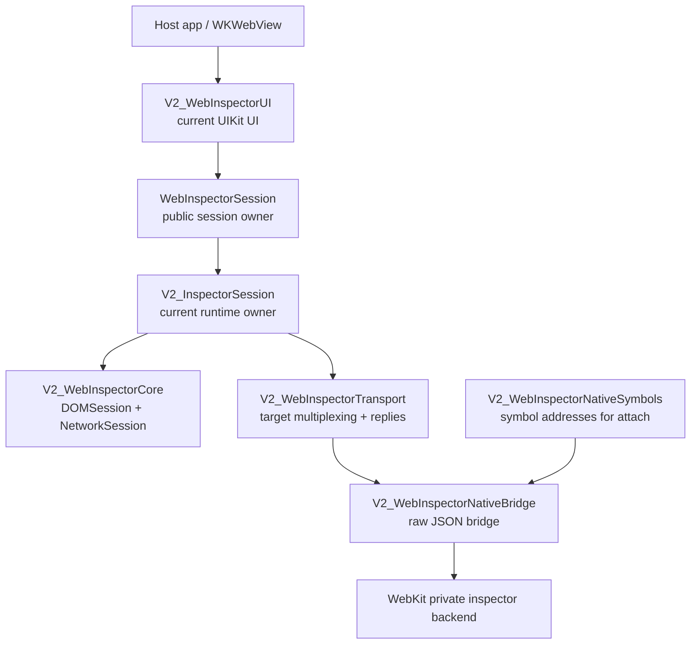
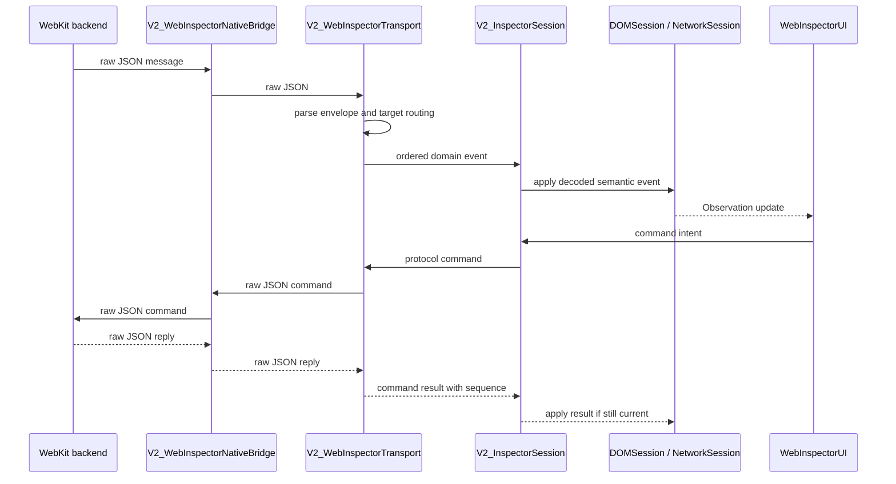
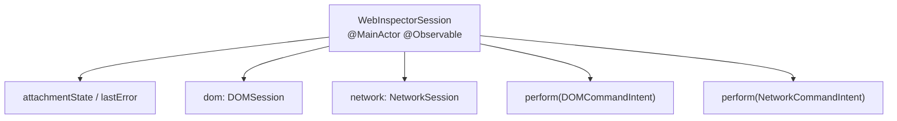

# WebInspector V2 Architecture Overview

This document is an orientation map for the current V2 inspector stack. It
focuses on module boundaries, runtime ownership, and transport flow. Detailed
UIKit containment and view-controller wiring lives in
[`V2UIIntegration.md`](../Sources/V2_WebInspectorUI/Docs/V2UIIntegration.md).

The `V2_` prefix is an implementation name. The app-facing entry points are
already `WebInspectorSession` and `WebInspectorViewController` through
`WebInspectorKit` aliases. After the V1 sources are deleted, the implementation
targets and types can be renamed in one pass to remove the prefix.

## Naming Direction

| Public / final name | Role |
| --- | --- |
| `WebInspectorSession` | UI-facing session and lifecycle owner |
| `WebInspectorViewController` | UIKit inspector container |
| `WebInspectorTab` | Public tab descriptor |
| `WebInspectorRuntime` | Session assembly target |
| `WebInspectorTransport` | Protocol command/reply and target multiplexing |
| `WebInspectorCore` | DOM/Network semantic model target |
| `WebInspectorNativeBridge` | Raw native inspector JSON bridge |
| `WebInspectorNativeSymbols` | Native symbol resolution for attach bootstrap |

`V2_WebInspectorUI` is the current UIKit implementation target. After V1 deletion
there should be one UI implementation target and one app-facing product surface.

## Layer Overview



Responsibilities stay intentionally narrow:

- `V2_WebInspectorNativeBridge`: attach, send raw JSON, receive raw JSON, detach.
- `V2_WebInspectorTransport`: parse protocol envelopes, unwrap target messages,
  route commands, manage replies, track protocol targets and execution contexts.
- `V2_InspectorSession`: bootstrap domains, own event pumps, apply decoded domain
  events to semantic sessions, perform command intents.
- `V2_WebInspectorCore`: hold `@MainActor @Observable` semantic model state for
  DOM and Network.
- `V2_WebInspectorUI`: render and interact with native UIKit/TextKit2 views.

## Event And Command Flow



The native bridge is deliberately not target-aware. Target wrapping,
`Target.dispatchMessageFromTarget` unwrapping, reply matching, and domain fan-out
belong to transport.

## Session Shape

`WebInspectorSession` is the UI-facing lifecycle owner. Package-internal UI
controllers observe the semantic sessions through the runtime owner:



The UI should receive one session object and avoid direct ownership of
transport/backend objects. Expensive work still stays outside the observable
model boundary:

- raw transport I/O
- JSON parsing
- protocol payload decoding
- DOM markup/tokenization
- search indexing
- response body decoding

## UI Integration Boundary

`V2_WebInspectorUI` owns the current UIKit/TextKit2 presentation. The root
container observes `WebInspectorSession`; DOM and Network controllers observe
the semantic sessions exposed from it.

Detailed UI diagrams are intentionally kept with the UI source:

- [`V2UIIntegration.md`](../Sources/V2_WebInspectorUI/Docs/V2UIIntegration.md)
- [`ViewControllerStructure.md`](../Sources/V2_WebInspectorUI/Docs/ViewControllerStructure.md)

## Public Surface Direction

The current public shape is intentionally small:

```swift
let session = WebInspectorSession()
let viewController = WebInspectorViewController(session: session)

try await session.attach(to: webView)
```

The important boundary is that the container observes `WebInspectorSession`, not
legacy runtime/model objects.

## Cleanup Order

1. Keep README, migration notes, and architecture notes pointed at the V2 public
   API.
2. Keep V2 regression tests for DOM, Network, transport, runtime, and UI
   behavior.
3. Delete legacy V1 sources and tests from `Package.swift`.
4. Simplify `WebInspectorKit` exports to the V2-only surface.
5. Rename V2 targets/types by dropping the `V2_` prefix.

## Avoided Shapes

- Do not keep a compatibility model that copies V2 state into V1 model objects.
- Do not keep two long-term UI implementation targets.
- Do not let UI parse raw protocol messages.
- Do not let the native bridge understand target routing.
- Do not store iframe documents as regular DOM children.
- Do not make redirect hops separate top-level network requests.
