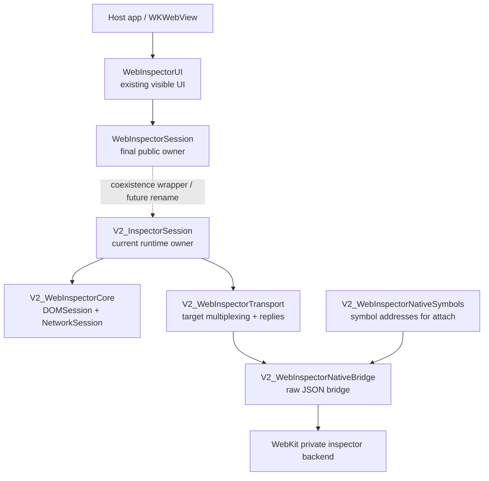
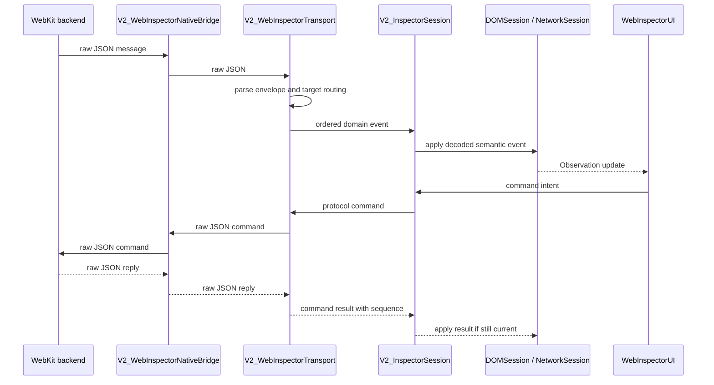
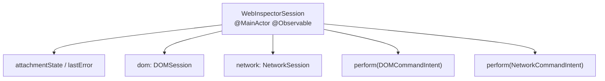

# WebInspector V2 Architecture Overview

This document is an orientation map for the V2 inspector stack. It focuses on
module boundaries, runtime ownership, and transport flow. Detailed UIKit
containment and view-controller wiring lives in
[`V2UIIntegration.md`](../Sources/WebInspectorUI/Docs/V2UIIntegration.md).

The V2 prefix is temporary. While V1 still exists, new targets and runtime types
use `V2_` names so both implementations can coexist. After V1 is removed, the
intended public owner name is `WebInspectorSession`, and the V2 prefixes can be
dropped.

## Naming Direction

| During V1/V2 coexistence | After V1 removal | Role |
| --- | --- | --- |
| `V2_InspectorSession` | `WebInspectorSession` | Runtime/orchestration owner observed by UI |
| `V2_WebInspectorRuntime` | `WebInspectorRuntime` | Session assembly target |
| `V2_WebInspectorTransport` | `WebInspectorTransport` | Protocol command/reply and target multiplexing |
| `V2_WebInspectorCore` | `WebInspectorCore` | DOM/Network semantic model target |
| `V2_WebInspectorNativeBridge` | `WebInspectorNativeBridge` | Raw native inspector JSON bridge |
| `V2_WebInspectorNativeSymbols` | `WebInspectorNativeSymbols` | Native symbol resolution for attach bootstrap |

`WebInspectorUI` does not need a separate `V2_WebInspectorUI` target. The existing
UI target should be rewired to observe `WebInspectorSession` while keeping the
same UIKit/TextKit2 presentation.

## Layer Overview



Responsibilities stay intentionally narrow:

- `V2_WebInspectorNativeBridge`: attach, send raw JSON, receive raw JSON, detach.
- `V2_WebInspectorTransport`: parse protocol envelopes, unwrap target messages,
  route commands, manage replies, track protocol targets and execution contexts.
- `V2_InspectorSession`: bootstrap domains, own event pumps, apply decoded domain
  events to semantic sessions, perform command intents.
- `V2_WebInspectorCore`: hold `@MainActor @Observable` semantic model state for
  DOM and Network.
- `WebInspectorUI`: render and interact with native UIKit/TextKit2 views.

## Event And Command Flow



The native bridge is deliberately not target-aware. Target wrapping,
`Target.dispatchMessageFromTarget` unwrapping, reply matching, and domain fan-out
belong to transport.

## Session Shape

`WebInspectorSession` should become the single UI-facing source of truth:



The UI should receive one session object and avoid direct ownership of
transport/backend objects. Expensive work still stays outside the observable
model boundary:

- raw transport I/O
- JSON parsing
- protocol payload decoding
- DOM markup/tokenization
- search indexing
- response body decoding

## UI Integration Boundary

`WebInspectorUI` should keep the current UIKit/TextKit2 presentation and replace
only its runtime/model wiring. The root container should observe
`WebInspectorSession`; DOM and Network controllers should observe the semantic
sessions exposed from it.

Detailed UI diagrams are intentionally kept with the UI source:

- [`V2UIIntegration.md`](../Sources/WebInspectorUI/Docs/V2UIIntegration.md)
- [`ViewControllerStructure.md`](../Sources/WebInspectorUI/Docs/ViewControllerStructure.md)

## Public Surface Direction

The final public shape can be simple:

```swift
let session = WebInspectorSession()
let viewController = WIViewController(session: session)

try await session.attach(to: webView)
```

The container name can be decided separately. The important boundary is that the
container observes `WebInspectorSession`, not V1 runtime/model objects.

## Migration Order

1. Add `WebInspectorSession` as the public name or thin wrapper over
   `V2_InspectorSession`.
2. Rewire DOM UI to read from `session.dom` and submit `DOMCommandIntent` through
   the session.
3. Rewire Network UI to read from `session.network` and submit
   `NetworkCommandIntent` through the session.
4. Remove V1 DOM/Network runtime dependencies from `WebInspectorUI`.
5. Delete V1 runtime/transport/model targets.
6. Rename V2 targets/types by dropping the `V2_` prefix.

## Avoided Shapes

- Do not add a `V2_WebInspectorUI` target just to mirror the existing UI.
- Do not keep a compatibility model that copies V2 state into V1 model objects.
- Do not let UI parse raw protocol messages.
- Do not let the native bridge understand target routing.
- Do not store iframe documents as regular DOM children.
- Do not make redirect hops separate top-level network requests.
