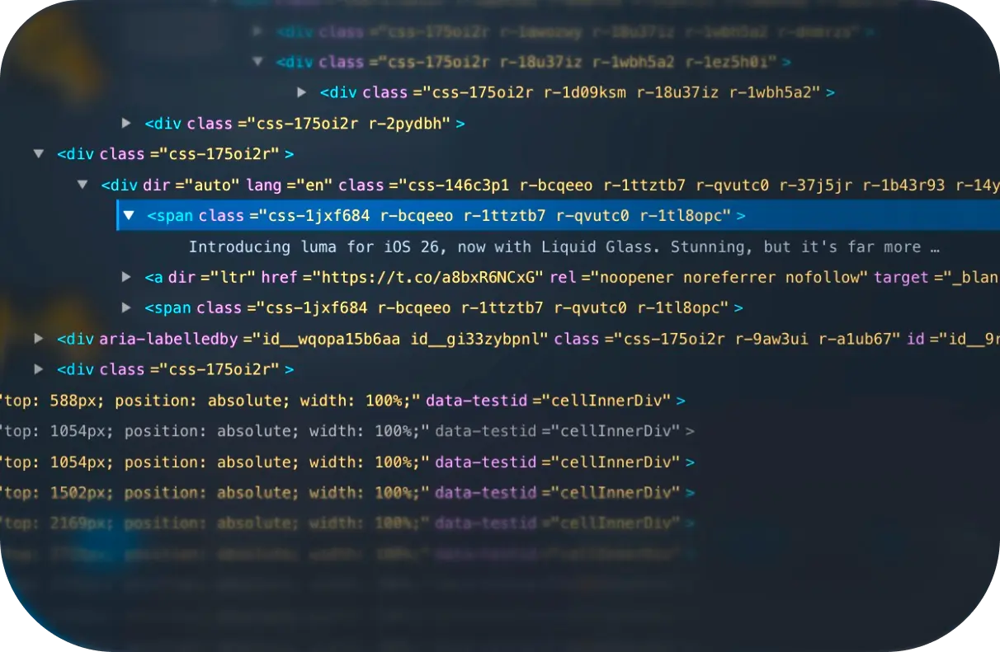

# WebInspectorKit



UIKit/AppKit-native Web Inspector for `WKWebView` (iOS / macOS).

## Products

- `WebInspectorKit` (Native UI): UIKit/AppKit container, pane descriptors, presenters, Observation state
- `WebInspectorKitCore` (Core): DOM/Network engines, runtime actors, bundled inspector scripts

`WebInspectorKit` depends on `WebInspectorKitCore`.

## Features

- DOM tree browsing (element picking, highlights, deletion, attribute editing)
- Network request logging (fetch/XHR/WebSocket) with buffering/active mode switching
- Configurable panes via `WIPaneDescriptor`
- Explicit lifecycle via `WISessionController` (`connect(to:)`, `suspend()`, `disconnect()`)
- Native presentation helpers:
  - iOS: `WISheetPresenter`
  - macOS: `WIWindowPresenter`

## Architecture (Actor-led MVVM)

- `Presentation`: `WIContainerViewController`, presenters
- `State`: `@MainActor @Observable WISessionStore`
- `Runtime`: `WIRuntimeActor`, `WIDOMRuntimeActor`, `WINetworkRuntimeActor`
- `Bridge`: `WIPageRuntimeBridge`
- Runtime events are delivered as `AsyncStream<WISessionEvent>`.

## Requirements

- Swift 6.2+
- iOS 18 / macOS 15+
- WKWebView with JavaScript enabled

## Testing

```bash
swift test
npm run test:ts
```

## Installation

Add this repository as a Swift Package dependency in Xcode and select:

- `WebInspectorKit`
- `WebInspectorKitCore`

## Quick Start (iOS)

```swift
import UIKit
import WebKit
import WebInspectorKit

final class BrowserViewController: UIViewController {
    private let pageWebView = WKWebView(frame: .zero)
    private let inspector = WISessionController()

    @objc private func presentInspector() {
        WISheetPresenter.shared.present(
            from: self,
            inspector: inspector,
            webView: pageWebView,
            tabs: [.dom(), .element(), .network()]
        )
    }
}
```

## Quick Start (macOS)

```swift
import AppKit
import WebKit
import WebInspectorKit

final class BrowserWindowController: NSWindowController {
    let pageWebView = WKWebView(frame: .zero)
    let inspector = WISessionController()

    @objc func presentInspector() {
        WIWindowPresenter.shared.present(
            parentWindow: window,
            inspector: inspector,
            webView: pageWebView,
            tabs: [.dom(), .element(), .network()]
        )
    }
}
```

## Custom Pane

```swift
let customPane = WIPaneDescriptor(
    id: "my_custom_pane",
    title: "Custom",
    systemImage: "folder",
    role: .other
) { context in
    #if canImport(UIKit)
    return UIViewController()
    #else
    return NSViewController()
    #endif
}

let container = WIContainerViewController(
    inspector,
    webView: pageWebView,
    tabs: [.dom(), .element(), .network(), customPane]
)
```

Tip: `.network()` を含めない場合、Network script は inject されません。

## Migration

See [`MIGRATION.md`](MIGRATION.md) for details on breaking changes.

## License

See [LICENSE](LICENSE).
