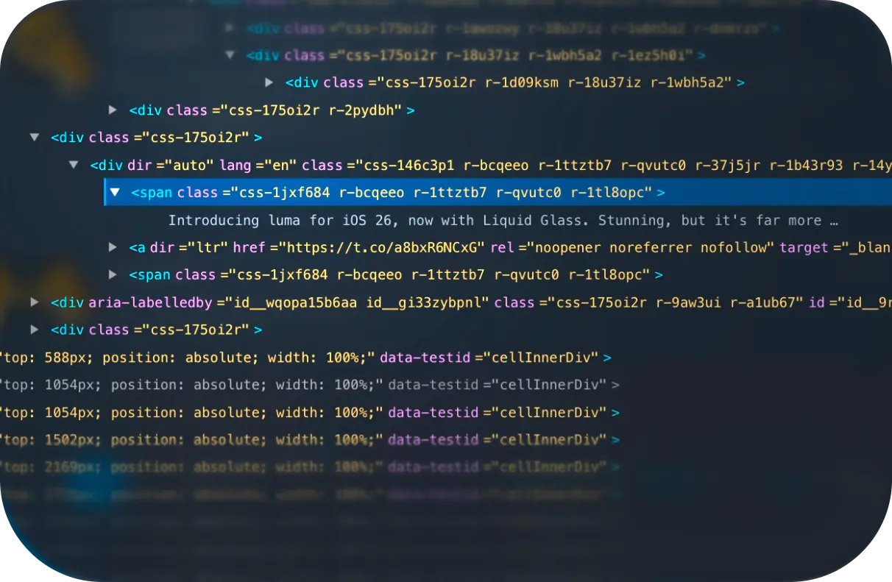

# WebInspectorKit

[日本語版 README](README.ja.md)



Web Inspector for `WKWebView` (iOS / macOS).

## Products

- `WebInspectorKit`: V2 UIKit container UI, `V2_WITab`-based tab composition, Observation state
- `WebInspectorEngine`: DOM/Network engines, runtime actors, bundled inspector scripts

`WebInspectorKit` depends on `WebInspectorEngine`.

## Features

- DOM tree browsing (element picking, highlights, deletion, attribute editing)
- Network request logging (fetch/XHR/WebSocket) with buffering/active mode switching
- Configurable V2 tabs via `V2_WITab`
- Explicit V2 lifecycle via `V2_WISession` / `V2_WIViewController` (`attach(to:)`, `detach()`)
- Dependency injection via `WIInspectorDependencies`

## Requirements

- Swift 6.2+
- iOS 18 / macOS 15+
- WKWebView with JavaScript enabled

## Quick Start

### UIKit

```swift
import UIKit
import WebKit
import WebInspectorKit

final class BrowserViewController: UIViewController {
    private let pageWebView = WKWebView(frame: .zero)

    @objc private func presentInspector() {
        let inspector = V2_WIViewController()
        inspector.modalPresentationStyle = .pageSheet
        if let sheet = inspector.sheetPresentationController {
            sheet.detents = [.medium(), .large()]
            sheet.selectedDetentIdentifier = .medium
        }
        Task { @MainActor in
            await inspector.attach(to: pageWebView)
            present(inspector, animated: true)
        }
    }
}
```

### AppKit

V2 UI is currently UIKit-only. The AppKit `WIInspectorController` / `WITabViewController`
entry point remains for compatibility, but is not the recommended architecture path and is
scheduled to be removed after V2 stabilization.

```swift
import AppKit
import WebKit
import WebInspectorKit

final class BrowserWindowController: NSWindowController {
    let pageWebView = WKWebView(frame: .zero)
    let inspector = WIInspectorController()

    @objc func presentInspector() {
        let container = WITabViewController(
            inspector,
            webView: pageWebView,
            tabs: [.dom(), .network()]
        )
        let inspectorWindow = NSWindow(contentViewController: container)
        inspectorWindow.styleMask = [.titled, .closable, .miniaturizable, .resizable]
        inspectorWindow.title = "Web Inspector"
        inspectorWindow.setContentSize(NSSize(width: 960, height: 720))
        inspectorWindow.makeKeyAndOrderFront(nil)
    }
}
```

## Custom Tab

```swift
let customTab = V2_WITab.custom(
    id: "my_custom_tab",
    title: "Custom",
    systemImage: "folder"
) { context in
    _ = context.runtime
    return UIViewController()
}

let inspector = V2_WIViewController(
    tabs: [.dom, .network, customTab]
)
```

## Dependency Injection

Keep value-only settings in `WIModelConfiguration`, and inject side-effectful runtime
boundaries through `WIInspectorDependencies`.

```swift
let dependencies = WIInspectorDependencies.testing {
    $0.network = WIInspectorNetworkClient(
        networkAgentScript: { "" }
    )
}

let inspector = V2_WIViewController(
    configuration: WIModelConfiguration(),
    dependencies: dependencies,
    tabs: [.dom, .network]
)
```

## Migration

See [`MIGRATION.md`](Docs/MIGRATION.md) for details on breaking changes.

## Contributor Workflow

- Consumers of the Swift package do not need `node`, `pnpm`, or `esbuild`.
- If you change files under `Sources/WebInspectorScripts/TypeScript`, `Plugins/WebInspectorKitObfuscatePlugin/ObfuscateJS/obfuscate.js`, or `Plugins/WebInspectorKitObfuscatePlugin/ObfuscateJS/obfuscate.config.json`, run `./Scripts/generate-bundled-js.sh`.
- `./Scripts/generate-bundled-js.sh` syncs `Plugins/WebInspectorKitObfuscatePlugin/ObfuscateJS` with `pnpm install --frozen-lockfile`, then updates `Generated/WebInspectorScriptsGenerated/CommittedBundledJavaScriptData.swift`.
- TypeScript test files stay under `Sources/WebInspectorScripts/TypeScript/Tests`, while the pnpm/vitest harness lives under `Tools/WebInspectorScriptsTypeScriptTests`, so local `node_modules` does not end up under `Sources/`.
- Commit the TypeScript/tooling change and the regenerated `CommittedBundledJavaScriptData.swift` in the same commit.

## License

See [LICENSE](LICENSE).
