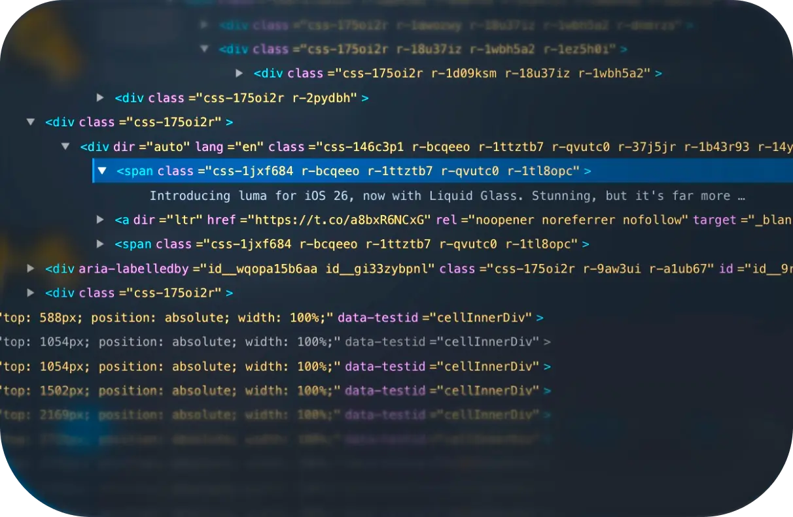

# WebInspectorKit



UIKit Web Inspector for `WKWebView`.

> [!WARNING]
> This package relies on undocumented APIs and runtime behavior, so extra care is needed before using it in App Store-bound projects.

## Features

- DOM tree browsing
- Network request logging
- Built-in DOM and Network tabs

## Requirements

- Swift 6.3+
- iOS 18.4+
- macOS 15.4+ for the non-UI products
- ARM64/ARM64e Apple runtime; Intel Mac / x86_64 simulator environments are not
  supported.

## Platform Notes

- The current implementation targets UIKit on iOS.
- AppKit support is planned to be rebuilt separately.

## Products

| Product | Use when |
| --- | --- |
| `WebKitRuntime` | You implement native WebKit features and need shared symbol discovery and scoped page access. |
| `WebInspectorKit` | You want the built-in UIKit inspector UI. |
| `WebInspectorDataKit` | You want observable DOM, Network, Console, Runtime, and CSS models for a custom UI. |
| `WebInspectorDataKitTesting` | You want deterministic `WebInspectorContext` startup synchronization in tests. |
| `WebInspectorProxyKit` | You want typed Web Inspector protocol commands and events directly over an inspected `WKWebView`. |
| `WebInspectorProxyKitTesting` | You want a controllable proxy backend and protocol fixtures without the native WebKit bridge. |

## Quick Start

### UIKit

```swift
import UIKit
import WebKit
import WebInspectorKit

final class BrowserViewController: UIViewController {
    private let pageWebView = WKWebView(frame: .zero)

    @objc private func presentInspector() {
        let inspector = WebInspectorViewController()
        inspector.modalPresentationStyle = .pageSheet
        if let sheet = inspector.sheetPresentationController {
            sheet.detents = [.medium(), .large()]
            sheet.selectedDetentIdentifier = .medium
        }
        Task { @MainActor in
            try await inspector.attach(to: pageWebView)
            present(inspector, animated: true)
        }
    }
}
```

Attaching to a loaded page populates Network with the page and frame resources
that WebKit still retains, then continues recording live requests. Restored
resources may have no HTTP status, headers, or timing information. This matches
Web Inspector's resource-tree snapshot; it does not recover every past request.
If the snapshot fails, `WebInspectorContext.networkResourceTreeError` reports
the failure while live Network recording continues.

## Tabs

```swift
let inspector = WebInspectorViewController(
    tabs: [.dom, .network]
)
```

The built-in tab surface exposes DOM and Network tabs. Apps can also add UIKit
tabs with a `UIViewController` factory:

```swift
let consoleTab = WebInspectorTab(
    id: "app_console",
    title: "Console",
    systemImage: "terminal"
) { session in
    ConsoleViewController(inspectorSession: session)
}

let inspector = WebInspectorViewController(
    tabs: [.dom, .network, consoleTab]
)
```

## Native runtime foundation

`WebKitRuntime` is a separate product for native WebKit integrations. It provides
asynchronous C++/linker symbol lookup, image and section validation, shared
successful lookup caching, and scoped access to a `WKWebView`'s native page.
It has no Inspector session or UI dependency. Objective-C++ consumers use
`WebKitRuntimeObjC.h` from the same product.

```swift
import WebKitRuntime

let symbol = RuntimeSymbol(
    .cxx("WebKit::WebPageProxy::legacyMainFrameProcessPtrForSwift() const"),
    in: .webKit,
    kind: .function
)
let resolved = try await WebKitRuntime.resolve([symbol])
```

This example resolves an optional private entry point; it does not call it or
guarantee its availability. Consumers own native calling conventions, object
layouts, and IPC schemas. Handle lookup failures for the feature that needs
them. See the `WebKitRuntime` DocC documentation for page lifetime and memory
read contracts.

## Documentation

The DocC workflow publishes [package documentation](https://lynnswap.github.io/WebInspectorKit/documentation/)
to GitHub Pages.

| Document | Purpose |
| --- | --- |
| [Migration Guide](Docs/MIGRATION.md) | Version-by-version source migration notes for app code. |
| [WebInspectorUI](Sources/WebInspectorUI/README.md) | UIKit inspector implementation notes and UI/DataKit ownership boundaries. |
| [WebKit Version Mapping](Docs/WebKitVersionMapping.md) | Local notes for mapping iOS WebKit framework versions to public WebKit source refs. |
| [Inspector Integration Fixture](Tools/InspectorFixture/README.md) | Manual verification with Monocly and fixture regression tests. |

## Project Structure

```text
Sources/
  WebInspectorKit/             Public built-in inspector product.
  WebInspectorDataKit/         Observable inspector model product.
  WebInspectorDataKitTesting/  Deterministic DataKit consumer test helpers.
  WebInspectorProxyKit/        Typed protocol proxy product.
  WebInspectorProxyKitTesting/ Controllable proxy test runtime and fixtures.
  WebInspectorUI*/             Internal UIKit implementation targets.
  WebInspectorNativeBridge*/   Internal Swift/Objective-C++ bridge targets.
  WebKitRuntime*/              Shared native runtime product targets.
Tests/
  WebInspectorNativeBridgeTests/   Native bridge and runtime tests.
  WebInspectorNativeSymbolFixtures/ Native symbol fixtures.
Docs/
  MIGRATION.md                 Version-by-version migration notes.
  WebKitVersionMapping.md      WebKit runtime/source mapping notes.
```

## License

See [LICENSE](LICENSE).
