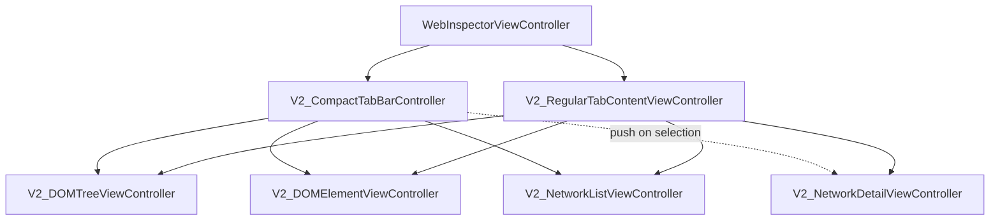
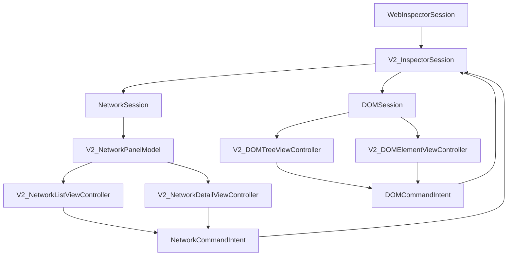
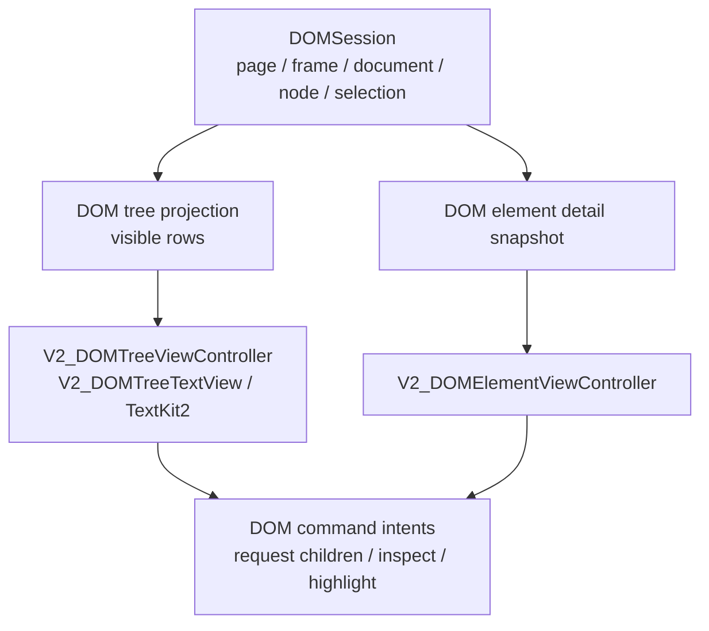
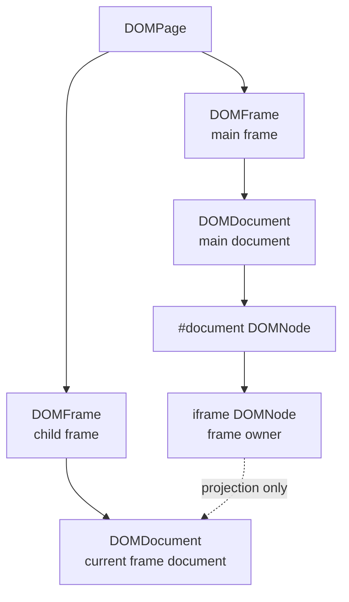
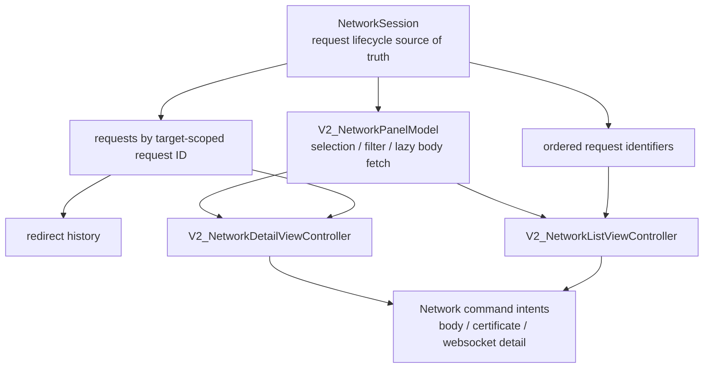

# V2 UI Integration

This document describes the current V2 UIKit inspector UI. It focuses on view
controller ownership and the boundary between UIKit presentation state and the
V2 runtime/model stack.

The visible UI is native UIKit/TextKit2. DOM and Network views render semantic
V2 model state; they do not keep copied DOM graphs, copied Network requests, or
protocol target registries.

## Current View Controller Tree

For the full UIKit containment map, see
[`ViewControllerStructure.md`](ViewControllerStructure.md).

## V2 UI Wiring

The UI receives `WebInspectorSession` and must not own transport or native bridge
objects directly.

## DOM Presentation

The DOM UI renders a projection generated from the semantic DOM model, not a
second DOM graph.

Frame documents remain frame-owned and are projected under their owner iframe:

The child frame document is not stored as a regular child of the iframe node.
This invariant prevents iframe refresh from corrupting the parent document.

## Network Presentation

Network UI observes request lifecycle state through `V2_NetworkPanelModel` and
keeps only view-local state in UIKit controllers.

The primary request identity remains target-scoped request identity. Redirects
are request history, not separate top-level requests.

## UI-Owned State

The semantic source of truth lives in `WebInspectorSession`, `DOMSession`, and
`NetworkSession`. UIKit controllers may keep only local presentation state:

- selected tab and split layout state
- scroll position
- TextKit2 fragment/view cache
- active find text and transient find UI state
- list selection presentation
- expanded/collapsed visual state when it is not semantic DOM state

The UI should not keep copied DOM nodes, copied network requests, or protocol
target registries.

## Cleanup Checkpoints

1. Keep V2 UI code reading from `WebInspectorSession`.
2. Keep DOM controllers reading from `DOMSession` projections and submitting
   `DOMCommandIntent`.
3. Keep Network controllers reading from `NetworkSession` through
   `V2_NetworkPanelModel` and submitting `NetworkCommandIntent`.
4. Move this documentation with the final UI target when the V2 target is
   renamed.
