# V2 View Controller Structure

This document shows only the V2 view-controller containment tree. Views,
processing, state, models, and tab definitions are intentionally omitted.

Arrows represent child view controllers.

For V2 runtime/model wiring, see [`V2UIIntegration.md`](V2UIIntegration.md).

## Source Layout

- `Containers`: host/wrapper view controllers. These own UIKit container
  responsibilities such as `UINavigationController`, `UITabBarController`, and
  split roots.
- `Tabs`: public tab API, layout-specific display item projection, content
  cache, and content factory.
- `DOM`: DOM-specific content view controllers, navigation items, and built-in
  DOM tab controllers.
- `Network`: Network-specific containers and built-in tab controllers. `List`
  contains the request list UI; `Detail` contains the selected entry detail UI.

```mermaid
flowchart TD
    Root["WebInspectorViewController<br/>UIViewController"]

    CompactHost["V2_CompactTabBarController<br/>UITabBarController"]
    RegularHost["V2_RegularTabContentViewController<br/>UINavigationController"]

    DOMCompactNavigation["V2_DOMCompactNavigationController<br/>UINavigationController"]
    ElementCompactNavigation["V2_DOMCompactNavigationController<br/>UINavigationController"]
    RegularDOMRoot["V2_RegularSplitRootViewController<br/>UIViewController"]
    DOMSplit["V2_DOMSplitViewController<br/>UISplitViewController"]
    NetworkCompactNavigation["V2_NetworkCompactNavigationController<br/>UINavigationController"]
    NetworkCompactList["V2_NetworkListViewController<br/>UICollectionViewController"]
    NetworkCompactDetail["V2_NetworkDetailViewController<br/>UIViewController"]
    RegularNetworkRoot["V2_RegularSplitRootViewController<br/>UIViewController"]
    NetworkSplit["V2_NetworkSplitViewController<br/>UISplitViewController"]

    CompactTree["V2_DOMTreeViewController<br/>UIViewController"]
    CompactElement["V2_DOMElementViewController<br/>UIViewController"]
    RegularTreeNavigation["V2_RegularSplitColumnNavigationController<br/>UINavigationController"]
    RegularTree["V2_DOMTreeViewController<br/>UIViewController"]
    RegularElementNavigation["V2_RegularSplitColumnNavigationController<br/>UINavigationController"]
    RegularElement["V2_DOMElementViewController<br/>UIViewController"]

    NetworkPrimaryNavigation["V2_NetworkListColumnNavigationController<br/>UINavigationController"]
    NetworkSecondaryNavigation["V2_RegularSplitColumnNavigationController<br/>UINavigationController"]
    NetworkList["V2_NetworkListViewController<br/>UICollectionViewController"]
    NetworkDetail["V2_NetworkDetailViewController<br/>UIViewController"]

    Root -->|compact| CompactHost
    Root -->|regular| RegularHost

    CompactHost --> DOMCompactNavigation
    CompactHost --> ElementCompactNavigation
    CompactHost --> NetworkCompactNavigation
    DOMCompactNavigation --> CompactTree
    ElementCompactNavigation --> CompactElement
    NetworkCompactNavigation --> NetworkCompactList
    NetworkCompactNavigation -. "push on selection" .-> NetworkCompactDetail

    RegularHost --> RegularDOMRoot
    RegularHost --> RegularNetworkRoot
    RegularDOMRoot --> DOMSplit
    RegularNetworkRoot --> NetworkSplit

    DOMSplit --> RegularTreeNavigation
    RegularTreeNavigation --> RegularTree
    DOMSplit --> RegularElementNavigation
    RegularElementNavigation --> RegularElement

    NetworkSplit --> NetworkPrimaryNavigation
    NetworkSplit --> NetworkSecondaryNavigation
    NetworkPrimaryNavigation --> NetworkList
    NetworkSecondaryNavigation --> NetworkDetail
```

