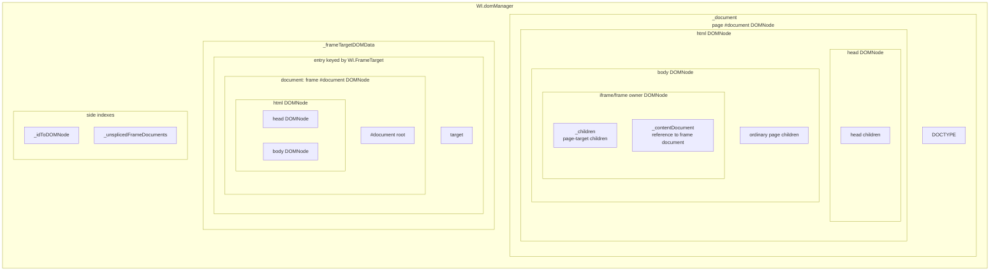
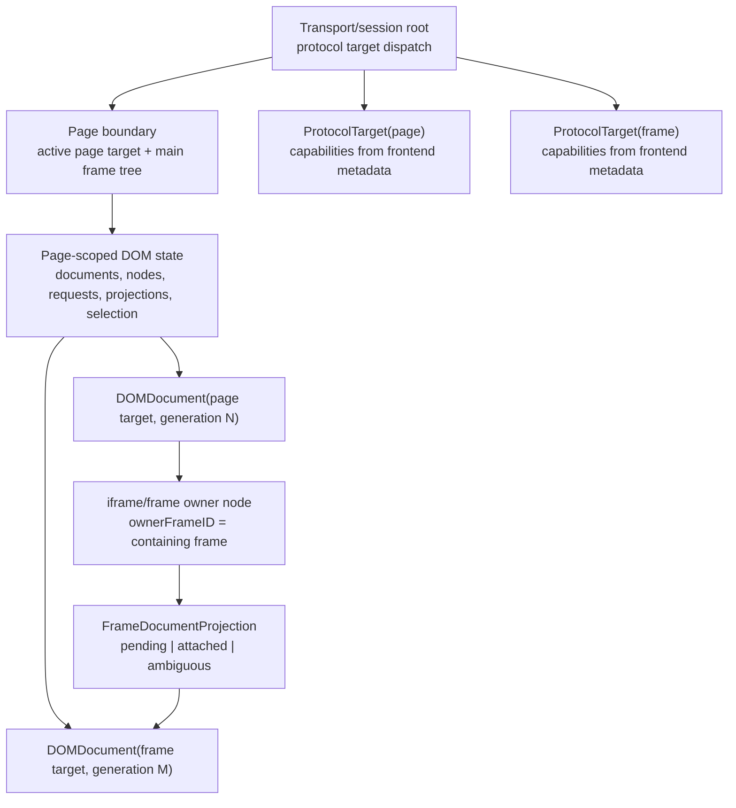

# DOM Model Research

This note records the WebKit DOM model behavior that `WebInspectorCore` is intentionally matching.

## 2026-05-14 Hypothesis Validation

The earlier debugging direction was too flow-oriented. The model boundary must
be fixed first. This section validates the current hypotheses against WebKit
source and captured WebInspector logs from cross-origin iframe pages.

- `DOM.Node.frameId` is not the iframe owner's child-frame id. The protocol
  defines it as the "Identifier of the containing frame" and
  `InspectorDOMAgent::buildObjectForNode` fills it from the node's own
  document/frame. For a page-target iframe element, that value is the page
  document's frame, not the out-of-process child document.
- `Target.TargetInfo` in current WebKit protocol contains `targetId`, `type`,
  `isProvisional`, and `isPaused`; it does not expose `frameId` or
  `parentFrameId` as protocol fields. The captured logs also show frame targets
  arriving with `frame=nil parentFrame=nil`.
- Frame target id decoding is not a model contract. Local WebKit source formats
  frame target ids as `frame-<frameID>-<processID>`, while captured runtime logs
  contain ids such as `frame-8589934597`. Treat target-id parsing only as a
  compatibility hint.
- `Runtime.ExecutionContextDescription.frameId` is "Id of the owning frame".
  It can supplement target/frame mapping, but it is not an iframe owner
  relation by itself.
- `DOM.Node.contentDocument` is the protocol field for frame owner elements,
  but Site Isolation means a cross-origin frame document often arrives through
  the frame target's `DOM.getDocument`, not as the page-target iframe payload's
  `contentDocument`.
- WebInspectorUI keeps frame-target DOM nodes target-scoped by prefixing the
  raw node id with the frame target id. It does not let raw protocol node ids
  collide across page/frame targets.
- The earlier "frame target created -> send `DOM.getDocument`" hypothesis was
  incomplete. WebInspectorUI first checks `target.hasDomain("DOM")`.
  `DOM.json` in local WebKit source has `targetTypes: ["itml", "frame",
  "page"]`, but the checked WebInspectorUI frontend metadata registers `DOM`
  only for `["itml", "page"]`. Therefore WebInspector needs a target
  capability model; target type alone is not permission to send `DOM` commands.
  Captured WebInspector iframe-page logs confirm the failure mode: 61 frame
  targets, 15 frame `DOM.getDocument` sends, 15 wrapper acknowledgements, 0
  frame `DOM.getDocument` replies, and 11 frame hydrate failures.
- WebInspectorUI does not use page reload as iframe recovery. A frame-target
  `DOM.documentUpdated` calls `_frameTargetDocumentUpdated`, which cleans up
  only that frame target and reinitializes that target's document.
- WebInspectorUI also does not synchronously reload the page document inside
  `_documentUpdated`. It calls `_setDocument(null)`, clears page node bindings,
  resets `_hasRequestedDocument`, and lets a later `requestDocument` /
  `ensureDocument` path fetch a fresh document. The later fetch is driven by
  normal frontend lifecycle paths such as target initialization and main
  resource changes; `DOM.documentUpdated` itself is not a synchronous reload
  hook. WebInspector logs that show `documentUpdated.reload.start` followed by
  `model.replaceDocumentRoot` are evidence of a WebInspector-specific race: a new shallow
  page root is being mixed with in-flight/stale page DOM events.
- `_ensurePageBodyChildrenLoaded` is not a generic missing-parent repair
  mechanism. It exists because `_unsplicedFrameDocuments` need iframe owner
  nodes to be present in `_idToDOMNode`; it requests `<html>` children if
  needed, then `<body>` children, and then retries frame document splice.
- `InspectorDOMAgent` only emits mutation events for nodes it has already bound
  for the frontend, but the meaning of WebInspector `missingParent` depends on the event:
  - `childNodeInserted`: backend only sends this when the parent is bound and
    children were requested. Missing the parent in the same document epoch is a
    WebInspector target/document/node mirror invariant breach.
  - `childNodeCountUpdated`: backend sends this when the parent is bound but
    children were not requested. A missing node after `DOM.documentUpdated` can
    be stale epoch fallout, not proof that iframe projection itself is wrong.
  - `setChildNodes`: this can be the response to `DOM.requestChildNodes` or a
    path push from `DOM.requestNode`. A missing parent means the outgoing
    request must be correlated with target id, document generation, and raw
    node id before drawing conclusions.
  The same captured logs show 169 `childNodeCountUpdated` drops,
  371 `setChildNodes` drops, and 73 `childNodeInserted` drops after page
  document replacement. That points at document-generation/request correlation
  failure, not a picker-only problem and not something to solve by blindly
  reloading the page document.
- The current WebInspectorUI frame DOM code is not a complete, copy-and-paste
  answer for WebInspector. It is guarded by target capability metadata, relies on a
  fragile URL fallback to find iframe owners, and still has FIXME markers for
  routing most frame-target DOM mutation events. WebInspector should match the invariants
  of WebInspectorUI, but it should not treat the current URL splice code as a
  stable identity model.

The immediate modeling conclusion is:

```text
Target-scoped document identity must be primary.
Target capabilities must be explicit before issuing target-scoped DOM commands.
DOM.documentUpdated must invalidate a target document generation.
DOM requests and DOM events must be correlated to the active target generation.
Frame document projection must be explicit state.
Page DOM mutation handling must preserve the current target/document mirror.
Iframe owner discovery may request page html/body children, but only as part of
pending frame-document splice, not as a standalone event-drop workaround.
```

## Reference Strategy

WebKit is the reference for protocol semantics and stable frontend invariants,
not a blanket source-level template. WebInspector should intentionally split WebKit
behavior into two groups.

Follow WebInspectorUI closely where the implementation is already a stable
contract:

- target-scoped protocol delivery via `Target.dispatchMessageFromTarget`;
- current page switching through `WI.pageTarget`, with `WI.mainTarget` resolving
  to `WI.pageTarget || WI.backendTarget`;
- current page frame-tree refresh through `NetworkManager.mainFrame` and
  `_frameIdentifierMap`;
- per-target domain availability through `target.hasDomain("DOM")`;
- page-target and frame-target documents are separate state;
- frame target document updates do not reset the parent page document;
- raw DOM node ids are target-local and must be scoped before entering the
  frontend model;
- `DOM.documentUpdated` clears/invalidates the target document instead of
  synchronously repairing another target;
- `DOM.requestNode` path materialization arrives as `setChildNodes`;
- iframe projected documents must not be erased by later ordinary
  `setChildNodes` on the owner element.

Design WebInspector independently where upstream WebInspectorUI is explicitly
transitional or incomplete:

- iframe owner discovery: upstream currently uses fragile URL matching and has
  a FIXME to replace it with frame/target identity;
- frame-target DOM mutation routing: upstream currently handles only part of
  the frame-target event surface and returns early for many mutations;
- frame-target backend sharing: `FrameDOMAgent` duplicates large parts of
  `InspectorDOMAgent` and has upstream FIXME notes to extract shared
  tree-building/binding logic and avoid traversing child frames that have their
  own frame agent;
- frame target identity threading: current `TargetInfo` does not carry
  `frameId`, `parentFrameId`, or owner node id even though the desired model
  needs that relation;
- ad iframe refresh and provisional frame commit behavior: upstream has target
  commit plumbing, but WebInspector still needs explicit generation/projection state to
  avoid corrupting the parent page DOM.

The balance is: match WebKit's proven boundaries, but do not inherit WebKit's
temporary URL fallback or missing frame-event handlers as WebInspector architecture. When
the upstream code says FIXME, WebInspector should model the intended final invariant and
use conservative fallback behavior only at the edge.

## Source Evidence

| Area | WebKit source | Relevant fact |
| --- | --- | --- |
| DOM protocol node identity | `Source/JavaScriptCore/inspector/protocol/DOM.json` | `DOM.Node.frameId` is the containing frame; `contentDocument` is the frame owner document field; `requestChildNodes(depth: -1)` means entire subtree but default is depth 1. |
| DOM target availability | `Source/JavaScriptCore/inspector/protocol/DOM.json`, `Source/WebInspectorUI/UserInterface/Protocol/Legacy/iOS/26.4/InspectorBackendCommands.js`, `Source/WebInspectorUI/UserInterface/Protocol/Target.js` | Local current protocol lists `frame` in `DOM.targetTypes`, but the checked WebInspectorUI frontend metadata registers `DOM` only for `itml` and `page`. WebInspectorUI builds each target's agents from `InspectorBackend.supportedDomainsForTargetType(target.type)`, so runtime capability must come from active frontend protocol metadata, not from target kind. |
| Backend node payload | `Source/WebCore/inspector/agents/InspectorDOMAgent.cpp` | `buildObjectForNode` sets `frameId` from the node's document frame and sets `contentDocument` only when a frame owner has an accessible content document. |
| Backend mutation contract | `Source/WebCore/inspector/agents/InspectorDOMAgent.cpp` | `didInsertDOMNode` returns when parent is not bound; otherwise it emits `childNodeCountUpdated` or `childNodeInserted` depending on whether children were requested. |
| Target protocol | `Source/JavaScriptCore/inspector/protocol/Target.json` | `TargetInfo` has no protocol-level frame id fields; `didCommitProvisionalTarget` swaps old/new target ids. |
| Frame target id implementation | `Source/WebKit/WebProcess/Inspector/FrameInspectorTarget.cpp`, captured runtime logs | Local source formats frame target ids as `frame-<frameID>-<processID>`, while runtime logs show `frame-<integer>`; target id shape is useful evidence, not a substitute for explicit model fields. |
| Main target globals | `Source/WebInspectorUI/UserInterface/Base/Main.js` | WebInspectorUI has `WI.backendTarget` and `WI.pageTarget`. `WI.mainTarget` is a getter returning `WI.pageTarget || WI.backendTarget`; there is no separate protocol page-id object. |
| Target frontend | `Source/WebInspectorUI/UserInterface/Controllers/TargetManager.js` | WebInspectorUI creates `WI.PageTarget` / `WI.FrameTarget` directly from `TargetInfo.targetId`. On provisional commit, the old target is destroyed, the new target is marked committed, and page transition managers run. |
| Target transport | `Source/WebInspectorUI/UserInterface/Protocol/TargetObserver.js` and `Connection.js` | `Target.dispatchMessageFromTarget` is routed to the target connection before domain dispatch. |
| Page frame tree | `Source/WebInspectorUI/UserInterface/Controllers/NetworkManager.js`, `Source/WebInspectorUI/UserInterface/Models/Frame.js` | Page navigation refreshes the main frame resource tree through `Page.getResourceTree`; frames are keyed by protocol frame id in `_frameIdentifierMap`. |
| Frame target DOM flow | `Source/WebInspectorUI/UserInterface/Controllers/DOMManager.js` | `initializeTarget` returns unless `target.hasDomain("DOM")`; only DOM-capable frame targets run `_initializeFrameTarget`, store a frame document separately, and attempt splice. |
| Pending splice | `Source/WebInspectorUI/UserInterface/Controllers/DOMManager.js` | `_unsplicedFrameDocuments` holds frame documents until owner iframes are available; `_ensurePageBodyChildrenLoaded` requests page html/body children. |
| Projection attach | `Source/WebInspectorUI/UserInterface/Controllers/DOMManager.js` | `_trySpliceFrameDocumentIntoNode` attaches the frame document as iframe `_contentDocument`; current fallback is exact/resolved URL match with a WebKit FIXME to use frame/target identity later. |
| Frame target document refresh | `Source/WebInspectorUI/UserInterface/Controllers/DOMManager.js` | `_frameTargetDocumentUpdated` cleans up and reinitializes only that frame target. |
| Node scoping/projection | `Source/WebInspectorUI/UserInterface/Models/DOMNode.js` | Frame-target node ids are scoped as `<target id>:<raw node id>`; commands use `backendNodeId` against the owning target; `_setChildrenPayload` returns if `_contentDocument` exists. |
| DOM event dispatch | `Source/WebInspectorUI/UserInterface/Protocol/DOMObserver.js` | DOM events are target-aware, but current frame-target routing is limited: `documentUpdated` and `setChildNodes` route to frame handlers, while many mutations still return early with a FIXME. |
| Frame target lifecycle | `Source/WebKit/UIProcess/Inspector/WebPageInspectorController.cpp`, `Source/WebKit/WebProcess/Inspector/FrameInspectorTarget.cpp` | Latest source creates frame targets only when Site Isolation frame target management is enabled. Target ids are currently formatted from frame id plus process id, and provisional frame commit sends `Target.didCommitProvisionalTarget` from old process target id to new process target id. This is implementation evidence, not a protocol-level DOM identity contract. |
| Frame DOM backend state | `Source/WebCore/inspector/agents/frame/FrameDOMAgent.cpp` | `FrameDOMAgent` exists as a frame-scoped backend DOM agent, but upstream FIXME comments still call out duplicated tree-building/binding logic and child-frame handling that should be refined. |

## 2026-05-15 DOMManager Containment

The target/page/network container shape belongs in `TransportResearch.md`.
This DOM note keeps only the WebKit DOM ownership shape.

`WI.DOMManager` is not one physical DOM tree. It owns both the page document
bucket and the frame-target document bucket. Projection connects those buckets
for display, but it does not move the frame document into the page document's
ordinary children.



This is the core containment answer:

```text
WI.domManager
  page document DOMNode
    page DOMNode tree
      iframe owner DOMNode
        _contentDocument pointer to frame document after projection
  frame target DOM data
    WI.FrameTarget object
      frame document DOMNode
        frame DOMNode tree
  node index
    page nodes and frame-target nodes
  pending frame documents
    frame documents waiting for owner discovery
```

The frame document is displayed under the iframe owner, but the frame document
is stored in the frame-target data bucket. That is the distinction WebInspector
must preserve: displayed nesting is not the same thing as ownership.

## What This Means for WebInspector

WebInspector must model these as separate concepts:

- `ProtocolTarget`: protocol routing endpoint. Owns target-local agent commands
  and target-local DOM events.
- `TargetCapabilities`: per-target domain/command/event availability. A
  `FrameTarget` without `DOM` domain support must not receive `DOM.getDocument`.
- `FrameIdentity`: WebKit frame id when known. It may come from document
  payload `frameId`, execution context `frameId`, or implementation-specific
  target id decoding only when deliberately supported.
- `DOMDocument`: target-scoped document generation and root node. Page target
  and frame target documents are never substitutes for each other.
- `DOMDocumentEpoch`: invalidation boundary created by `DOM.documentUpdated`.
  In-flight `requestChildNodes`, `requestNode`, and DOM events must be accepted
  only when they match the active target/document generation.
- `DOMNode`: node mirror scoped by target document generation plus raw
  protocol node id. `ownerFrameID` means containing frame, not child frame.
- `DOMHydrationRequest`: outgoing DOM request state keyed by target, document
  generation, and raw node id. `setChildNodes` must be interpreted through this
  request context instead of as an unqualified tree repair.
- `FrameDocumentProjection`: relation between one iframe/frame owner node and
  one frame-target document root. This is not a regular `children` array.
- `PendingFrameDocument`: frame-target document that exists but has not yet
  found its iframe owner in the page DOM.
- `PageOwnerHydration`: the WebKit `_ensurePageBodyChildrenLoaded` equivalent.
  It is keyed by page document generation and exists only to make pending
  projections discover owner iframe nodes.

The invalid model is:

```text
DOM.Node.frameId == child frame id
or
frame target type == DOM-capable target
or
frame target DOM.getDocument replaces/repairs page target document
or
page DOM.documentUpdated -> synchronous page DOM reload while old events/requests
are still in flight
or
any missing page mutation parent -> reload page DOM
```

The valid model is:

```text
ProtocolTarget(page)
  capabilities include DOM and other domains advertised for this target
  currentDocument -> DOMDocument(page generation N)
    node ids scoped to page target/generation
    iframe owner node
      projection -> DOMDocument(frame target generation M)

ProtocolTarget(frame)
  capabilities may or may not include DOM
  currentDocument? -> DOMDocument(frame target generation M)
    node ids scoped to frame target/generation, only if DOM-capable

FrameDocumentProjection(owner node, frame document root, state: pending|attached)
```

## WebKit Shape

- `DOMManager` owns the frontend node index and current document state.
- `DOMNode` instances are created from WebKit DOM protocol payloads and are indexed by protocol node identity.
- Frame targets are handled separately from the page document. A frame target document is fetched from that target and then spliced into the matching iframe as `contentDocument`.
- If the iframe owner is not yet available, WebKit keeps the frame document unspliced and retries when more page nodes are loaded.

## WebKit Site Isolation Shape

In Site Isolation mode, WebKit treats a frame as an inspector target, not as
just another subtree inside the page target:

- Each `WebFrameProxy` creation creates a `FrameInspectorTargetProxy` in
  UIProcess and a `WI.FrameTarget` in WebInspectorUI.
- The page still has a `PageInspectorTargetProxy`, but cross-origin frame
  content can live behind a different `FrameInspectorController` in another
  WebContent process.
- Frame-to-page and frame-to-frame relationships are metadata. They are not
  the lifetime owner of protocol targets.
- Commands for frame-scoped domains are routed through the target system to the
  frame target. The frontend receives frame events as
  `Target.dispatchMessageFromTarget(targetId, message)`.
- Cross-origin iframe navigation can produce a provisional frame target before
  commit. The frontend must handle `Target.didCommitProvisionalTarget` and must
  not keep using the first provisional target as the final frame target.

For DOM specifically, current WebKit source expresses the important model split
through separate page and frame target plumbing: page documents are handled by
the page target, while out-of-process frame documents can be fetched from
frame targets through `FrameDOMAgent`. WebInspector should preserve that split instead
of exposing an out-of-process frame document as ordinary page-target children.

This means a cross-origin iframe is represented by two related but separate
things:

```text
Page target DOM
  #document
    html
      body
        iframe/frame owner node

Frame target DOM
  #document
    html
      body
        ...
```

The connection between those two documents is frame/target ownership, not a
single page-target `children` array.

## WebInspectorUI Frame Document Flow

WebInspectorUI's current DOM code is a bridge between old page-DOM assumptions
and Site Isolation frame targets:

- `DOMManager.initializeTarget(target)` first returns unless
  `target.hasDomain("DOM")`. A `WI.FrameTarget` is not automatically a
  DOM-capable target.
- `DOMObserver.documentUpdated()` dispatches by target type.
  - For `WI.FrameTarget`, it calls `DOMManager._frameTargetDocumentUpdated`.
  - For the page target, it calls `DOMManager._documentUpdated`.
- `DOMManager._documentUpdated()` clears the current page document by calling
  `_setDocument(null)`. A new page document is requested later through
  `requestDocument` / `ensureDocument`, not by treating every DOM update as an
  iframe recovery reload. `_mainResourceDidChange` is one lifecycle path that
  calls `ensureDocument()` after main-frame resource changes.
- `DOMManager._initializeFrameTarget(target)` calls
  `target.DOMAgent.getDocument`, creates a `DOMNode` with `{frameTarget:
  target}`, stores it in `_frameTargetDOMData`, and then tries to splice that
  frame document into the page tree.
- `DOMNode` stores frame-target nodes under a scoped frontend id:
  `<frame target id>:<raw node id>`. The raw node id remains target-local.
- `DOMManager._spliceFrameDocumentIntoPageTree` tries to attach the frame
  document to the matching iframe owner. WebKit currently does this with URL
  matching and explicitly marks that as fragile; the desired identity is
  frame/target metadata threaded through `Target.targetCreated`.
- If the iframe owner is not yet known, the document is kept in
  `_unsplicedFrameDocuments`. `DOMManager._ensurePageBodyChildrenLoaded`
  requests page body children, and `_trySpliceUnsplicedFrameDocuments` is
  retried from both `_setChildNodes` and `_childNodeInserted`.
- `DOMManager._frameTargetDocumentUpdated(target)` cleans up only the previous
  frame-target document and then reinitializes that frame target. It does not
  reset the parent page document.
- Current `DOMObserver` frame-target support is partial. Frame-target
  `documentUpdated` and `setChildNodes` are handled, but attribute, character
  data, child insertion/removal, pseudo-element, and shadow-root events still
  return early with FIXME comments. So even the latest WebInspectorUI source is
  a transitional implementation, not the final shape of frame DOM mutation
  handling.
- `DOMNode._setChildrenPayload` returns early when the node already has a
  `contentDocument`. So a later `DOM.setChildNodes` on an iframe owner must not
  replace or erase the frame document projection.

`DOM.requestNode` explicitly promises that the node path up to the root is sent
as `setChildNodes` notifications. `DOM.setChildNodes(parentId: 0)` is the
detached-root variant used by `pushNodePathToFrontend` when the pushed node has
no parent. For normal inspect selection, WebKit walks up to the nearest bound
ancestor and then emits `setChildNodes` for real parent ids. Therefore WebInspector must
not drop `requestNode` path fragments just because the immediate parent is not
yet bound locally; it must keep those fragments in the active request/document
context and splice them when their parent appears. This is still not a reason
to reload or replace the page document.

## URL Splice Fallback Is Not a Stable Model

The upstream FIXME around `_trySpliceFrameDocumentIntoNode` is central to WebInspector:

```text
URL-based matching is fragile (breaks with redirects, blob: URLs,
about:srcdoc, query strings). Use frame identity information (frame ID or
target ID) threaded through Target.targetCreated to directly look up the parent
iframe element.
```

The current WebInspectorUI code loops over known page nodes, finds the first
`IFRAME` or `FRAME` node without `_contentDocument`, reads its `src` attribute,
and compares it against the frame document's `documentURL`, first as an exact
string and then as a resolved URL. That is a discovery fallback, not identity.

Important consequences:

- It can attach the wrong document when multiple ad iframes share the same
  `src`, when redirects change the final document URL, when the owner is
  `about:blank` before script navigation, when `srcdoc` or `blob:` is used, or
  when query strings are rewritten.
- It has no stable answer for ad iframe refreshes where the frame target
  navigates or commits in another process while the page owner node remains
  the same.
- It is order-sensitive: current WebInspectorUI attaches the first matching
  node. WebInspector should not copy that as-is. A URL fallback should attach only when
  there is a single unambiguous exact/resolved match, and otherwise leave the
  frame document pending.
- `DOM.Node.frameId` does not solve this. It is the containing frame id of the
  node that the payload belongs to, not the child frame id owned by an iframe
  element.
- Current `Target.TargetInfo` also does not solve this. The protocol payload
  exposes `targetId`, `type`, `isProvisional`, and `isPaused`, but no
  `frameId`, `parentFrameId`, or iframe owner node id.
- Latest WebKit source encodes frame id and process id into the frame target
  id (`frame-<frameID>-<processID>`), and provisional frame commit maps old and
  new target ids through `Target.didCommitProvisionalTarget`. That is useful
  evidence for a compatibility adapter, but it is not enough to identify the
  owner iframe node unless the owner relation is also exposed or derived from a
  trusted protocol path.

Therefore WebInspector needs an explicit model slot for future correct data even if the
current runtime cannot fill it:

```text
FrameIdentity
  frameID?
  targetID
  processID?
  parentFrameID?
  ownerNodeID?

FrameDocumentProjection
  ownerNodeID?
  frameTargetID
  frameDocumentID
  state: pending | attached | ambiguous
```

The correctness baseline is conservative: if WebInspector cannot resolve the owner with
explicit identity or one unambiguous URL fallback, it should keep the page DOM
intact and keep the frame document pending. Showing an iframe owner without a
projected child document is preferable to corrupting the parent page tree.

## WebInspector Model Decisions

- The transport/session root owns protocol target records and dispatch. It
  should not make page DOM state global by accident.
- Page-scoped DOM state should be owned by the page boundary that corresponds
  to the active `WI.pageTarget` / `NetworkManager.mainFrame` lifetime. When that
  page boundary is discarded, its documents, nodes, hydration requests,
  projections, revisions, and selection state should be discarded together.
- Target capabilities must be known before issuing target-scoped DOM commands.
  A target kind of `frame` is insufficient.
- `DOMNode.ID` is `targetID + documentGeneration + nodeID`, so the same protocol `nodeID` in different targets or document generations cannot collide.
- `DOMNodeCurrentKey` is only a current mirror lookup key: `targetID + nodeID`.
- `DOMNode.ownerFrameID` is the containing frame id from protocol
  `DOM.Node.frameId`. It must never be used as the iframe owner node's child
  frame id.
- `DOM.documentUpdated` advances or invalidates the target's document
  generation. Pending DOM command replies and DOM events from the old
  generation must not be applied to the new document root.
- `DOM.requestChildNodes` and `DOM.requestNode` are tracked as hydration
  requests against a target/document generation. `requestChildNodes`
  `setChildNodes` must match the requested parent. `requestNode`
  `setChildNodes` may arrive as ordered path fragments; unknown parents are
  retained as request-node path fragments within the active document generation.
- iframe documents are not stored as regular DOM children. Projection renders `DOMFrame.currentDocumentID` under the iframe owner node.
- Frame document refresh updates only that frame's current document generation and does not mutate the parent page document.
- Selection stores node identifiers and request generation, not stale node object references.

## Model Shape



## Identity Rules

- `ProtocolTarget.ID`: WebKit target identifier.
- Page boundary: the current page target lifetime plus current main frame tree.
  WebKit frontend does not expose a separate stable protocol page id.
- `DOMFrame.ID`: WebKit frame identifier when known. Do not assume current
  `TargetInfo` exposes this directly.
- `DOMDocument.ID`: `targetID + documentGeneration`.
- `DOMNode.ID`: `documentID + nodeID`.
- `DOMNodeCurrentKey`: `targetID + nodeID` for resolving the current node mirror within one target.

`backendNodeId`, URL strings, raw node ids, and `page-*` naming are not global
DOM identity. Frame target-id shape is implementation/version evidence only;
local source and captured runtime logs do not agree on a single string form. It
may be decoded deliberately as a WebKit compatibility signal, but the Core
model still needs explicit fields for target, frame, document, node, and
projection.

## Frame Documents

Frame documents are owned by the frame target's current document and projected
through `DOMFrame.currentDocumentID` / `FrameDocumentProjection`.

An iframe node does not get its child frame identity from protocol
`DOM.Node.frameId`. That value is the iframe node's containing frame. A future
explicit child-frame field can directly bind the owner; until then, owner
discovery is a separate projection step. The projected document is not stored
as an iframe regular child.

This preserves the parent page DOM when an iframe ad refreshes or navigates.

For cross-origin frames, a page-target iframe node may initially be known
before the frame-target document arrives, or the frame-target document may
arrive before the iframe owner is loaded. The model needs an explicit pending
frame-document state for this gap. Recovery should load or hydrate the missing
owner path; it should not collapse the frame document into the page document or
rebuild the page document from a shallow `DOM.getDocument` response.

## Selection

Selection is transaction based:

1. Resolve `RemoteObject.injectedScriptID` to the owning protocol target.
2. Return a `DOM.requestNode` command intent for that target.
3. Accept the result only if the selection request, target, and document generation still match.
4. On failure or stale result, update selection failure state only. Do not mutate the DOM tree.

## WebKit Order

WebInspector projection uses the WebKit DOM tree order:

```text
templateContent -> ::before -> effective children -> ::after
```

For frame owner nodes, effective children prefer the projected frame document. Regular children are not used to store the projected document.

## Intentional Differences

- WebInspector does not use URL matching as document or node identity. URL matching is
  allowed only as WebKit-compatible iframe owner discovery when there is a
  single exact/resolved match and no explicit child-frame identity is
  available.
- WebInspector does not use `backendNodeId`, URL strings, or target name prefixes as DOM identity.
- WebInspector does not refresh the parent page document as recovery for frame document updates.
- WebInspector keeps UIKit/TextKit2 out of the core model. UI rows are projection output, not source-of-truth model objects.

## Debugging Implications for Cross-Origin Iframes

When a cross-origin iframe disappears from the DOM tree view, investigate in
this order:

1. Target capabilities: confirm the frame target actually has the `DOM` domain
   in the active `InspectorBackend` frontend metadata before sending
   `DOM.getDocument`. In the checked WebInspectorUI frontend metadata, `DOM` is
   registered for `itml` and `page`, not `frame`, so a frame target must not be
   hydrated just because its `TargetInfo.type` is `frame`.
2. Target lifecycle: confirm the frame target survived provisional commit and
   the model now points at the committed target id.
3. Frame document ownership: confirm `DOM.getDocument` result for the frame
   target is stored as a frame-owned document, not as a page document
   replacement.
4. Splice state: confirm the frame document is either projected under the iframe
   owner or kept pending until the owner node is hydrated.
5. Page document updates: confirm page-target `DOM.documentUpdated` invalidates
   the page document generation and does not synchronously replace an existing
   expanded page tree with a shallow `DOM.getDocument` result while old DOM
   events/requests are still in flight.
6. Request/event correlation: for `setChildNodes` and `childNodeInserted`
   drops, inspect the target id, document generation, and originating DOM
   request before treating the event as a page-tree repair signal.
7. Selection hydration: if `DOM.requestNode` emits `setChildNodes` for missing
   parents, keep those fragments in the request-node path buffer for the active
   document generation and attach them when the parent fragment arrives. Do not
   use missing-parent logs as a reason to reload the page document.

The core invariant is: a frame document is target-scoped state. Page DOM events
may reveal or remove the iframe owner, but they do not own the frame target
document.

## Source References

- `Source/WebInspectorUI/UserInterface/Controllers/DOMManager.js`
- `Source/WebInspectorUI/UserInterface/Models/DOMNode.js`
- `Source/WebInspectorUI/UserInterface/Controllers/TargetManager.js`
- `Source/WebInspectorUI/UserInterface/Protocol/Connection.js`
- `Source/WebInspectorUI/UserInterface/Protocol/DOMObserver.js`
- `Source/WebKit/UIProcess/Inspector/WebPageInspectorController.cpp`
- `Source/WebKit/UIProcess/Inspector/FrameInspectorTargetProxy.cpp`
- `Source/WebCore/inspector/agents/InspectorDOMAgent.cpp`
- `Source/WebCore/inspector/agents/frame/FrameDOMAgent.cpp`
- `Source/JavaScriptCore/inspector/protocol/DOM.json`
- `Source/WebInspectorUI/UserInterface/Protocol/Legacy/iOS/26.4/InspectorBackendCommands.js`
