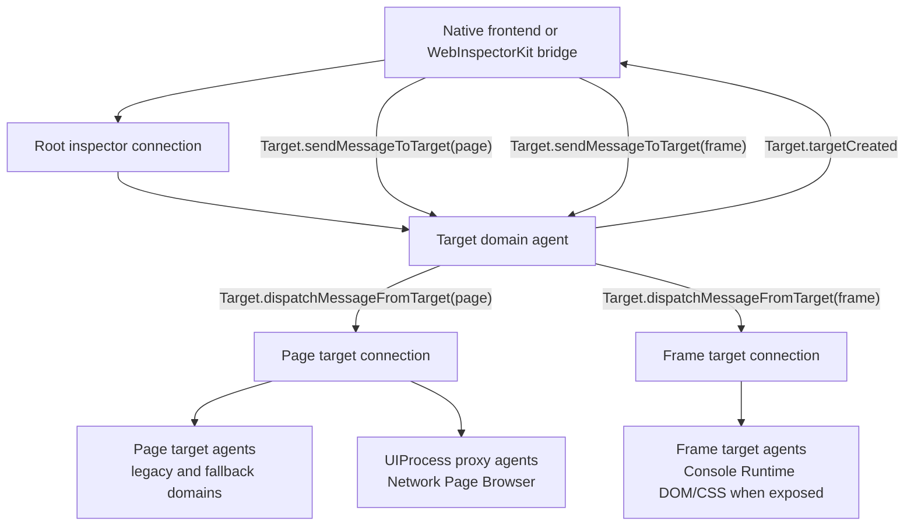
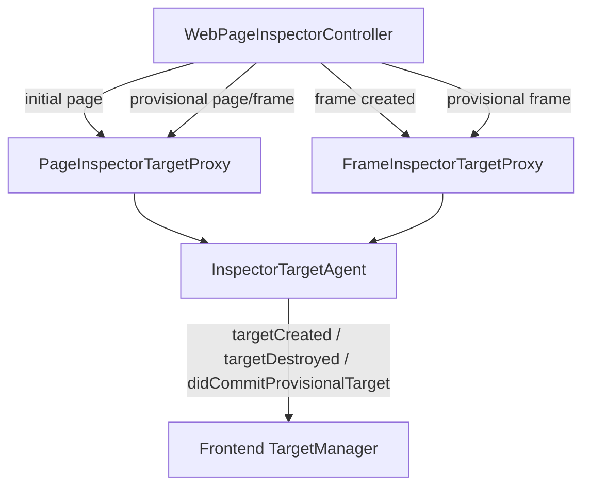
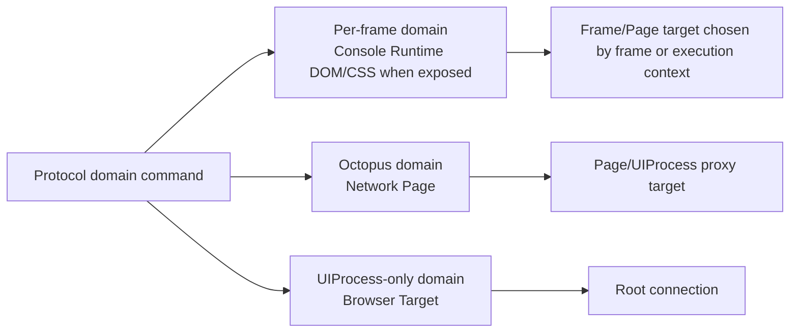

# Transport Research

This note records the WebKit inspector transport behavior that `WebInspectorTransport` is intentionally matching.

## Scope

Transport owns:

- private WebKit inspector API communication
- root protocol command/reply handling
- `Target` domain lifecycle and subtarget routing
- frame/execution-context ownership facts needed by DOM, CSS, Runtime, Console, and Network
- off-main raw parsing and protocol payload decode before semantic events reach `@MainActor` models

UI, TextKit2 rows, and model mutation are not transport responsibilities.

## WebKit Transport Shape

WebKit uses one root inspector connection plus target-scoped sub-connections.



Important details:

- `Target.TargetInfo` contains `targetId`, `type`, optional `isProvisional`, and optional `isPaused`.
- Target types include `page`, `frame`, `service-worker`, and `worker`.
- `Target.sendMessageToTarget` sends a JSON protocol command string to a target's agents.
- `Target.dispatchMessageFromTarget` returns a JSON protocol response or event string from that target.
- `Target.didCommitProvisionalTarget` swaps an old target id with a committed target id.
- WebInspectorUI represents each subtarget with `InspectorBackend.TargetConnection`; that connection sends through the parent target's `TargetAgent.sendMessageToTarget`.

## Official Site Isolation Explainer

The official WebKit Site Isolation explainer confirms and refines this model:

- In Site Isolation mode, each `WebFrameProxy` gets a `FrameInspectorTargetProxy` and a frontend `FrameTarget`.
- Frame targets represent individual frames and may point at different WebContent processes.
- Frame parent/child relationships are optional data. They must not drive target lifetime semantics.
- Commands targeted at a frame are routed through the target system to that frame's `FrameInspectorController`.
- Frame targets can be provisional. The frontend must handle `Target.didCommitProvisionalTarget` and must not keep using the old provisional target id.
- Domains fall into two migration patterns:
  - per-frame domains: command/event IDs are scoped per target, and the frontend must pair protocol IDs with the target that produced them.
  - octopus domains: each WebContent process has a proxy agent and UIProcess owns an aggregator/proxying agent that presents one unified frontend domain.

This changes one important design point from the earlier local-source-only read: `Network` and `Page` should not be treated as ordinary frame-target domains. WebKit's Site Isolation design keeps them as page/UIProcess proxy domains with per-WebContent instrumentation feeding the UIProcess aggregator.

## Backend Target Lifecycle

WebKit's UIProcess inspector controller creates target proxies and sends target lifecycle events to the frontend.



Transport implications:

- Page and frame targets are first-class protocol targets.
- Frame target lifecycle is not a page document reset.
- A committed provisional page target can reset the main page model, but a committed provisional frame target should update only frame-target ownership.
- Target identity must come from WebKit target ids. Prefixes, URLs, and current DOM document shape are not identity.
- Target commands must be routed by target id and domain support, not by "current page" guessing.

## WebCore Inspector Agents

`Source/WebCore/inspector` confirms that protocol domains are implemented as per-target agents.

Key findings:

- `FrameDOMAgent` exists separately from page `InspectorDOMAgent`.
- `FrameRuntimeAgent` and `PageRuntimeAgent` both emit `Runtime.executionContextCreated` with `frameId`.
- `InspectorNetworkAgent` emits `Network.requestWillBeSent` with `requestId`, `frameId`, `loaderId`, optional protocol resource type, and optional payload `targetId`.
- `InspectorIdentifierRegistry` is the shared frame/loader id source used by Page, Runtime, Network, CSS, and other agents.
- Under Site Isolation, `BackendIdentifierRegistry` derives deterministic protocol frame ids so UIProcess and WebProcess can agree without ad-hoc frontend sync.
- `FrameDOMAgent` currently has a FIXME to set `frameId` on frame-target document payloads, so target-to-frame association cannot rely on the DOM root payload alone.

This means the WebInspector transport needs to capture target/frame/execution-context facts at the protocol envelope boundary and pass them to domain models as already-resolved semantic ownership.

## Domain Routing Categories

WebInspector transport should route by protocol domain category, not by a blanket "send every command to the selected node's target" rule.



Rules:

- Per-frame domains use target-based multiplexing directly. Protocol IDs such as node ids, stylesheet ids, script ids, and execution context ids must be paired with the target that produced them.
- Octopus domains present a unified page-level domain. The UIProcess proxy agent handles command dispatch, source-process lookup, ID remapping, and aggregation.
- UIProcess-only domains stay on the root/page inspector controller and should not be projected into DOM or Network models.
- Domain support is capability based. WebInspector should not assume that every target exposes every domain.

## WebInspectorUI Behavior

WebInspectorUI keeps target routing and domain models separate.

`TargetManager`:

- stores targets by `target.identifier`
- creates `PageTarget`, `FrameTarget`, and worker targets from `Target.targetCreated`
- destroys targets from `Target.targetDestroyed`
- commits provisional targets via `Target.didCommitProvisionalTarget`
- dispatches target messages into each target's own connection

`NetworkManager`:

- initializes `Page`, `Network`, and other agents per target when available
- maps `Runtime.executionContextCreated.frameId` to a frame
- under Site Isolation, expects frame targets to report their own contexts
- explicitly notes incomplete advanced multi-target support for some Network commands

`DOMManager`:

- stores frame documents separately before splicing into an iframe
- still has a FIXME for URL-based iframe matching
- notes that frame identity should be threaded through target/frame information instead of URL matching

WebInspector should preserve the good boundary from WebInspectorUI, but avoid inheriting its URL-based frame document splice fallback.

## External Site Isolation Report

The inspectdev issue [iOS 26+ Support: Adapt to WebKit Site Isolation and Frame Target Architecture](https://github.com/inspectdev/inspect-issues/issues/241) reports the same architecture shift:

- iOS 26 moves toward Frame targets as first-class inspection targets.
- Domains such as DOM, CSS, Runtime, Debugger, and Console may live on frame targets.
- Clients that expect all domains on a Page target fail with "domain was not found" errors.
- Safari Web Inspector works because it tracks targets and routes commands through the new target architecture.

This is consistent with the WebKit source findings above.

## WebInspector Transport Design Consequences

The WebInspector transport owns protocol routing facts and produces decoded semantic
events/command results for domain models.

Recommended ownership:

```text
WebInspector transport
  ├─ root connection
  ├─ command id / reply table
  ├─ target table
  │   ├─ target id
  │   ├─ target kind
  │   ├─ provisional / paused state
  │   └─ known frame id when available
  ├─ frame/execution-context index
  │   ├─ frame id -> target id candidates
  │   └─ execution context id -> target id
  └─ ordered domain event streams
      ├─ DOM
      ├─ CSS
      ├─ Runtime
      ├─ Console
      └─ Network
```

Domain models should not parse raw nested target messages and should not infer target ownership from URLs, target prefixes, or stale selection state.

## Command Routing Rules

Root commands:

- Use the root connection directly.
- Examples: target lifecycle setup commands such as `Target.setPauseOnStart`, `Target.resume`, and `Target.sendMessageToTarget`.

Target commands:

- Encode the inner protocol command as JSON.
- Send it through root `Target.sendMessageToTarget(targetId, message)`.
- Track the inner command reply under `(targetId, innerCommandId)`.
- Treat `Target.sendMessageToTarget` itself as transport delivery, not the domain command result.
- Decode the actual domain response when it returns through `Target.dispatchMessageFromTarget(targetId, message)`.

Octopus domain commands:

- Route to the page/UIProcess proxy domain, not to a frame target.
- Preserve the user-facing protocol id and any source-process/resource key metadata carried by the command result.
- Do not make domain models guess source process from URL, frame tree position, or request timing.

Event routing:

- Decode the root event envelope first.
- If it is `Target.dispatchMessageFromTarget`, parse the nested message off-main and route it to that target's domain stream.
- Preserve target-local ordering for events and replies.
- Do not let a slow DOM or Network decoder block delivery to unrelated domains.

## Frame and Execution Context Rules

Frame ownership is a transport-level fact, not a DOM tree guess.

- Prefer explicit frame metadata from target lifecycle, Page frame tree, and Runtime execution contexts.
- Use `Runtime.executionContextCreated.frameId` plus the target connection that delivered it to map `executionContextID -> targetID`.
- Use deterministic Site Isolation frame ids as stable frame graph keys.
- If a frame target document payload lacks `frameId`, attach it through transport's `targetID -> frameID` knowledge.
- If target-to-frame is unknown, keep the frame document pending. Do not refresh or replace the parent page document as recovery.

## Network / Page Octopus Notes

Network and Page are special under Site Isolation:

- Network/Page commands are handled by UIProcess proxy agents.
- WebContent-side proxy agents capture instrumentation data and forward it to UIProcess.
- `Network.getResponseBody` must be routed by the UIProcess proxy to the WebContent process that actually loaded the resource.
- `ResourceLoaderIdentifier` can collide across WebContent processes, so backend-facing lookup needs a source-process-qualified resource key.
- WebInspector's frontend-facing `NetworkRequest.ID` can remain `targetID + requestID`, but transport must be ready to carry a separate backend resource identity for body/certificate/lazy fetch commands.
- `requestWillBeSent.targetId` in the Network payload is not the same thing as the protocol envelope target id. Keep both if both are present.

## MainActor Boundary

Transport should keep expensive and order-sensitive work outside domain models:

- raw private-API I/O
- root JSON parsing
- nested target JSON parsing
- command/reply correlation
- target/frame/execution-context routing
- protocol payload decoding

`@MainActor @Observable` domain models should receive already-decoded semantic events and command results.

## Failure Modes to Avoid

- Treating every new `page-*` target id as a main page navigation.
- Treating frame target commit/destroy as parent document reset.
- Sending DOM/CSS/Runtime commands to the page target because the selected node is displayed under the page tree.
- Sending Network/Page octopus commands to a frame target because the resource belongs to that frame.
- Using iframe URL, `src`, document URL, or target id prefix as frame identity.
- Treating `Network.requestWillBeSent.targetId` as the same thing as the protocol envelope target id.
- Treating WebKit protocol IDs as globally unique when the Site Isolation design says they are target-scoped or source-process-scoped.
- Clearing or rebuilding domain models from transport failures that only affect one target.
- Reinitializing inspect mode because the selected node disappeared; selection state should clear without mutating DOM transport state.

## Headless Test Coverage

Transport tests should cover:

- root command reply, timeout, and remote error handling
- target command wrapping through `Target.sendMessageToTarget`
- nested response/event delivery through `Target.dispatchMessageFromTarget`
- independent reply tables for root and target-scoped commands
- targetCreated / targetDestroyed / didCommitProvisionalTarget for page and frame targets
- frame target commit does not reset page DOM or Network state
- executionContextCreated from a frame target maps that execution context to the frame target
- DOM.requestNode for a frame remote object is sent to the frame target
- CSS.getMatchedStylesForNode for a selected frame node is sent to that node's owning target
- Network/Page commands route through the page/UIProcess proxy path
- Network lazy body fetch preserves backend resource identity separately from frontend request identity
- Network events preserve both envelope target id and payload `targetId`
- slow decode in one domain does not reorder or block another domain's stream

## Source References

- `Web Inspector and Site Isolation` in WebKit Documentation
- `Source/JavaScriptCore/inspector/protocol/Target.json`
- `Source/WebInspectorUI/UserInterface/Controllers/TargetManager.js`
- `Source/WebInspectorUI/UserInterface/Protocol/Connection.js`
- `Source/WebInspectorUI/UserInterface/Controllers/DOMManager.js`
- `Source/WebInspectorUI/UserInterface/Controllers/NetworkManager.js`
- `Source/WebKit/UIProcess/Inspector/WebPageInspectorController.cpp`
- `Source/WebKit/UIProcess/Inspector/PageInspectorTargetProxy.cpp`
- `Source/WebKit/UIProcess/Inspector/FrameInspectorTargetProxy.cpp`
- `Source/WebCore/inspector/InspectorIdentifierRegistry.h`
- `Source/WebCore/inspector/agents/frame/FrameDOMAgent.cpp`
- `Source/WebCore/inspector/agents/frame/FrameRuntimeAgent.cpp`
- `Source/WebCore/inspector/agents/page/PageRuntimeAgent.cpp`
- `Source/WebCore/inspector/agents/InspectorNetworkAgent.cpp`
