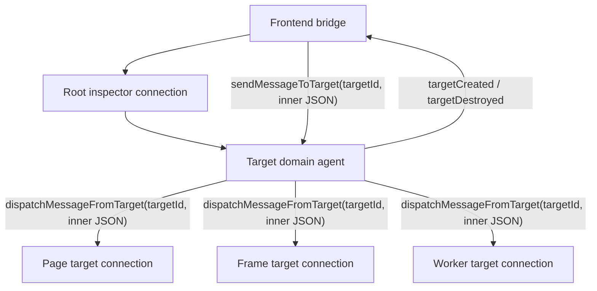
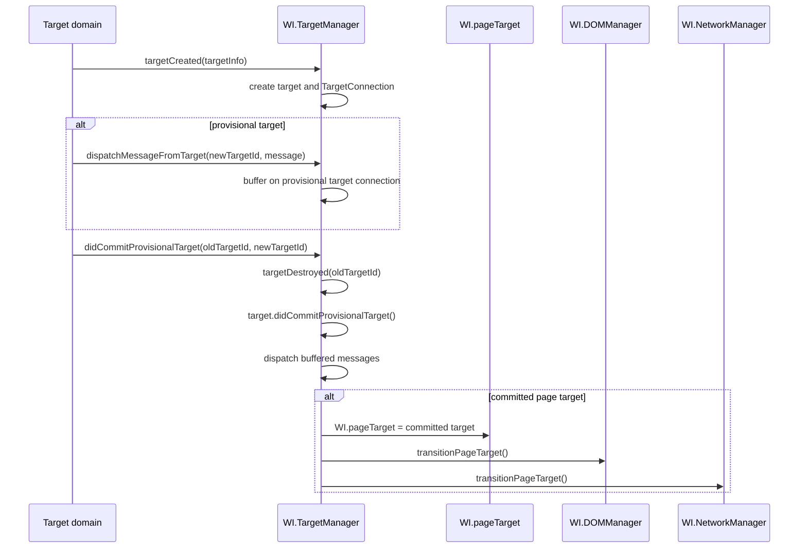

# Transport Research

This note records the WebKit inspector transport behavior that
`WebInspectorCore` is comparing against.

## WebKit Transport Shape

WebKit uses one root inspector connection plus target-scoped sub-connections.
The root connection receives the `Target` domain. Page, frame, worker, and
service-worker targets are exposed through `Target.targetCreated`, then nested
protocol messages are routed with `Target.sendMessageToTarget` and
`Target.dispatchMessageFromTarget`.



`Target.TargetInfo` contains `targetId`, `type`, optional `isProvisional`,
and optional `isPaused`. It does not contain `frameId`, `parentFrameId`, or an
iframe owner node id.

## Source Evidence

| Area | WebKit source | Relevant fact |
| --- | --- | --- |
| Target protocol | `Source/JavaScriptCore/inspector/protocol/Target.json` | `TargetInfo` exposes `targetId`, `type`, `isProvisional`, and `isPaused`; commands include `sendMessageToTarget`; events include `targetCreated`, `targetDestroyed`, `didCommitProvisionalTarget`, and `dispatchMessageFromTarget`. |
| Root and target connections | `Source/WebInspectorUI/UserInterface/Protocol/Connection.js` | `BackendConnection` sends directly to `InspectorFrontendHost`. `TargetConnection` sends inner JSON through `parentTarget.TargetAgent.sendMessageToTarget(targetId, message)`. Each connection owns its own pending response table. |
| Target event dispatch | `Source/WebInspectorUI/UserInterface/Protocol/TargetObserver.js`, `Source/WebInspectorUI/UserInterface/Controllers/TargetManager.js` | `dispatchMessageFromTarget` is looked up by target id and dispatched on that target's connection. Provisional target messages are buffered until commit. |
| Target lifecycle | `Source/WebInspectorUI/UserInterface/Controllers/TargetManager.js` | `targetCreated` creates a target-specific connection and `WI.PageTarget`, `WI.FrameTarget`, or `WI.WorkerTarget`. `didCommitProvisionalTarget` destroys the old target id, marks the new target committed, checks page transition, and dispatches buffered messages. |
| Target capabilities | `Source/WebInspectorUI/UserInterface/Protocol/Target.js` | A target builds agents from `InspectorBackend.supportedDomainsForTargetType(target.type)`. `hasDomain` checks the created agent table, so target type and domain availability are separate facts. |
| Current main target globals | `Source/WebInspectorUI/UserInterface/Base/Main.js` | `WI.mainTarget` is a getter returning `WI.pageTarget || WI.backendTarget`; it is not a separate protocol page identity. |
| Page and frame target classes | `Source/WebInspectorUI/UserInterface/Protocol/PageTarget.js`, `Source/WebInspectorUI/UserInterface/Protocol/FrameTarget.js`, `Source/WebInspectorUI/UserInterface/Protocol/WorkerTarget.js` | `PageTarget` has a top-level execution context. `FrameTarget` keeps an execution-context list and replaces prior normal contexts on navigation. Worker targets use the worker id as target identifier. |
| UIProcess target proxies | `Source/WebKit/UIProcess/Inspector/WebPageInspectorController.cpp`, `Source/WebKit/UIProcess/Inspector/PageInspectorTargetProxy.cpp`, `Source/WebKit/UIProcess/Inspector/FrameInspectorTargetProxy.cpp` | The UIProcess creates page and frame target proxies, emits target lifecycle events through the target agent, and sends target messages to either `WebPage` or `WebFrame` IPC endpoints. |
| Target id implementation | `Source/WebKit/WebProcess/Inspector/PageInspectorTarget.cpp`, `Source/WebKit/WebProcess/Inspector/FrameInspectorTarget.cpp` | Checked source formats page target ids as `page-<pageID>` and frame target ids as `frame-<frameID>-<processID>`. This is implementation evidence, not a protocol-level ownership field. |
| Site Isolation frame targets | `Source/WebKit/UIProcess/Inspector/WebPageInspectorController.cpp`, `Source/WebKit/UIProcess/Inspector/FrameInspectorTargetProxy.cpp` | Frame target management is gated by `shouldManageFrameTargets()`, which reads the Site Isolation preference. Frame proxies are created for frame creation, provisional frames, and process commits. |
| Runtime frame context routing | `Source/WebInspectorUI/UserInterface/Protocol/RuntimeObserver.js`, `Source/WebCore/inspector/agents/page/PageRuntimeAgent.cpp`, `Source/WebCore/inspector/agents/frame/FrameRuntimeAgent.cpp` | Page runtime execution contexts carry `frameId` from the identifier registry. Frame runtime contexts are delivered on the frame target and stored on that `WI.FrameTarget`. |
| Shared frame/loader ids | `Source/WebCore/inspector/InspectorIdentifierRegistry.h`, `Source/WebCore/inspector/InspectorIdentifierRegistry.cpp` | Page, Runtime, Network, CSS, and DOM agents use a shared identifier registry for frame and loader ids. The Site Isolation registry is declared to produce deterministic frame ids, but the checked implementation body is not present in the same source file. |
| Domain-specific gaps | `Source/WebInspectorUI/UserInterface/Controllers/NetworkManager.js`, `Source/WebInspectorUI/UserInterface/Protocol/DOMObserver.js`, `Source/WebInspectorUI/UserInterface/Protocol/CSSObserver.js` | Network, DOM, and CSS all contain FIXME notes around incomplete frame-target routing or support. Current WebInspectorUI is transitional in those areas. |

## 2026-05-16 WebKit Source Reverification

The transport research was rechecked against WebKit source. The target routing
conclusion is unchanged: transport identity is target based, and nested
messages are delivered through per-target connections. The review narrowed
several points:

- `TargetInfo` has no protocol frame ownership fields. Any target-to-frame
  relation has to come from other source signals, such as runtime frame ids,
  page frame tree data, target id implementation evidence, or domain payloads.
- `WI.mainTarget` is only `WI.pageTarget || WI.backendTarget`. It is not a
  stable page object separate from targets.
- `TargetConnection` uses the same generic `InspectorBackend.Connection`
  response machinery as the root connection, but its outbound path is wrapped
  in `Target.sendMessageToTarget`.
- Provisional target messages are explicitly buffered on the target connection
  and replayed after `didCommitProvisionalTarget`.
- Site Isolation frame target creation is gated by the page preference, and
  frame target ids include both frame and process implementation ids.
- The checked source has declarations and comments for deterministic Site
  Isolation identifier registry behavior, but only the legacy registry
  implementation body was present in the inspected file.

## Derived Concepts

The source evidence implies these separate concepts:

- `RootConnection`: the direct inspector frontend/backend connection. It owns
  root protocol ids and receives the `Target` domain.
- `ProtocolTarget`: a page, frame, worker, or service-worker protocol endpoint
  identified by `TargetInfo.targetId`.
- `TargetConnection`: a frontend connection object scoped to one
  `ProtocolTarget`. It has target-local pending replies and dispatches target
  events/responses.
- `TargetCapabilities`: the domain/command/event surface created from active
  frontend protocol metadata for that target type.
- `ProvisionalTarget`: target whose messages are buffered until
  `didCommitProvisionalTarget` marks it committed.
- `PageBoundary`: the current page target plus the current page frame/resource
  tree. WebInspectorUI does not expose a separate stable protocol `pageID`.
- `FrameIdentity`: WebKit frame id when available through Page, Runtime,
  Network, DOM, CSS, or target-id implementation evidence.
- `ExecutionContextOwnership`: mapping from execution context id to the target
  connection that delivered it and, when available, the associated frame id.
- `DomainEventStream`: decoded events for one protocol domain under one
  target connection.

## Derived Model Invariants

- Root command ids and target command ids are correlated in separate
  connection scopes.
- `Target.sendMessageToTarget` is transport delivery. The domain command result
  arrives later as the nested response in `Target.dispatchMessageFromTarget`.
- Target type does not imply domain support. Domain availability comes from the
  target's active agent table.
- Page target commit and frame target commit are different lifecycle events.
  Frame target commit is not a page document reset.
- Protocol ids emitted by target-scoped domains are meaningful only together
  with the target that emitted them.
- Frame ownership is not derived from URL, target id prefix, DOM nesting, or
  selected UI row state.
- Runtime execution-context ownership is target-scoped. Frame target runtime
  contexts are attached to the `WI.FrameTarget`, while page target contexts are
  routed through the page frame tree.
- Network and Page have transitional multi-target behavior in WebInspectorUI.
  Current FIXME notes are evidence of incomplete upstream routing, not stable
  identity semantics.

## Message Flow

```text
Root command
  -> BackendConnection.sendMessageToBackend(root JSON)
  -> root response/event on BackendConnection

Target command
  -> TargetConnection builds inner JSON
  -> parentTarget.TargetAgent.sendMessageToTarget(targetId, inner JSON)
  -> Target.dispatchMessageFromTarget(targetId, inner response JSON)
  -> target.connection.dispatch(inner response JSON)

Target event
  -> Target.dispatchMessageFromTarget(targetId, inner event JSON)
  -> target.connection.dispatch(inner event JSON)
  -> domain observer for that target
```

## Page and Frame Target Lifecycle



The page transition path is specific to committed page targets. Frame target
creation, destruction, and commit are target lifecycle events, but they are not
the same as replacing the page target/main-frame boundary.

## Domain Routing Categories

The checked source supports a distinction between target-scoped domains and
page/UIProcess-proxy domains, but the boundaries are not fully finalized in
WebInspectorUI.

- Target-scoped domains use target connections directly. DOM, CSS, Runtime,
  Debugger, and Console have frame-target-related code paths or FIXME markers.
- Page/UIProcess-proxy domains can aggregate or proxy data from multiple
  processes. Network and Page have explicit source notes around incomplete
  advanced multi-target support.
- UIProcess/root domains remain on the root or page inspector controller path.
- The capability check is the stable frontend guard: send only to targets whose
  active protocol metadata exposes the domain/command.

## Relationship to DOM, CSS, and Network

- DOM owns document/node projection and frame document containment. Transport
  owns the target envelope and any target/frame/execution-context facts needed
  to interpret DOM payloads.
- CSS owns style state. Transport only carries the target-scoped command and
  event envelope used to reach the CSS agent for a node's owning target.
- Network owns request/resource identity. Transport preserves the event target
  and optional payload `targetId` separately so Network can distinguish routing
  from origin/placement metadata.
- Runtime owns execution contexts. Transport preserves the target connection
  that delivered each context and the frame id carried by the context payload.

## Contradicted Interpretations

```text
TargetInfo.targetId prefix == protocol frame ownership field
or
TargetInfo has frameId / parentFrameId / ownerNodeID
or
WI.mainTarget == stable page identity independent of targets
or
Target.sendMessageToTarget response == domain command result
or
frame target commit == page document reset
or
domain support follows target type without checking target capabilities
or
Network.requestWillBeSent.targetId == protocol event envelope target
```

## Failure Signals

Useful signals when transport routing looks wrong:

1. A command is sent to a target whose active agent table does not include the
   domain or command.
2. A nested response is matched against the root reply table instead of the
   target connection reply table.
3. A provisional target emits messages that are processed before
   `didCommitProvisionalTarget`.
4. A page target transition path is triggered for a frame target commit.
5. DOM/CSS node or style ids are used without the target connection that
   produced them.
6. Network request origin `targetId` is treated as the event envelope target.
7. Frame identity is inferred from URL or target id string shape without a
   stronger source signal.

## Source References

- `Source/JavaScriptCore/inspector/protocol/Target.json`
- `Source/WebInspectorUI/UserInterface/Protocol/Connection.js`
- `Source/WebInspectorUI/UserInterface/Protocol/TargetObserver.js`
- `Source/WebInspectorUI/UserInterface/Controllers/TargetManager.js`
- `Source/WebInspectorUI/UserInterface/Protocol/Target.js`
- `Source/WebInspectorUI/UserInterface/Protocol/PageTarget.js`
- `Source/WebInspectorUI/UserInterface/Protocol/FrameTarget.js`
- `Source/WebInspectorUI/UserInterface/Protocol/WorkerTarget.js`
- `Source/WebInspectorUI/UserInterface/Base/Main.js`
- `Source/WebInspectorUI/UserInterface/Protocol/RuntimeObserver.js`
- `Source/WebInspectorUI/UserInterface/Controllers/DOMManager.js`
- `Source/WebInspectorUI/UserInterface/Controllers/NetworkManager.js`
- `Source/WebInspectorUI/UserInterface/Protocol/CSSObserver.js`
- `Source/WebKit/UIProcess/Inspector/WebPageInspectorController.cpp`
- `Source/WebKit/UIProcess/Inspector/PageInspectorTargetProxy.cpp`
- `Source/WebKit/UIProcess/Inspector/FrameInspectorTargetProxy.cpp`
- `Source/WebKit/WebProcess/Inspector/PageInspectorTarget.cpp`
- `Source/WebKit/WebProcess/Inspector/FrameInspectorTarget.cpp`
- `Source/WebCore/inspector/InspectorIdentifierRegistry.h`
- `Source/WebCore/inspector/InspectorIdentifierRegistry.cpp`
- `Source/WebCore/inspector/agents/page/PageRuntimeAgent.cpp`
- `Source/WebCore/inspector/agents/frame/FrameRuntimeAgent.cpp`
