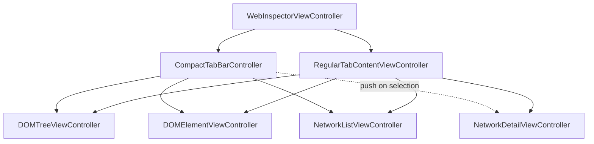
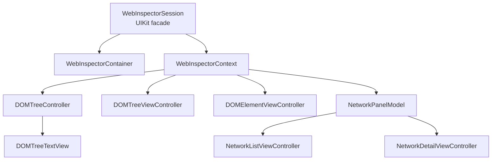
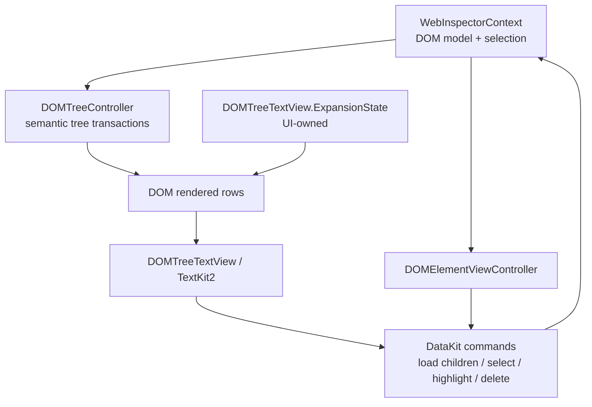
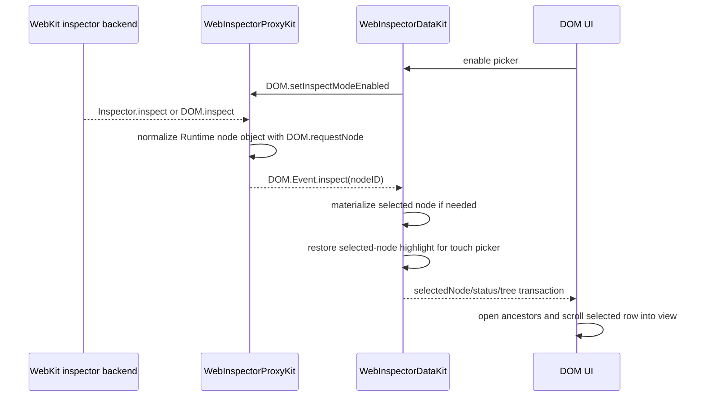
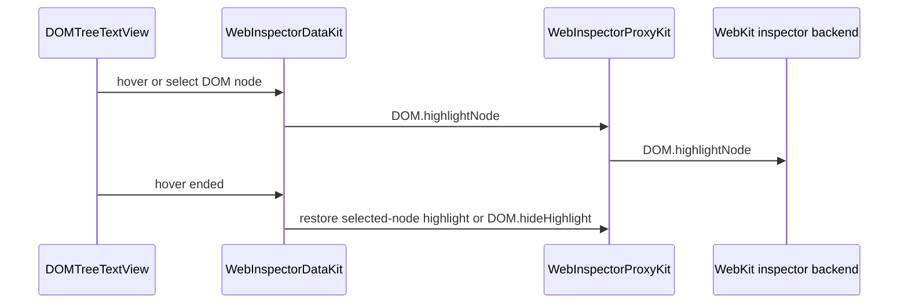
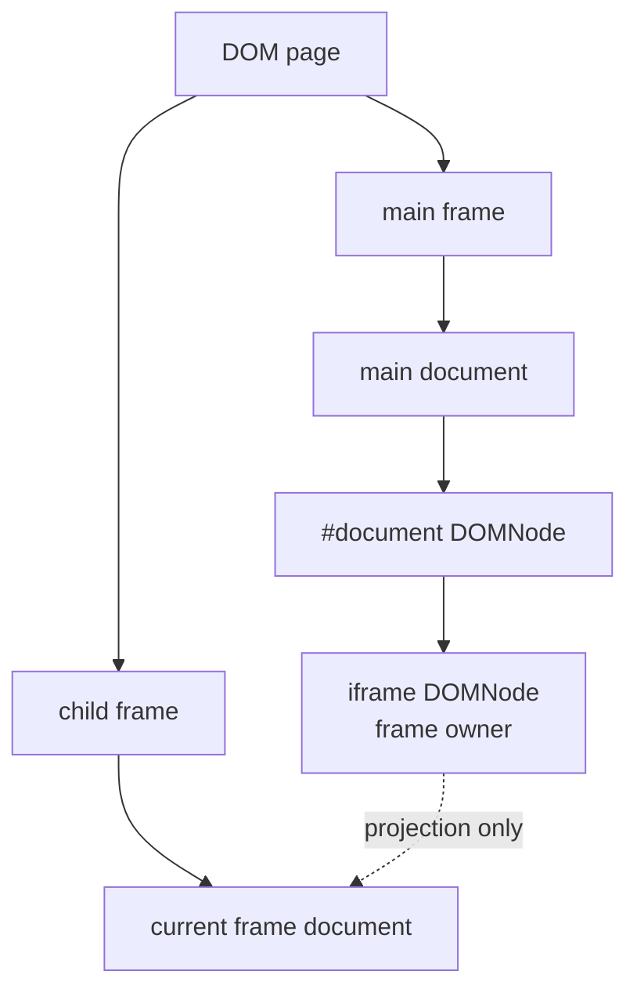
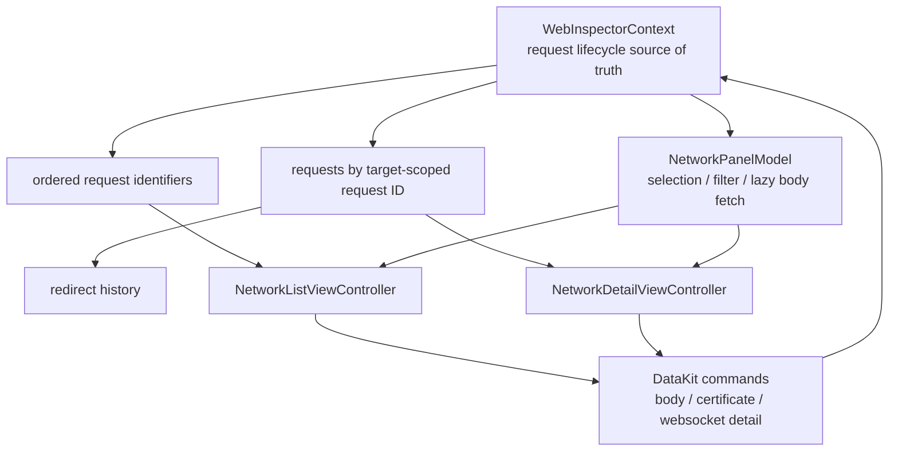

# WebInspector UI Integration

This document describes the current WebInspector UIKit inspector UI. It focuses
on view-controller ownership and the boundary between UIKit presentation state
and the `WebInspectorDataKit` model stack.

The visible UI is native UIKit/TextKit2. DOM and Network views render DataKit
state; they do not keep copied DOM graphs, copied Network requests, or protocol
target registries.

## Current View Controller Tree

For the full UIKit containment map, see
[`ViewControllerStructure.md`](ViewControllerStructure.md).

## WebInspector UI Wiring

`WebInspectorSession` remains the UIKit facade and custom-tab compatibility
owner. It wraps `WebInspectorContainer` / `WebInspectorContext`. The UI must not
own native bridge objects, protocol envelopes, `TransportSession`, or
`TransportBackend` directly.

## DOM Presentation

The DOM UI renders a projection generated from `DOMTreeController`, not a second
DOM graph.

Picker selection flow:

Hover/click highlight flow:

Frame documents remain frame-owned and are projected under their owner iframe:

The child frame document is not stored as a regular child of the iframe node.
This invariant prevents iframe refresh from corrupting the parent document.

## Network Presentation

Network UI observes request lifecycle state through `NetworkPanelModel` and
keeps only view-local state in UIKit controllers.

The primary request identity remains target-scoped request identity. Redirects
are request history, not separate top-level requests. Cross-origin navigation is
a DataKit retarget transition, not a UI detach.

## UI-Owned State

The semantic source of truth lives in `WebInspectorContext` and DataKit models.
UIKit controllers may keep only local presentation state:

- selected tab and split layout state
- scroll position
- TextKit2 fragment/view cache
- active find text and transient find UI state
- list selection presentation
- DOM row expansion/collapse state
- keyboard command registration and first-responder routing

The UI should not keep copied DOM nodes, copied network requests, protocol
target registries, or raw transport state.

## Cleanup Checkpoints

1. Keep built-in WebInspector UI code reading from `WebInspectorSession.context`
   and DataKit models.
2. Keep DOM controllers reading from `WebInspectorContext` /
   `DOMTreeController` and submitting DataKit commands.
3. Keep Network controllers reading from `NetworkPanelModel` and submitting
   DataKit commands.
4. Keep picker selection, selected-node highlight restore, and navigation
   retarget recovery owned by DataKit.
5. Keep row expansion, scroll-to-selection, hover/click affordances, and
   keyboard command routing owned by UI.
