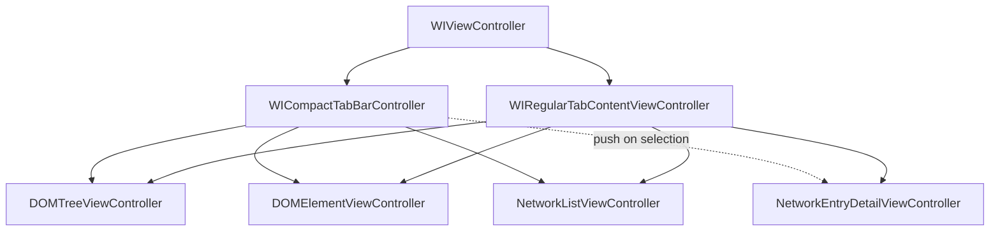
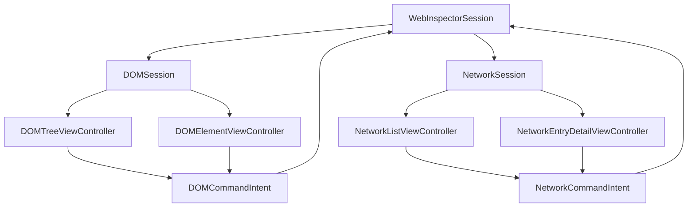
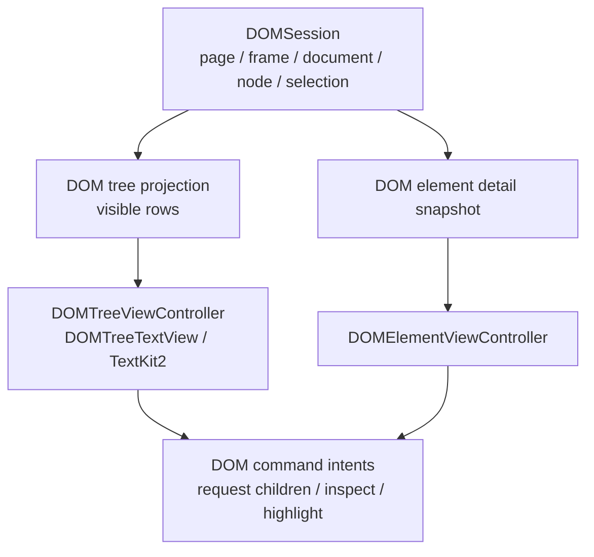
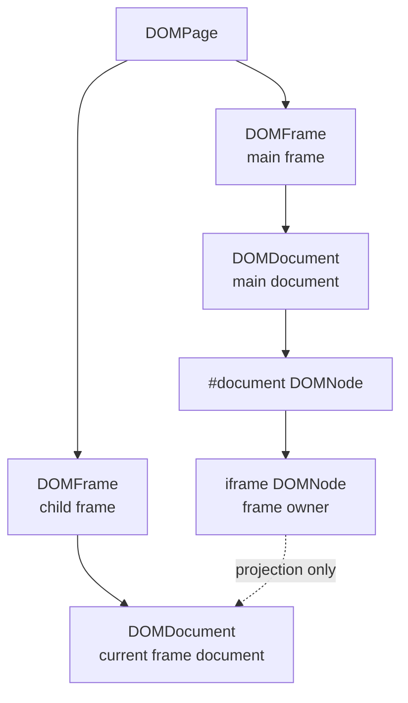
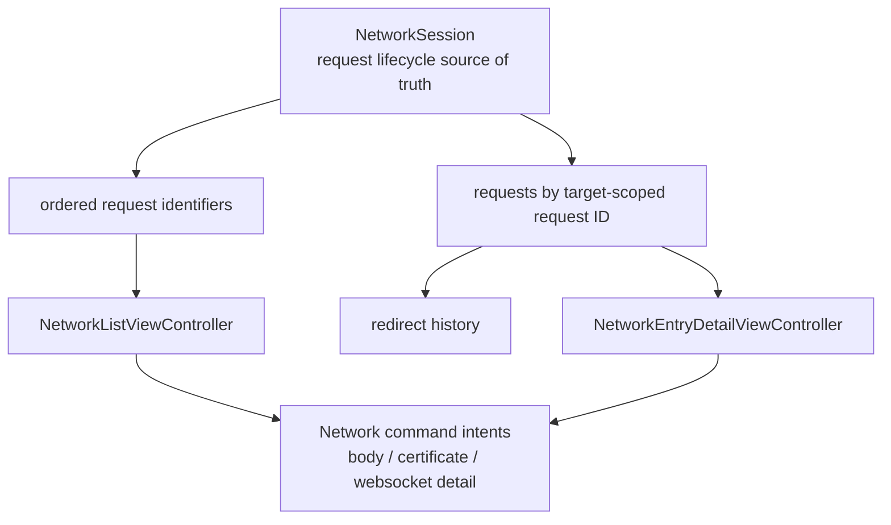

# WebInspectorUI V2 Integration

This document describes how the existing UIKit UI should connect to the V2
runtime/model stack. It intentionally stays inside `Sources/WebInspectorUI`
because these diagrams are about view-controller containment and presentation
wiring, not core transport semantics.

The visible UI should not change. V2 changes the source of truth and command
flow beneath the existing controllers.

## Current View Controller Tree

The current visual container structure remains valid. V2 should change model and
command wiring, not the visible layout.

For the full UIKit containment map, see
[`ViewControllerStructure.md`](ViewControllerStructure.md).

## V2 UI Wiring

The UI should receive `WebInspectorSession` and avoid direct ownership of
transport or native bridge objects.

## DOM Presentation

The DOM UI should render a projection generated from the semantic DOM model, not
own a second DOM graph.

Frame documents remain frame-owned and are projected under their owner iframe:

The child frame document is not stored as a regular child of the iframe node.
This invariant prevents iframe refresh from corrupting the parent document.

## Network Presentation

Network UI should observe request lifecycle state from `NetworkSession` and keep
only view-local state in UIKit controllers.

The primary request identity remains target-scoped request identity. Redirects
are request history, not separate top-level requests.

## UI-Owned State

The semantic source of truth should live in `WebInspectorSession`, `DOMSession`,
and `NetworkSession`. UIKit controllers may keep only local presentation state:

- selected tab and split layout state
- scroll position
- TextKit2 fragment/view cache
- active find text and transient find UI state
- list selection presentation
- expanded/collapsed visual state when it is not semantic DOM state

The UI should not keep copied DOM nodes, copied network requests, or protocol
target registries.

## Migration Checkpoints

1. Pass `WebInspectorSession` into the root inspector container.
2. Replace V1 DOM runtime references in DOM controllers with `session.dom`.
3. Replace V1 Network model references in Network controllers with
   `session.network`.
4. Route DOM and Network commands through `WebInspectorSession.perform(...)`.
5. Remove UI dependencies on V1 runtime/transport types.
