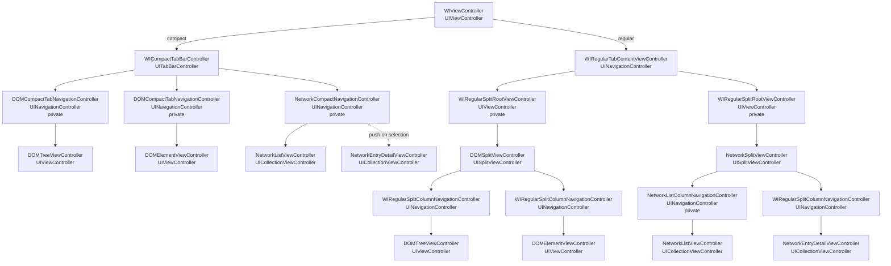

# ViewController Structure

`Sources/WebInspectorUI` で作っている ViewController の親子構造だけを示します。
View、処理、状態、モデル、タブ定義は省略します。

矢印は child ViewController を表します。

## Source Layout

- `Containers`: host / wrapper ViewController。`UINavigationController` / `UITabBarController` / split root など、UIKit container の責務を持つ型。
- `Tabs`: public tab API、layout 別 display item projection、content cache、content factory。
- `DOM`: DOM 固有の content ViewController、navigation item、built-in DOM tab controller。
- `Network`: Network 固有の container / built-in tab controller。`List` に一覧 UI、`Detail` に選択 entry の detail UI を置く。

