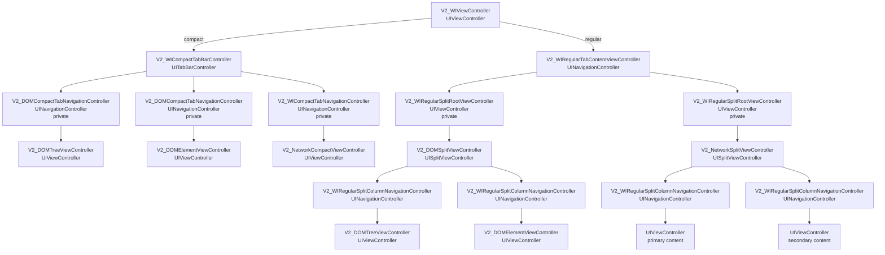

# V2 ViewController Structure

`Sources/WebInspectorUI/V2` で作っている ViewController の親子構造だけを示します。
View、処理、状態、モデル、タブ定義は省略します。

矢印は child ViewController を表します。

## 要点

- root は `V2_WIViewController`。
- root の child は compact なら `V2_WICompactTabBarController`、regular なら `V2_WIRegularTabContentViewController`。
- `V2_WIRegularTabContentViewController` は `UINavigationController`。DOM / Network の切り替え segment もここが持つ。
- compact host の下に来る DOM 系の標準 VC は `V2_DOMCompactTabNavigationController` で包んだ `V2_DOMTreeViewController` / `V2_DOMElementViewController`。custom tab にはこの wrapping を強制しない。
- compact の Element は public tab ではなく、DOM tab から派生した compact 専用 display tab。
- regular host の下に来る標準 VC は `V2_DOMSplitViewController` / `V2_NetworkSplitViewController`。
- ただし `UISplitViewController` は `UINavigationController` に直接入れられないため、regular host では private な `V2_WIRegularSplitRootViewController` で包む。
- `UISplitViewController` の column は UIKit が自動で `UINavigationController` に包むため、regular split では column 側を明示的な hidden `UINavigationController` にしている。
- DOM split の下は Tree / Element。compact では Tree と Element が別 tab。
- `V2_DOMTreeViewController` は `UIViewController`。compact では tab 側の `UINavigationController`、regular では split column 側の hidden `UINavigationController` が必要な navigation container を担う。
- `V2_NetworkSplitViewController` は hidden `UINavigationController` の root に空の `UIViewController` を持つ。
